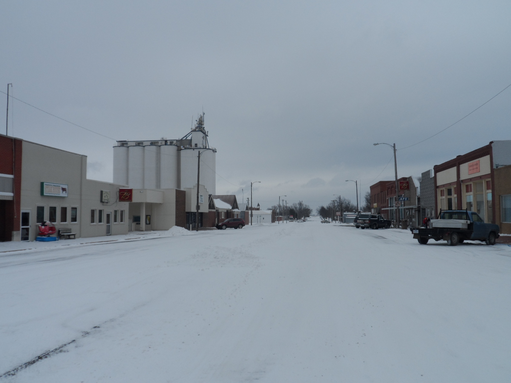
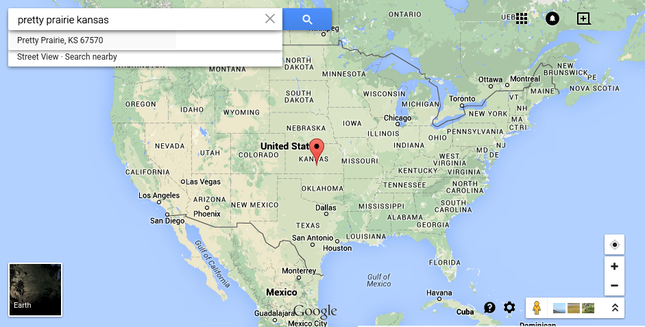

# About Pretty Prairie

Pretty Prairie downtown- winter

Pretty Prairie downtown- spring

These two pictures were actually taken one week apart :) 

## Location
[Pretty Prairie](http://en.wikipedia.org/wiki/Pretty_Prairie,_Kansas) (population ~688) is in central Kansas, U.S.A....

...241 miles southwest of [Kansas City, Kansas](http://en.wikipedia.org/wiki/Kansas_City_metropolitan_area) and 45.9 miles due west of [Wichita](http://en.wikipedia.org/wiki/Wichita,_Kansas)...

...24.9 miles south of [Hutchinson](http://en.wikipedia.org/wiki/Hutchinson,_Kansas) (population 42,080), 13.7 miles north of [Kingman](http://en.wikipedia.org/wiki/Kingman,_Kansas) (population 3,177), and 21.7 miles southwest of the [Amish](http://en.wikipedia.org/wiki/Amish) community of [Yoder](http://en.wikipedia.org/wiki/Yoder,_Kansas) (population 194)
 

## Harvest and Pretty Prairie Rodeo
Pretty Prairie is a very quiet place, except for every June when Harvest happens and July when Pretty Prairie hosts the world famous 
[Pretty Prairie Rodeo](http://www.pprodeo.com) (the largest night rodeo in Kansas). 

Google Trends search interest graph showing increased interest every July for phrase ["Pretty Prairie" (region: worldwide)](http://www.google.com/trends/explore#q=pretty%20prairie) 

## Pretty Prairie Institutions
* A school system ([U.S.D. 311](http://www.usd311.com))
* A post office ([Pretty Prairie Post Office](http://www.uspspostoffices.com/ks/pretty-prairie/pretty-prairie))
* A city office
* Four churches
* A newspaper
* A nursing home ([Pretty Prairie Sunset Home](http://prairiesunsethome.org))
* A bank ([Citizens Bank of Kansas](https://www.citizensbankofkansas.com/MyCommunity/MyLocations/PrettyPrairie))
* A gas station
* A restaurant 
* A golf course ([The Links at Pretty Prairie](http://www.prettyprairiegolf.com))
* A senior center
* A repurposing charity ([Ubuntu](http://www.ubuntuks.com))
* A food bank
* Several other small business

## Work
A number of Pretty Prairie residents work locally (farmers, teachers, police, city workers, ect.), or commute to other nearby cities (Kingman, Hutchinson, Wichita, ect.) for work (business people, machine operators, ect.). Though the cost of living may be lower, the price of gas and time spent commuting also have to be considered. Meanwhile, the outskirts of Wichita are steadily expanding outward. Still, the Pretty Prairie population remains fairly constant (~688). 

### Nielson Company Demographic Info

Through the national United Methodist Church Communications Office, I obtained the most recent Nielson Company demographic info for the city of Pretty Prairie, Kansas. 

Pretty Prairie has a population of ~688.

Pretty Prairie [Area Map](https://drive.google.com/file/d/0B02bpu7HZwJRaVp5dGNMOUpYbU0/view?usp=sharing)

[Executive Summary](https://drive.google.com/file/d/0B02bpu7HZwJRMFJTM3BWZXprbWM/view?usp=sharing)

[Household Trends](https://drive.google.com/file/d/0B02bpu7HZwJRV1dnSGplRUxmMDg/view?usp=sharing)

[Pop-Facts: Census Demographic Overview 2014 Report](https://drive.google.com/file/d/0B02bpu7HZwJRSHFwVm5kX0FHMmc/view?usp=sharing)

[Population by Age and Race Trend 2014](https://drive.google.com/file/d/0B02bpu7HZwJRelJTXzd1XzVWUE0/view?usp=sharing)

