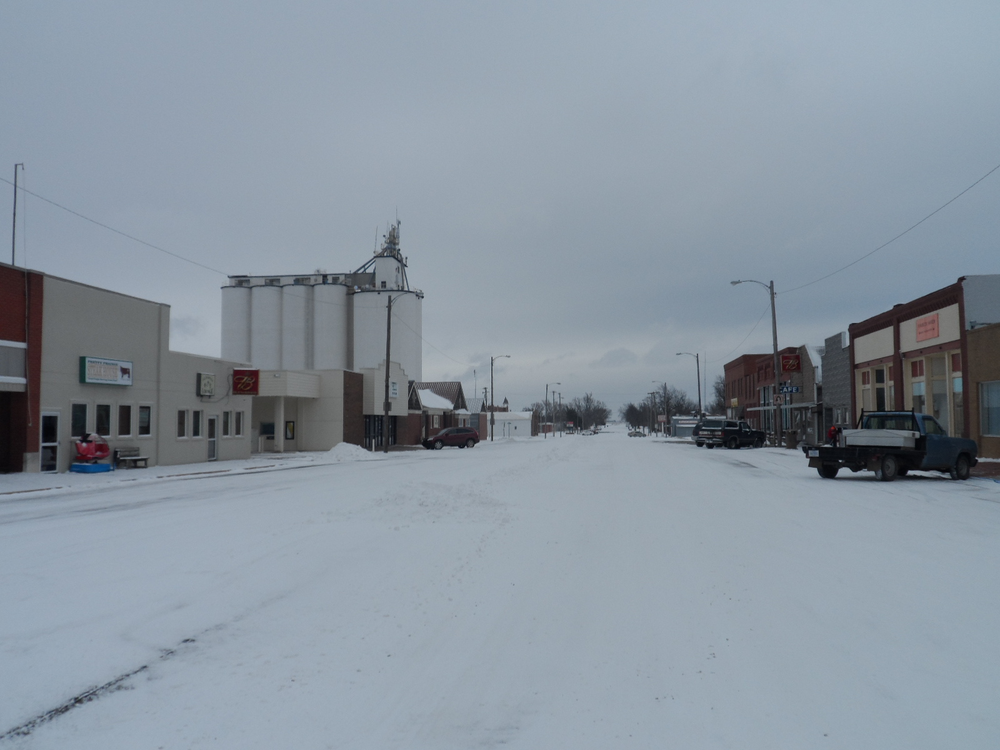

# About Pretty Prairie

[Pretty Prairie](http://en.wikipedia.org/wiki/Pretty_Prairie,_Kansas) is in central Kansas...

Pretty Prairie, Kansas, U.S.A.

...southwest of Kansas City and due west of Wichita...

... north of Kingman (population), south of Hutchinson (population), and near the Amish community of Yoder

Pretty Prairie downtown

Pretty Prairie is a very quiet place, except for every July when Pretty Prairie hosts the world famous 
[Pretty Prairie Rodeo](http://www.pprodeo.com) (the largest night rodeo in Kansas).

Google Trends search interest graph showing increased interest every July for phrase ["Pretty Prairie" (region: worldwide)](http://www.google.com/trends/explore#q=pretty%20prairie) 

### Nielson Company Demographic Info

Through the national United Methodist Church Communications Office, I obtained the most recent Nielson Company demographic info for the city of Pretty Prairie, Kansas. 

Pretty Prairie has a population of 688

Pretty Prairie [Area Map](https://drive.google.com/file/d/0B02bpu7HZwJRaVp5dGNMOUpYbU0/view?usp=sharing)

[Executive Summary](https://drive.google.com/file/d/0B02bpu7HZwJRMFJTM3BWZXprbWM/view?usp=sharing)

[Household Trends](https://drive.google.com/file/d/0B02bpu7HZwJRV1dnSGplRUxmMDg/view?usp=sharing)

[Pop-Facts: Census Demographic Overview 2014 Report](https://drive.google.com/file/d/0B02bpu7HZwJRSHFwVm5kX0FHMmc/view?usp=sharing)

[Population by Age and Race Trend 2014](https://drive.google.com/file/d/0B02bpu7HZwJRelJTXzd1XzVWUE0/view?usp=sharing)

### The "Business" Problem

* Changing lifestyles (digital and philosophical reorganization)
* Dwindling, predominantly older adult local population 
* Four churches in close proximity

