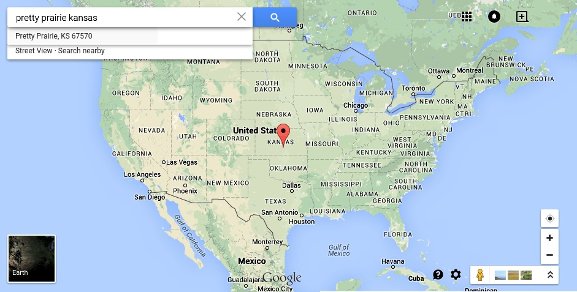
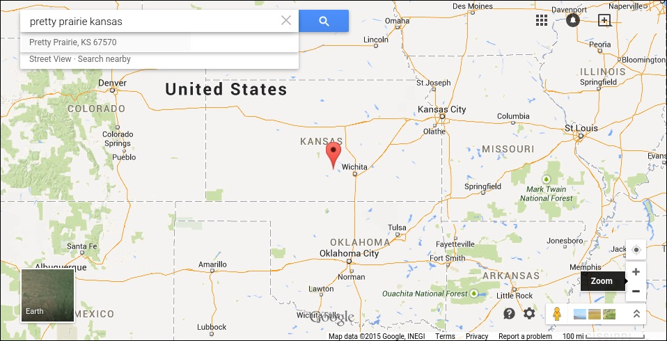
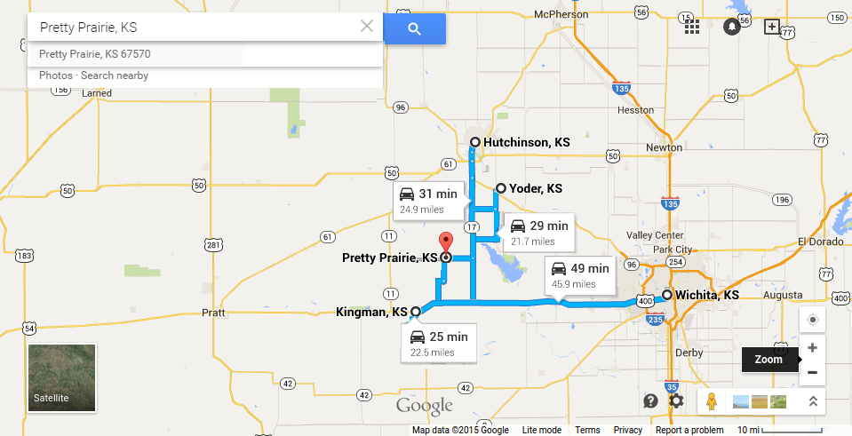
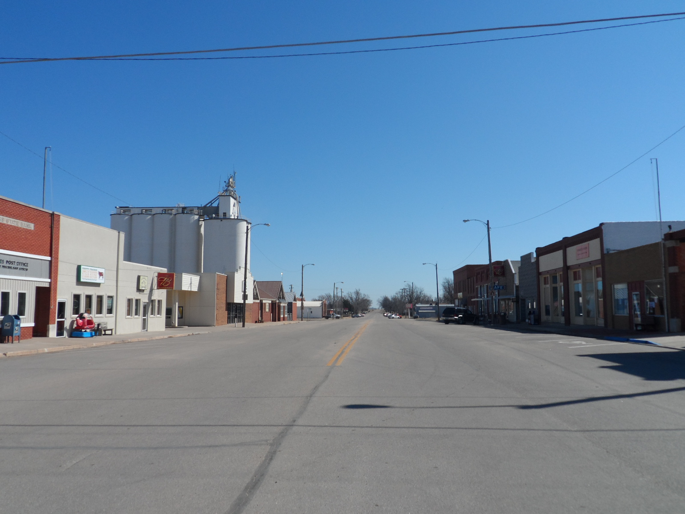
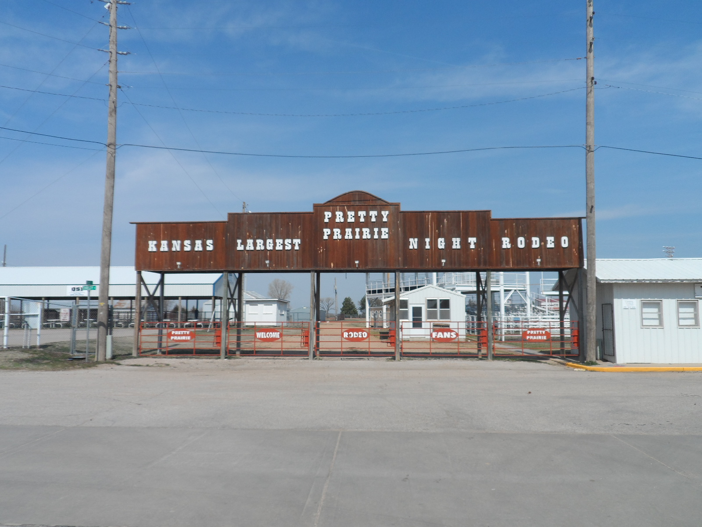
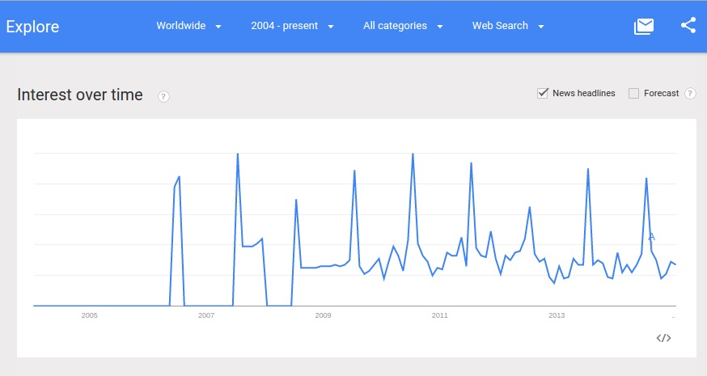

# About Pretty Prairie

## Location
[Pretty Prairie](http://en.wikipedia.org/wiki/Pretty_Prairie,_Kansas) (population ~688) is in central Kansas, U.S.A....

...  241 miles southwest of [Kansas City, Kansas](http://en.wikipedia.org/wiki/Kansas_City_metropolitan_area)... 

... 45.9 miles due west of [Wichita](http://en.wikipedia.org/wiki/Wichita,_Kansas), 24.9 miles south of [Hutchinson](http://en.wikipedia.org/wiki/Hutchinson,_Kansas), 13.7 miles north of [Kingman](http://en.wikipedia.org/wiki/Kingman,_Kansas), and 21.7 miles southwest of the [Amish](http://en.wikipedia.org/wiki/Amish) community of [Yoder](http://en.wikipedia.org/wiki/Yoder,_Kansas)
 

## Surrounding Populations

| City | Approximate Population |
| -- | -- |
| Pretty Prairie | 688 |
| Kingman | 3,177 |
| Yoder | 194 |
| Hutchinson | 42,080 |
| Wichita | 386,552 (city)/637,394 (metro) |

## Climate
Pretty Prairie is very cold in the winter and warm in the summer. Pretty Prairie is in "tornado alley," and the weather is known to be erratic from time to time. 

Pretty Prairie downtown- winter

Pretty Prairie downtown- spring

These two pictures were actually taken one week apart :) 

## Harvest and Pretty Prairie Rodeo
Pretty Prairie is a very quiet place, except for every June when Harvest happens and July when Pretty Prairie hosts the world famous 
[Pretty Prairie Rodeo](http://www.pprodeo.com) (the largest night rodeo in Kansas). 

Pretty Prairie Rodeo arena entrance

Google Trends search interest graph showing increased interest every July for phrase ["Pretty Prairie" (region: worldwide)](http://www.google.com/trends/explore#q=pretty%20prairie) 

## Pretty Prairie Institutions
* A school system ([U.S.D. 311](http://www.usd311.com))
* A post office ([Pretty Prairie Post Office](http://www.uspspostoffices.com/ks/pretty-prairie/pretty-prairie))
* A city office/library ([Pretty Prairie City Office](http://members.hutchchamber.com/Government-Public-Office/City-of-Pretty-Prairie-1513))
* Four churches
* A newspaper ([Ninnescah Valley News](https://www.facebook.com/pages/Ninnescah-Valley-News/142191375827044))
* A nursing home ([Pretty Prairie Sunset Home](http://prairiesunsethome.org))
* A bank ([Citizens Bank of Kansas](https://www.citizensbankofkansas.com/MyCommunity/MyLocations/PrettyPrairie))
* A gas station ([Strohl Oil Co.](https://plus.google.com/102940219961032410746/about?gl=us&hl=en))
* A restaurant ([Wagon Wheel Cafe](https://plus.google.com/101663998196844699536/about?gl=us&hl=en))
* A golf course ([The Links at Pretty Prairie](http://www.prettyprairiegolf.com))
* A senior center ([Prairie Senior Center](https://www.facebook.com/pages/Prairie-Senior-Center/115988521762791))
* A repurposing charity ([Ubuntu](http://www.ubuntuks.com))
* A food bank
* Several other small business

## Work
A number of Pretty Prairie residents work locally (farmers, teachers, police, city workers, ect.), or commute to other nearby cities (Kingman, Hutchinson, Wichita, ect.) for work (business people, machine operators, ect.). Though the cost of living may be lower, the price of gas and time spent commuting also have to be considered. Meanwhile, the outskirts of Wichita are steadily expanding outward. Still, the Pretty Prairie population remains fairly constant (~688). 

## Dilemma
The city of Pretty Prairie has a very small population. Though there are surrounding cities with far larger populations, there is no need for people to travel to Pretty Prairie to go to church. Though the population of Pretty Prairie may increase in time as the population of Wichita expands outward, presumably many years will go before this has a major impact. 

Kansas is in the center of the Bible Belt, and there are many people of faith in the region. Still...

