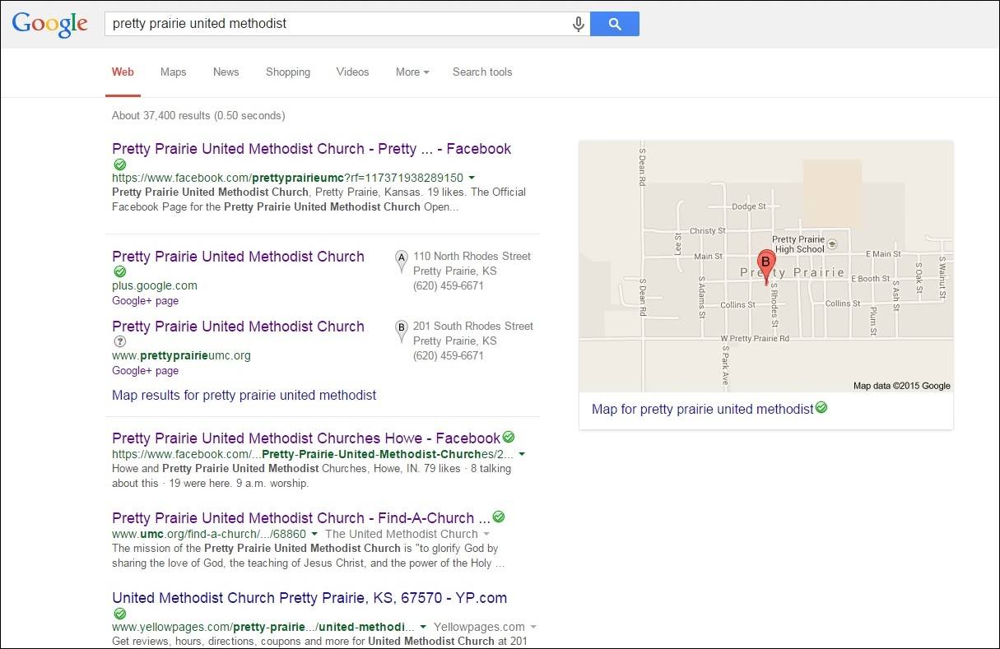

# Advanced Marketing

Advanced marketing techniques matter, which can be seen in [Upworthy Case Study](upworthy_case_study.md)

### Publicity Engine

* Church channel
* Traditional advertising
* Dedicated campaign
* Advance marketing tools
* Social media advertising (Facebook/Twitter)
* Partnerships

* Facebook advertises a "potential reach" of 120,000,000 people
* Funnel
Pirate metrics

### Digital Outreach

#### Church Administered
* Website
* Facebook Page

#### National United Methodist Church Administered

* Find-a-Church

#### Search Engine Optimization (SEO)

* [Search Engine Optimization](http://en.wikipedia.org/wiki/Search_engine_optimization) (SEO)

#### Google+ and Google Rich Snippets
* [Google+](https://plus.google.com/)
* [Google Rich Snippets](https://support.google.com/webmasters/answer/99170?hl=en)

#### Facebook Sharing Amongst Friends

#### [Facebook Advertising](https://www.facebook.com/business/products/ads) (Pay)
In general, Facebook is considered to be the 'king' of social traffic, with other networks such as Twitter, Instagram and Pinterest close behind.

#### [Google AdWords](https://www.google.com/adwords) (Pay) 
#### [Twitter Advertising](https://ads.twitter.com) (Pay)

### Research and Data Collection
* [Google Trends](http://www.google.com/trends)
* [Google Forms](http://www.google.com/forms/about)
* [Google Consumer Surveys](http://www.google.com/insights/consumersurveys/home) (pay)
* [Google Keyword Planner](https://support.google.com/adwords/answer/3114286?hl=en)

#### Email Management

* [MailChimp](http://mailchimp.com)

### Advanced Marketing 

#### Webmaster
* [Google Webmaster](http://www.google.com/intl/en-US/webmasters)
* [Yahoo and Bing Webmaster](http://www.bing.com/toolbox/webmaster)

#### Analytics
* [Google Analytics](http://www.google.com/analytics)
* [Facebook Insights](https://www.facebook.com/help/336893449723054) (analytics)
* [Twitter Analytics](https://analytics.twitter.com)

#### Sharing and Engagement
* [Facebook OpenGraph](http://ogp.me)
* [Twitter Cards](https://dev.twitter.com/cards/overview)
* [Twitter Intents](https://dev.twitter.com/web/intents)
* Share Buttons ([AddThis](http://www.addthis.com)/[ShareThis](http://www.sharethis.com))

#### Embedded Advertising
* [Google AdSense](http://www.google.com/adsense)

#### Mobile Advertising (Pay)
* [Facebook Audience Network](https://www.facebook.com/business/news/audience-network) 

## Website SEO

### Search Engine Optimization (SEO)
SEO is an important aspect of ensuring that people 'discover' your website. Identify the SEO functionality of your website and verify that it is enabled and optimized. Search engines will 'crawl' the content of your website and give your site a page ranking. 

In some websites, SEO will be optimized manually via the "head" part of the code. In other websites, SEO will be automatic. 

Google is the most popular search engine in most countries, often followed by Yahoo. Identify the most important search phrases associated with your website and test the search results. Make sure that cookies are not enabled. Otherwise, your search results might be skewed due to the search history of the computer. 

And most important of all, encourage people to use the website! The search ranking of the website will rise naturally as a result.

## Google+ and Google Rich Snippets
Verify that the Google map info is correct. If possible, link the website to the map. Consider creating a Google+ organization page, and/or Google rich snippet for support

### Google Rich Snippet
Example Google search: "Pretty Prairie United Methodist"

Example Google search result: "Pretty Prairie United Methodist"

Correcting incorrect Google Map info

