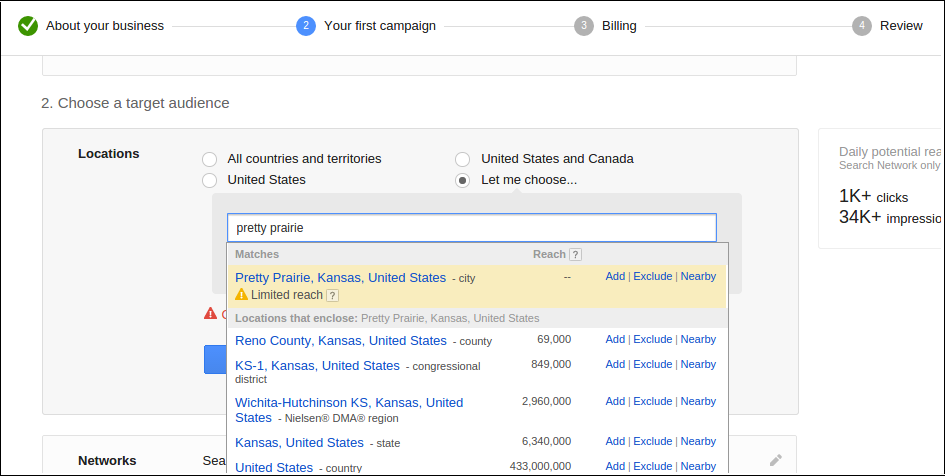
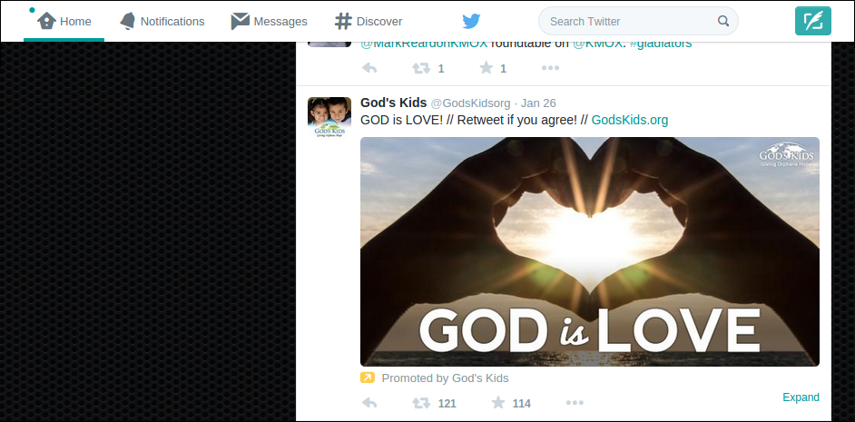

# Advanced Marketing Options

## Research
* Google Trends
* Google Forms
* Google Consumer Surveys (pay)

## SEO and Webmaster
* Search Engine Optimization (SEO)
* Google Rich Snippets
* Google Webmaster
* Google Analytics

## Social Media Engagement
* Facebook OpenGraph
* Twitter Cards
* Facebook/Twitter Sharing
* Share Buttons (Add This/Share This)

## Social Media Analytics
* Facebook Analytics
* Facebook Insights
* Twitter Analytics

## Social Media Advertisement
* Google Ads (pay)
* Google Keyword Planner
* Google AdWords
* Facebook Ads (pay)
* Twitter Ads (pay)

## Mobile
* Facebook Audience Network (Mobile Ads)
* Deep Linking

## Email
* MailChimp

### Search Engine Optimization (SEO) and Webmaster

#### Search Engine Optimization (SEO)
SEO is an important aspect of ensuring that people 'discover' your website. Identify the SEO functionality of your website and verify that it is enabled and optimized. Search engines will 'crawl' the content of your website and give your site a page ranking. 

In some websites, SEO will be optimized manually via the "head" part of the code. In other websites, SEO will be automatic. 

Google is the most popular search engine in most countries, often followed by Yahoo. Identify the most important search phrases associated with your website and test the search results. Make sure that cookies are not enabled. Otherwise, your search results might be skewed due to the search history of the computer. 

Verify that the Google map info for the church is correct. If possible, link the website to the map. Consider creating a Google+ organization page, and/or Google rich snippet for support

And most important of all, encourage church members to use the website! The search ranking of the website will rise naturally as a result.

### Social Media Advertisement

#### Google Adwords

Google Adwords Pretty Prairie "Limited reach"

Google Adwords Pretty Prairie targeting

#### Facebook Sharing and Advertising

Facebook is the 'king' of social traffic, with other networks such as Twitter, Instagram and Pinterest close behind. 

#### Twitter Advertising

Twitter has a media playbook devoted to faith and religious ads can be occasionally found on Twitter. 

Twitter for Faith Playbook

Example religious ad on Twitter

Members of the church are less likely to use Twitter. However, Twitter is an option to keep in mind, particularly for reaching the public at large. 

