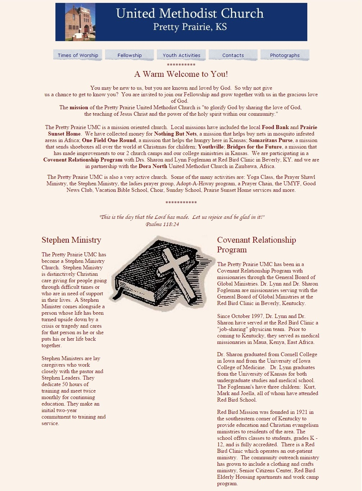
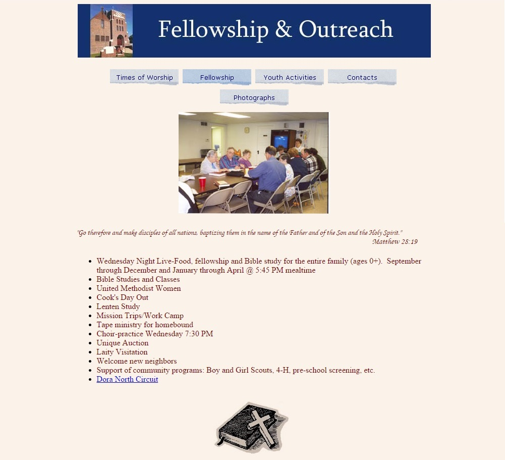
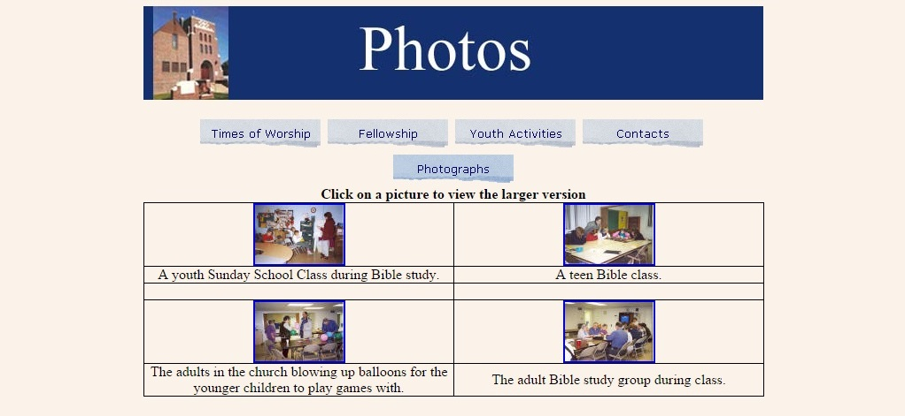
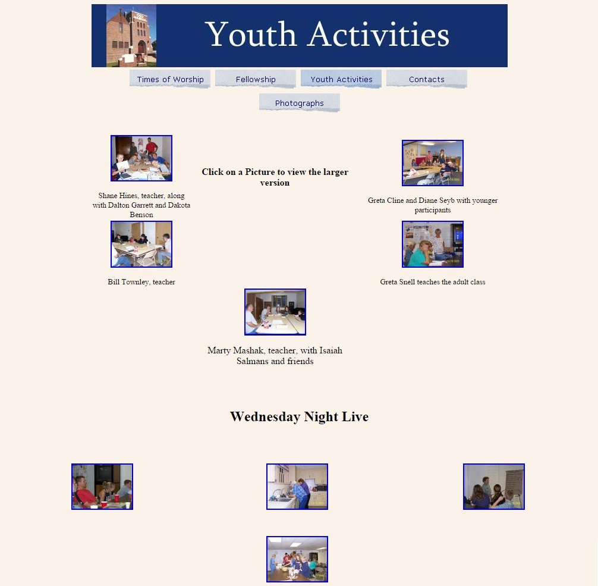
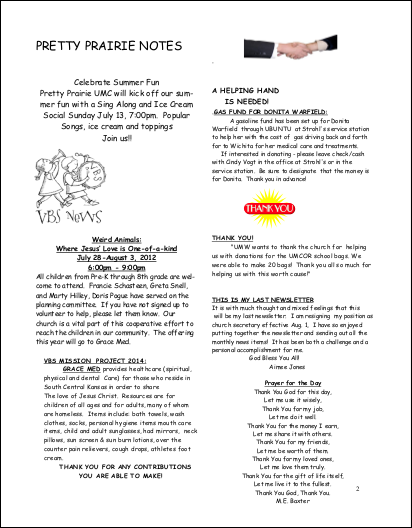
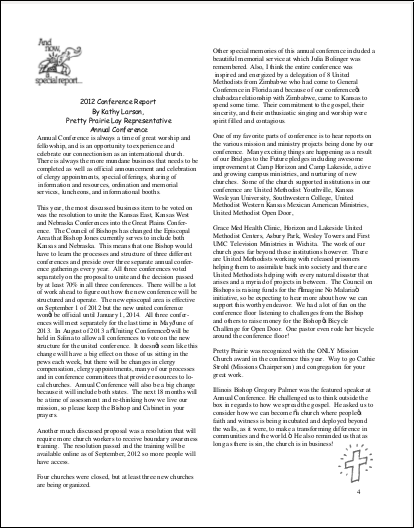
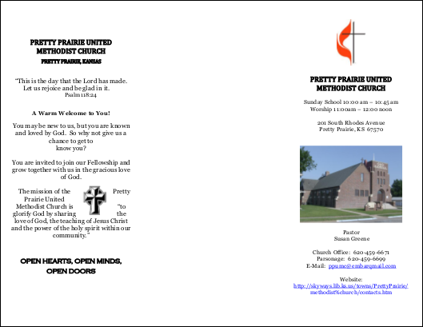
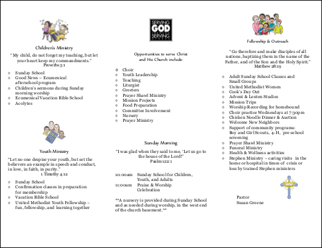
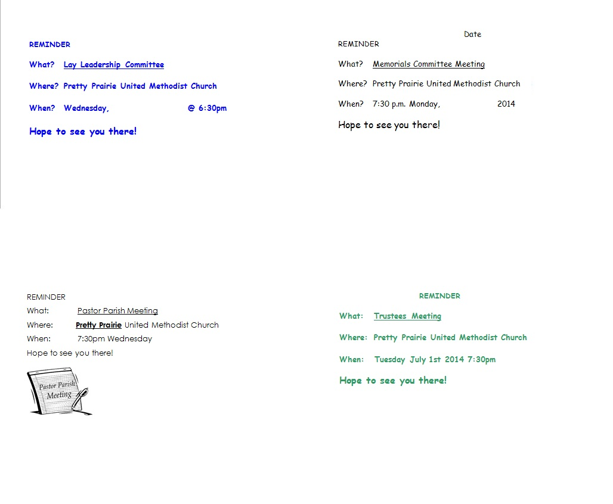

# As Is

The old church website and marketing materials were created by different people, at different times, with no thought to creating one consistent church brand experience spanning all materials.

## Old Marketing Materials

### Old Website
See [Lightning Demos](lightning_demos.md) section for a critique

### Old Newsletter

### Old Brochure

Outside 

Inside 

### Old Visitor Postcards

### Old Reminder Postcards

### Old Update Cards 

