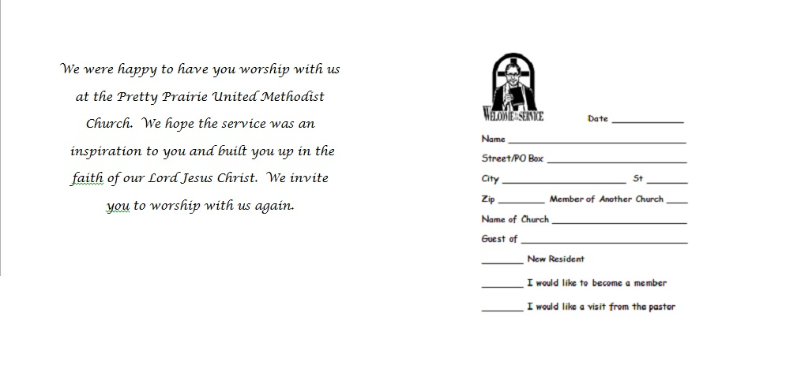
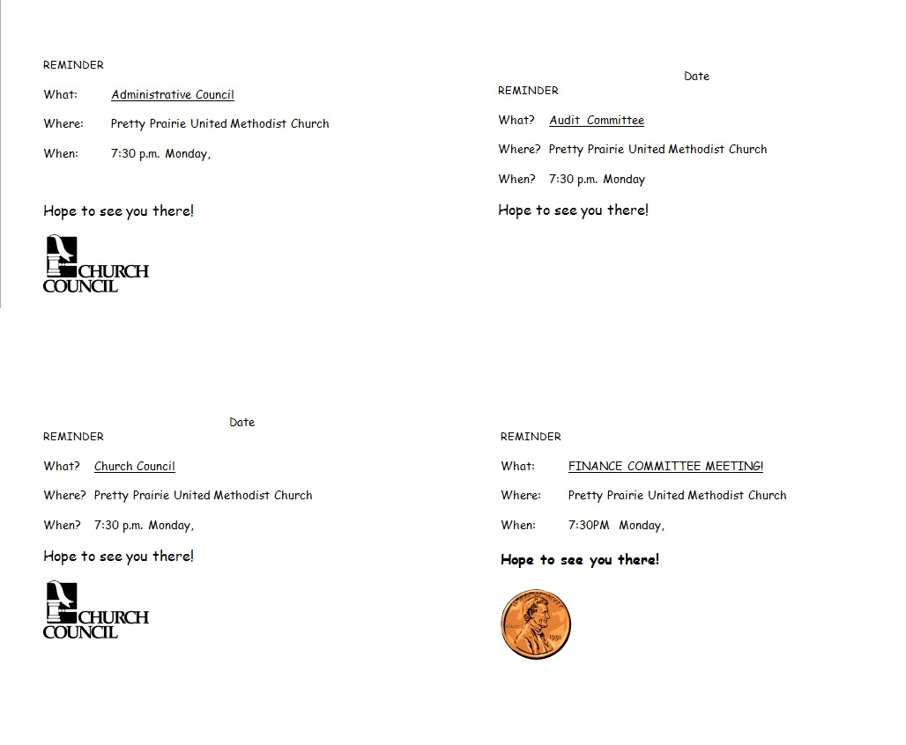
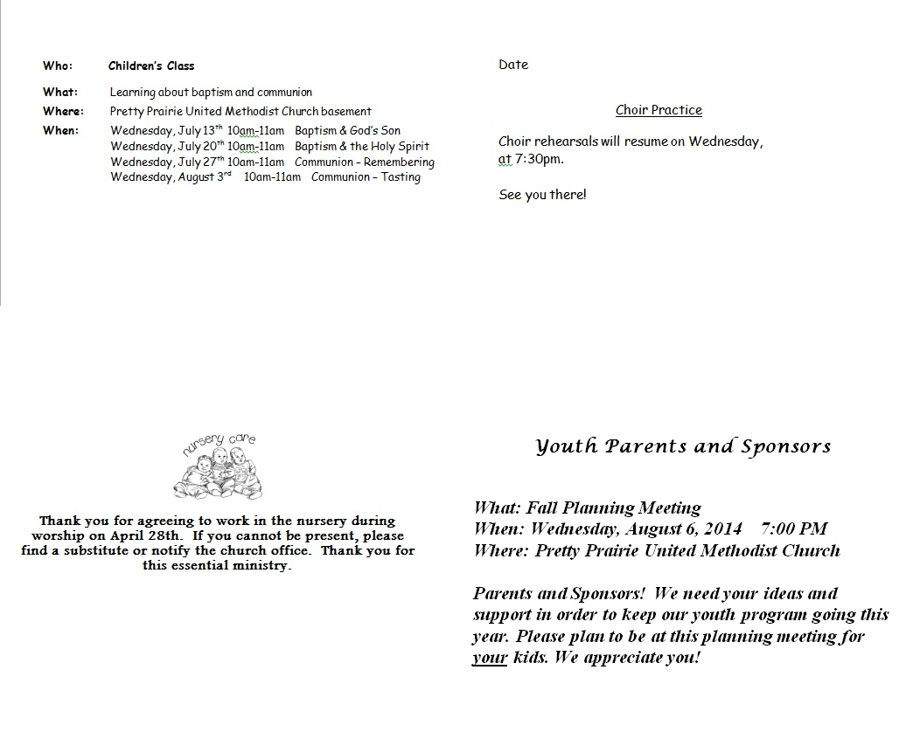

# As Is

The old church website and marketing materials were created by different people, at different times, with no thought to creating one consistent church brand experience spanning all materials.

## Old Website

## Old Newsletter

## Old Brochure

Outside 

Inside 

## Old Visitor Postcards

## Old Reminder Postcards

## Old Update Cards 

