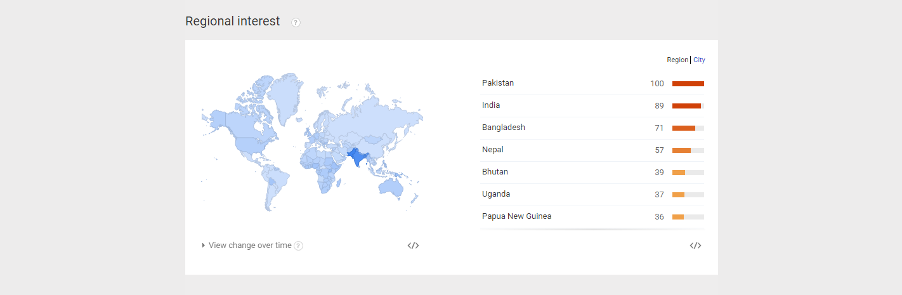

# Changing Global Landscape

"I skate to where the puck is going to be, not where it has been." - Wayne Gretzky

## Changing Lifestyles

Marc Andreessen ([@pmarca](https://twitter.com/pmarca)) famously wrote that [Software is Eating the World](http://online.wsj.com/article/SB10001424053111903480904576512250915629460.html). 

Balaji Srinivasan ([@balajis](https://twitter.com/balajis)) famously wrote that [Software is Reorganizing the World](http://www.wired.com/2013/11/software-is-reorganizing-the-world-and-cloud-formations-could-lead-to-physical-nations). 

Fred Wilson ([@fredwilson](https://twitter.com/fredwilson)) famously wrote that [Mobile is Eating the World](http://www.avc.com/a_vc/2013/06/mobile-is-eating-the-world.html). 

Though there is an "upper bound" to area population, as Balaji Srinivasan points out, "when cloud formations take physical shape, neither their scale nor duration has an upper bound." 

Mobile leap-frogging desktop

## Competitor Idea Maze
The competition (not who you might think)

## Google Trends Graph for Phrases "mobile" Versus "desktop"

Google Trends graph for phrases ["mobile" versus "desktop" (region: worldwide)](http://www.google.com/trends/explore#q=mobile%2C%20desktop&cmpt=q&tz=), from 2004 to 2015:

## Google Trends Graph for Phrase "mobile" 

Regional interest

1. Pakistan
2. India
3. Bangladesh
4. Nepal
5. Bhutan
6. Uganda
7. Papua New Guinea

(None are [developed countries](http://en.wikipedia.org/wiki/The_World_Factbook_list_of_developed_countries), 

## Google Trends Graph for Phrases "app" Versus "website"

Google Trends graph for phrases ["app" versus "website" (region: worldwide)](http://www.google.com/trends/explore#q=app%2C%20website&cmpt=q&tz=), from 2004 to 2015:

## What the Church Can Learn from Google Trends, Upworthy, and The Bible App 

There are both challenges and untapped opportunities. 

gauge the effectiveness of traditional and modern religious methods amid changing lifestyles. Insight into tech trends and which channels could be the best to use to reach people locally, or perhaps even worldwide.

The church should not aspire to be exactly like Upworthy or to copy The Bible App. However, the success of Upworthy and The Bible App provides important clues about how the United Methodist Church can stay relevant. There is still a market for religious and "uplifting" content. However, the messenger that stays relevant is increasingly the one that adapts to changes in today's modern lifestyles. The church may need to repackage its message and how the message is delivered if it is to continue to compete for the public's attention. 

http://en.wikipedia.org/wiki/List_of_countries_by_number_of_mobile_phones_in_use
http://en.wikipedia.org/wiki/Religions_by_country

* mobile and apps are increasing in popularity. In some developing countries, a mobile phone may be the first and only "computer" people can afford, which is perhaps why many of the countries recording the highest levels of Google Trends search interest for [The Bible App](the_bible_app_case_study.md) are African countries. 

Missed opportunities
* Due to lack of knowledge/foresight
* Pre-existing assumptions

* Changing lifestyles (digital and philosophical reorganization)

### The "Business" Opportunity
* Decreasing importance of physical proximity
* More channels (traditional and digital) than ever to reach people and more people than ever to reach
* New and undiscovered ways to minister

Power Laws
* Moore's Law
* The Law of Accelerating Returns
* Network Effect

http://en.wikipedia.org/wiki/List_of_countries_by_smartphone_penetration

