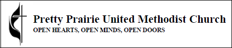

# Church Image Re-Brand

For the tl:dr go to [New Marketing Materials](new_marketing_materials.md) to see the new branding in use. 

Like the Pretty Prairie United Methodist Church itself, the new church theme will beautifully blend the traditional and the contemporary by incorporating the traditional United Methodist Church [black cross and flame](http://cdnfiles.umc.org/Website_Properties/Resources/graphics-library/cross-and-flame-bw-1058x1818.png) with a contemporary sunflower motif. 

Black cross and flame

 
Original, license-free, [Morgue File photo](http://www.morguefile.com/archive/display/662765) used in new materials

## Significance of the Sunflower

The Pretty Prairie United Methodist Church is in the state of Kansas (where the state flower is the sunflower), in a town called Pretty Prairie (where "pretty prairies" of sunflowers can be found in the vicinity). Yellow is a "warm" color, reminiscent of the sun. The sunflower symbolizes warm welcome, bright optimism, and renewal. 

## New Color Scheme

The new color scheme is the Microsoft Publisher "Tuscany" color scheme plus black

## New Sanctuary Equipment
