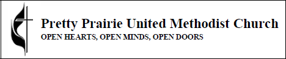
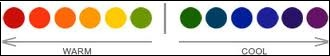

# Church Image Re-Brand

## New Sanctuary Equipment
As part of the church's revitalization effort, in addition to the new website, a generous donation was made by an anonymous donor to purchase new, large flat-screen televisions and a laptop for the church sanctuary, to be used to play contemporary videos and music, and to project the words of the hymns. 

## Marketing Materials Re-Brand
Like the Pretty Prairie United Methodist Church itself, the new church branding for the website and marketing materials beautifully blend the traditional and contemporary by incorporating the traditional United Methodist Church [black cross and flame](http://cdnfiles.umc.org/Website_Properties/Resources/graphics-library/cross-and-flame-bw-1058x1818.png) with a contemporary sunflower motif. 

Black cross and flame

 
Original, license-free, [Morgue File photo](http://www.morguefile.com/archive/display/662765) used in new materials

### Significance of the Sunflower

The Pretty Prairie United Methodist Church is in the state of Kansas (where the state flower is the sunflower), in a town called Pretty Prairie (where "pretty prairies" of sunflowers can be found in the vicinity). Yellow is a "warm" color, reminiscent of the sun. Like a congregation, a field sunflowers with their faces to the sun symbolizes warm welcome, bright optimism, and renewal. 

Yellow = warm color

### New Color Scheme

The new marketing materials color scheme is the Microsoft Publisher "Tuscany" color scheme plus black

