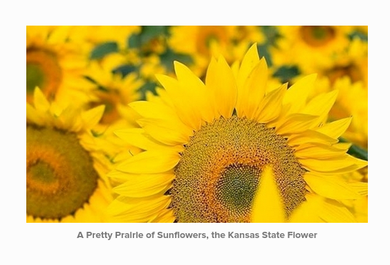
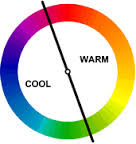

# Church Image Rebrand

Like the Pretty Prairie United Methodist Church itself, the new church theme will beautifully blend the traditional and the conventional by incorporating:
* The black version of the traditional United Methodist cross and flame
* A contemporary sunflower motif

# The Significance of the Sunflower

Above: A screenshot from the church's new website

The Pretty Prairie United Methodist Church is in the state of Kansas (where the state flower is the sunflower), in a town called Pretty Prairie (where "pretty prairies" of sunflowers can be found in the vicinity). 

Yellow is a "warm" color, reminiscent of the sun. The sunflower symbolizes warm welcome, bright optimism, and renewal. 

The sunflower symbolizes bright, "happy" faces turned toward the sky amid the warmth and promise of a new day.

The new church theme will strive whenever possible to use fewer materials, but with a common brand experience incorporated into all of them. For example, rather than having 12 slightly different post card designs, the church will have 1 beautifully branded post card design altered to suit the purpose. 
