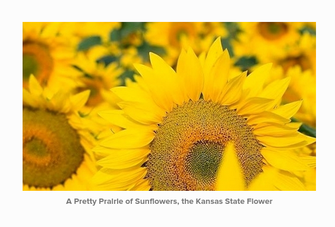
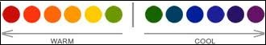

# Church Re-Imagined

Ideally, the church website and other materials would have a clean, modern, minimalistic look, with a lightweight, responsive layout that adapts well from desktop to mobile, and other devices. The website would have an intuitive content management system that could be used by non-techies and occasional volunteers. And the new marketing strategy would incorporate both traditional and modern methods in order to fit with changing lifestyles, and to reach the most people possible, perhaps even beyond city boundaries. 

# Church Image Rebrand

Like the Pretty Prairie United Methodist Church itself, the new church theme will beautifully blend the traditional and the conventional by incorporating:
* United Methodist Church [Official Black Cross and Flame](http://www.umc.org/resources/cross-and-flame)

 
* A contemporary sunflower motif

Original, license-free, Morgue File Photo

# The Significance of the Sunflower

Above: A screenshot from the church's new website

The Pretty Prairie United Methodist Church is in the state of Kansas (where the state flower is the sunflower), in a town called Pretty Prairie (where "pretty prairies" of sunflowers can be found in the vicinity). 

 
Yellow is a "warm" color, reminiscent of the sun. The sunflower symbolizes warm welcome, bright optimism, and renewal. 

The number of church outreach materials will be streamlined, with a common brand experience incorporated into them all. For example, instead of twelve inconsistently designed post cards, one beautiful postcard template will be created, then altered to suit the purpose at hand. 

Templates in both color and black-and-white will be created to address the impracticality of printing color copies versus sending electronically.

[United Methodist Church Brand Guidelines](http://www.umcom.org/tools/brand-guidelines)

[United Methodist Church Brand Manual](http://s3.amazonaws.com/Website_Properties_UGC/tools/documents/brand_manual_12-01.pdf)
