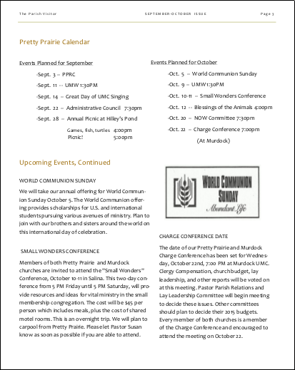
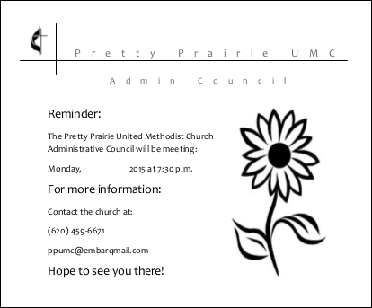

# Church Re-Imagined :)

## Church Image Rebrand

Like the Pretty Prairie United Methodist Church itself, the new church theme will beautifully blend the traditional and the contemporary by incorporating the traditional United Methodist Church [black cross and flame](http://cdnfiles.umc.org/Website_Properties/Resources/graphics-library/cross-and-flame-bw-1058x1818.png) with a contemporary sunflower motif. 

Original, license-free, Morgue File Photo used in new materials

### Significance of the Sunflower

The Pretty Prairie United Methodist Church is in the state of Kansas (where the state flower is the sunflower), in a town called Pretty Prairie (where "pretty prairies" of sunflowers can be found in the vicinity). Yellow is a "warm" color, reminiscent of the sun. The sunflower symbolizes warm welcome, bright optimism, and renewal. 

### Color Scheme

## New Materials

The number of church outreach materials will be streamlined, with a common brand experience incorporated into them all. For example, instead of twelve inconsistently designed post cards, one beautiful postcard template will be altered to suit the purpose at hand. 

Templates in both color and black-and-white will be used to address the impracticality of printing color copies versus sending electronically.

### New Website
[www.prettyprairieumc.org](www.prettyprairieumc.org)

### New Facebook Page

### New e-Newsletter
(Some information altered to protect privacy) 

### New Bulletin (example)

Front cover

Inside

### New Multi-Purpose Greeting Card (example)

Front cover 

Inside 

Back cover 

### New Multi-Purpose Postcard (example)

