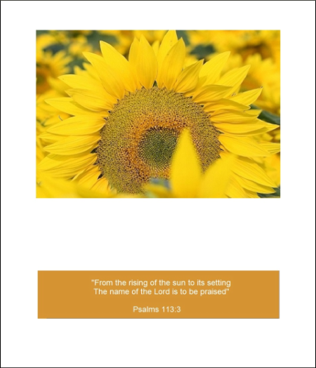

# Church Re-Imagined :)

## Church Image Rebrand

Like the Pretty Prairie United Methodist Church itself, the new church theme will beautifully blend the traditional and the conventional by incorporating:

## New Website
[www.prettyprairieumc.org](www.prettyprairieumc.org)

## New Facebook Page

## New e-Newsletter
(Some information altered to protect privacy) 

## New Bulletin (example)

Front cover

Inside

## New Multi-Purpose Greeting Card (example)

Front cover 

Inside 

Back cover 

## New Multi-Purpose Postcard (example)

