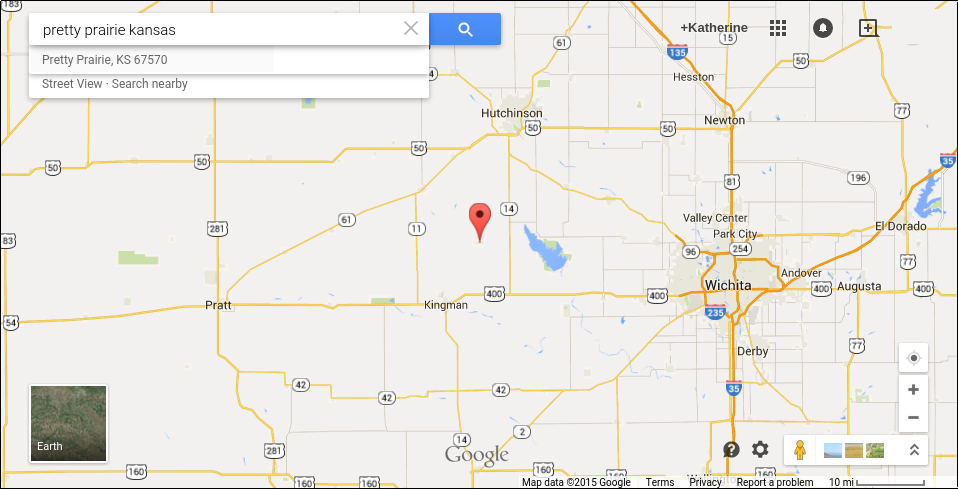

# Research and Design Sprint

## What is This All About?
I conducted a Research and Design Sprint loosely based on the Google Ventures [Research Sprint](http://www.gv.com/lib/the-gv-research-sprint-a-4-day-process-for-answering-important-startup-questions) and [Design Sprint](http://www.gv.com/sprint) models. 

The point of the Research and Design Sprint is to design and user test a minimal, but realistic prototype without the time and expense of creating a full version. 

## People and Supplies
Taking stock of supplies on hand

#### Supplies Needed
* Sticky notes 
* Drawing pens 
* Whiteboard
* Whiteboard markers
* Dot stickers (for voting)
* Timer 
* Snacks 
* Sticky stuff

* And a working space

#### People Needed

At least one person

A complex Research and Design Sprint might include: 
* Facilitator
* CEO (buy-in/decision-maker)
* Designer
* Product manager
* User expert 
* Engineer
* Marketer

## Research Sprint Basics

### Understand the "Problem"

* What questions do you want to answer?
* What features/tasks do you want to test?

[Google Ventures Questions to Ask Before Starting User Research](http://www.gv.com/lib/questions-to-ask-before-starting-user-research)

### Demographic Info

Pretty Prairie, Central Kansas, West of Wichita

North of Kingman, South of Hutchinson, near the Amish community of Yoder

Through the national United Methodist Church, I obtained the most recent Nielson Company demographic info for the city of Pretty Prairie, Kansas. 

Important points:

Pretty Prairie [Area Map](https://drive.google.com/file/d/0B02bpu7HZwJRaVp5dGNMOUpYbU0/view?usp=sharing)

[Executive Summary](https://drive.google.com/file/d/0B02bpu7HZwJRMFJTM3BWZXprbWM/view?usp=sharing)

[Household Trends](https://drive.google.com/file/d/0B02bpu7HZwJRV1dnSGplRUxmMDg/view?usp=sharing)

[Pop-Facts: Census Demographic Overview 2014 Report](https://drive.google.com/file/d/0B02bpu7HZwJRSHFwVm5kX0FHMmc/view?usp=sharing)

[Population by Age and Race Trend 2014](https://drive.google.com/file/d/0B02bpu7HZwJRelJTXzd1XzVWUE0/view?usp=sharing)

## Design Sprint

* Business opportunity 
* Lightning demos 
* Lay it out 
* Success metrics — Ex. Kerry Rodden’s HEART framework.
* Existing research 
* Team interviews
* Analytics

Can do User Studies/Microstudies/Team Interviews ahead of time if needed

Sketch the most important user story (as a group) = visual map

* Choose parts of the problem (divide up user story)
* Take notes (5 minutes) "how might we"
* Mind map (10–15 minutes)
* Crazy Eights (5 minutes)
* Storyboard (10–20 minutes)
* Three-minute critiques (3 minutes per idea)

* Whiteboard the final user story (comic book frames)
* Create protoype

### User Testing

* Define favorable and unfavorable user criteria
* Post ad for users, including link to recruiting screener questionnaire

When you have identified prospective users: 

* Call the prospective users by phone
* Send a follow-up email, including important info and a link to non-disclosure agreement to sign; Request prospective user to reply to confirm

Example confirmation email

Example non-disclosure agreement

* Create interview guide

Example interview guide

* Conduct user study
* Summarize and analyze findings

