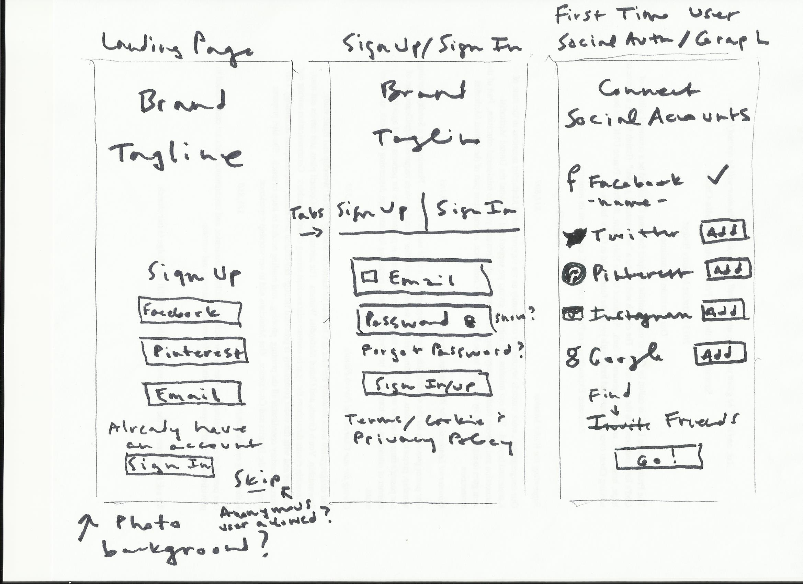
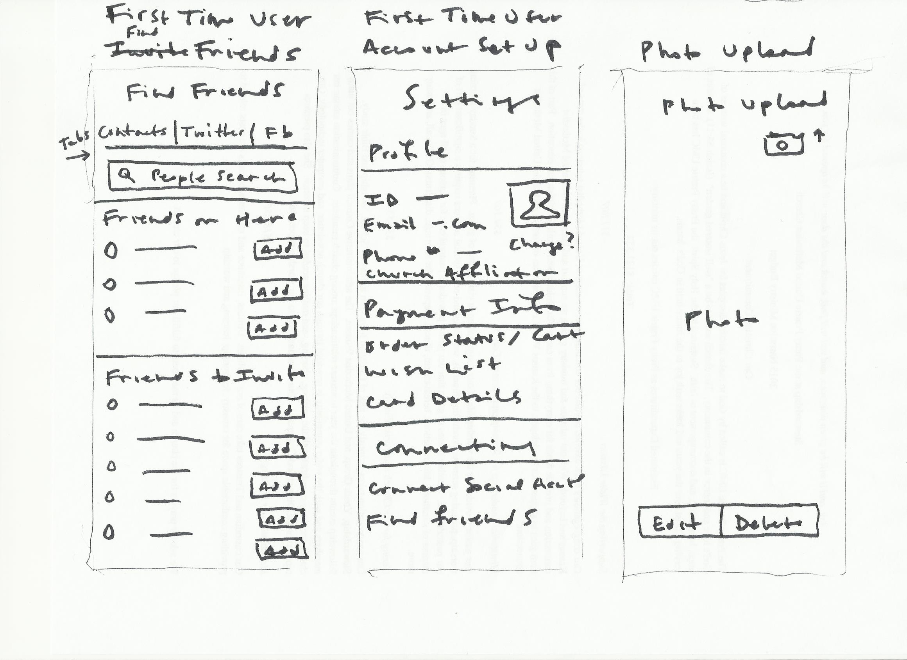
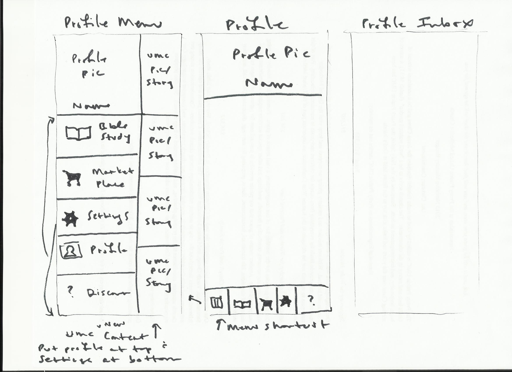
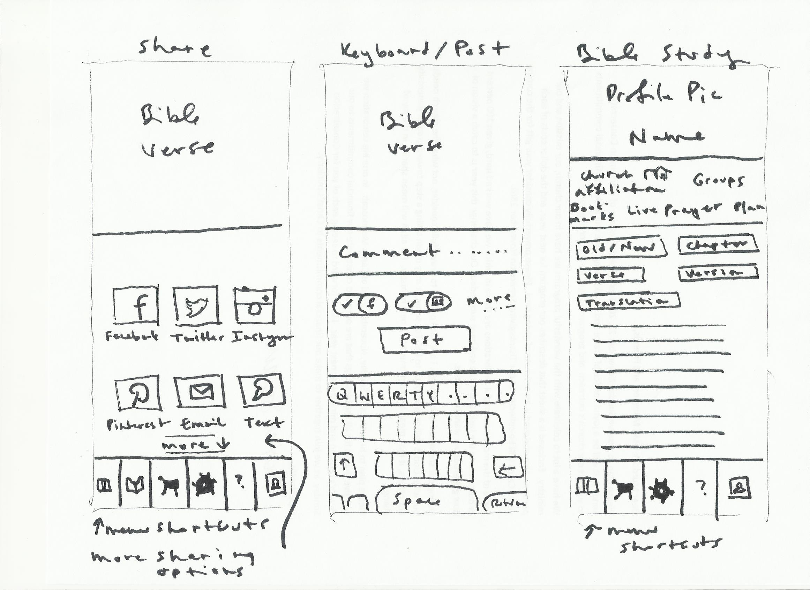
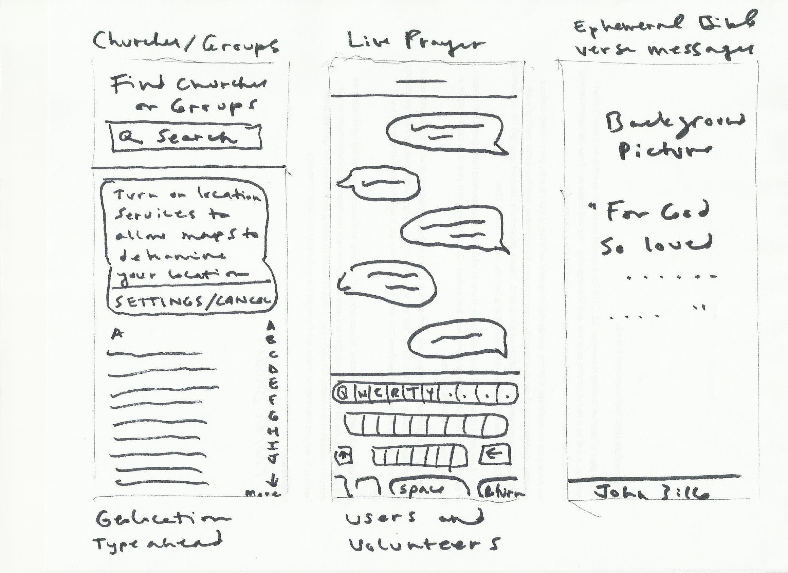
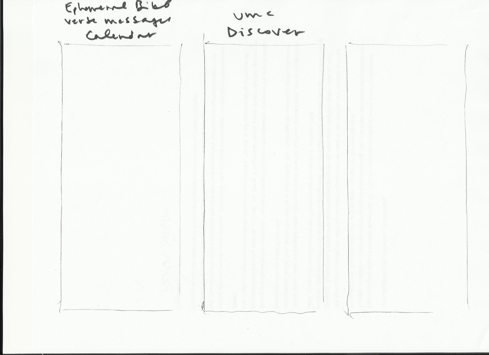

# Design Sprint

## People and Supplies
Taking stock of resources on hand

### [Supplies Needed](http://amzn.com/lm/RS9AYY6BTLDCM)
* Paper
* Sticky notes 
* Drawing pens 
* Whiteboard
* Whiteboard markers
* Dot stickers (for voting)
* Sticky stuff
* Timer 
* Snacks 

* And a working space

### People Needed

I would do most of the design work alone, and act as facilitator for select brainstorming and planning group work, particularly involving the church's Nurture Outreach Witness (NOW) Committee, which plans outreach for the church. 
## Design Sprint Process

### Lightning Demos

 See [Case Studies](case_studies.md) for lightning demos of.... 
* [The National United Methodist Church](the_national_united_methodist_church_case_study.md)
* [LifeChurch and The Bible App](lifechurch_and_the_bible_app_case_study.md)
* [Upworthy](upworthy_case_study.md)
* [Watsi](watsi_case_study.md)

### User Story

Sketch of most important user story

Prioritized list of tasks users could accomplish

User story divided into parts

### Mind map

#### Soft Systems Rich Picture

### Storyboard
What I intended to be Crazy Eights become more like a Storyboard. I felt that after a critique, I could move on to a prototype. 

### Prototype

See [Prototype](prototype.md)