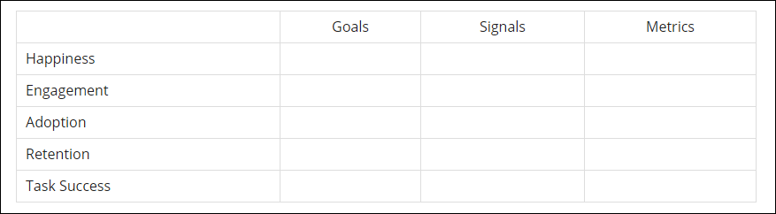

# Design Sprint

## People and Supplies
Taking stock of resources on hand

### [Supplies Needed](http://amzn.com/lm/RS9AYY6BTLDCM)
* Paper
* Sticky notes 
* Drawing pens 
* Whiteboard
* Whiteboard markers
* Dot stickers (for voting)
* Sticky stuff
* Timer 
* Snacks 

* And a working space

### People Needed

I would do most of the design work alone, and act as facilitator for select brainstorming and planning group work, particularly involving the church's Nurture Outreach Witness (NOW) Committee, which plans outreach for the church. 
### Facilitation: Reverse Engineering for Success

The idea for reverse engineering came from this article:

## Design Sprint Process

### Lightening Demos

See [Marketing As Is](marketing_as_is.md) for an analysis of Pretty Prairie United Methodist Church's marketing as is. 

See [Lightning Demos](lightning_demos.md) for analysis of the websites of other area churches. 

### Problem Structuring and Problem Solving Methods

#### Soft Systems Rich Picture

#### User Story

Sketch of most important user story

User story divided into parts

#### Mind map

Mind map 

#### Crazy Eights

Crazy Eights 

#### Storyboard

Storyboard 

Critiques to decide final user story

Whiteboard of final user story 

#### Prototype

See [Prototype](prototype.md)

## Metrics

### HEART/Goals-Signals-Metrics Framework

Example [HEART/Goals-Signals-Metrics](https://www.gv.com/lib/how-to-choose-the-right-ux-metrics-for-your-product) chart from Google Ventures

### Quality Function Deployment

[House of Quality](http://en.wikipedia.org/wiki/House_of_Quality)