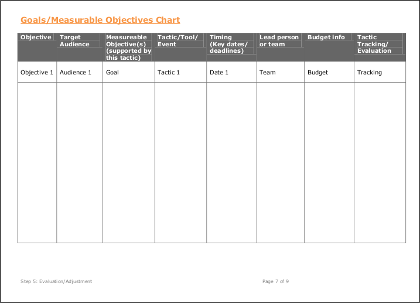

# Design Sprint

## People and Supplies
Taking stock of supplies on hand

### [Supplies Needed](http://amzn.com/lm/RS9AYY6BTLDCM)
* Paper
* Sticky notes 
* Drawing pens 
* Whiteboard
* Whiteboard markers
* Dot stickers (for voting)
* Sticky stuff
* Timer 
* Snacks 

* And a working space

### People Needed

I would do most of the design work alone, and act as facilitator for select brainstorming and planning group work, particularly involving the church's Nurture Outreach Witness (NOW) Committee, which handles community outreach for the church. 

## Design Sprint Process

### "How might we"

Members of the Nurture, Outreach, Witness (NOW) Committee would begin to collaborate on a new church marketing plan. In preparation for their group work, I provided the NOW Committee with an example plan, a [Marketing Plan Worksheet](http://s3.amazonaws.com/Website_Properties_UGC/market-your-church/documents/UMCOM_YOUR_MARKETING_PLAN_WORKSHEET.PDF), and a ["Tactics" List](http://s3.amazonaws.com/Website_Properties_UGC/market-your-church/documents/STEP_4_IMPLEMENTATION_HOMEWORK.PDF) taken from the [United Methodist Communications](http://www.umcom.org) [Marketing Audit](http://www.umcom.org/learn/market-your-church-getting-started). 

See [New Marketing Strategy](new_marketing_strategy.md) for the finished result. See also [Advanced Marketing Options](advanced_marketing_options.md) for a list of advanced marketing options :).

### Lightening Demos

See [Marketing As Is](marketing_as_is.md) for an analysis of Pretty Prairie United Methodist Church's marketing as is. 

See [Lightning Demos](lightning_demos.md) for analysis of the websites of other area churches. 

### Problem Structuring and Problem Solving Methods

#### Soft Systems Rich Picture

#### User Story

Sketch of most important user story

User story divided into parts

#### Mind map

Mind map 

#### Crazy Eights

Crazy Eights 

#### Storyboard

Storyboard 

Critiques to decide final user story

Whiteboard of final user story 

#### Prototype

See [Prototype](prototype.md)

## Metrics

### HEART/Goals-Signals-Metrics Framework

Example [HEART/Goals-Signals-Metrics](https://www.gv.com/lib/how-to-choose-the-right-ux-metrics-for-your-product) chart from Google Ventures

### Goals and Measurable Objectives Chart

[United Methodist Communications](http://www.umcom.org) suggests using a Goals and Measurable Objectives Chart as part of the [Evaluation Step](http://www.umcom.org/learn/evaluation-adjustment-resources) of its [Marketing Audit](http://www.umcom.org/learn/market-your-church-getting-started). 

United Methodist Goals and Measurable Objectives example chart

### Quality Function Deployment

[House of Quality](http://en.wikipedia.org/wiki/House_of_Quality)