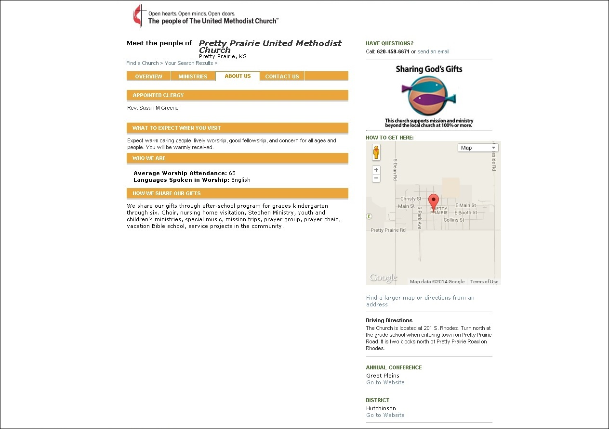

# Executive Summary

## Part 1
## Proposition
[Pretty Prairie](http://en.wikipedia.org/wiki/Pretty_Prairie,_Kansas) is a rural farming community (population 688) in central Kansas. 

Members of the Pretty Prairie United Methodist Church, a congregation of around 200 members, contacted me about designing a new website, marketing materials, and marketing plan for the church. 

## Problem

### No Website
The church's previous website, which had been made using a technique called [Flash](http://en.wikipedia.org/wiki/Adobe_Flash), was no longer in existence because [the web host had stopped hosting](https://kslib.info/1013/Blue-Skyways-Transition). I made the screenshot below of the website welcome page by locally rendering files that I recovered from the web host. 

### Find-a-Church Page

Without an independent website, the church was making due with a Find-a-Church page, (a basic information page hosted for free by the national United Methodist Church.

### Revitalization Effort

In addition to the website, church members were also ready for a new community outreach campaign. 

## Solution

I would Project Manage a modern new website, marketing materials, and marketing plan for the Pretty Prairie United Methodist Church. Anytime possible, the project would utilize low-cost options and pre-existing resources. 

## Part 2
Also, in the process of doing research for the outreach campaign, I learned about problems (and opportunities) facing the national [United Methodist Church](http://www.umc.org). I conducted a [Research and Design Sprint](http://www.gv.com/sprint) to re-imagine the national United Methodist Church's mobile presence, in line with trends in tech and United Methodist membership.
