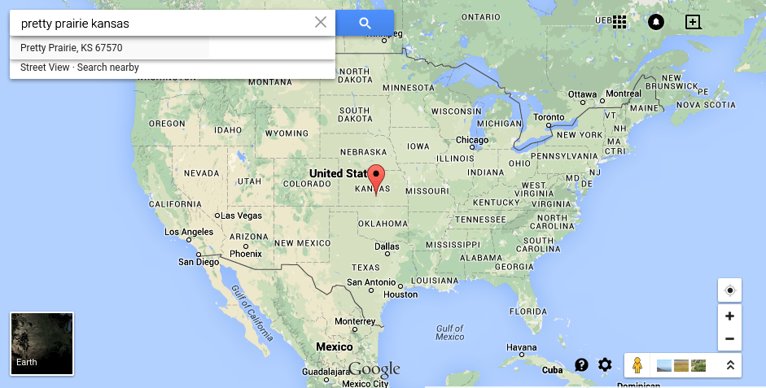

# Executive Summary

## Note: 
For the tl:dr, check out [Marketing As Is](marketing_as_is.md) and [Church Re-Imagined](church_re-imagined.md) :) 

## Proposition

Members of the Pretty Prairie United Methodist Church, a congregation of around 65 in the rural farming community of [Pretty Prairie](http://en.wikipedia.org/wiki/Pretty_Prairie,_Kansas) in Kansas, contacted me about designing a new website and marketing plan for the church. 

Pretty Prairie, Kansas, U.S.A.

## Problem
The church's previous website, which had been made using a technique called [Flash](http://en.wikipedia.org/wiki/Adobe_Flash), was no longer in existence because [the web host had stopped hosting](https://kslib.info/1013/Blue-Skyways-Transition). I made the screenshot below of the website welcome page by locally rendering files that I recovered from the web host. See [As Is](as_is.md) for screenshots of the entire old website.

### Find-a-Church Page

Without an independent website, the church was making due with a Find-a-Church page, (a basic information page hosted for free by the national [United Methodist Church](http://www.umc.org)).

## Solution

I would project manage a modern new website and marketing plan for the church, using low-cost tools and available resources.
