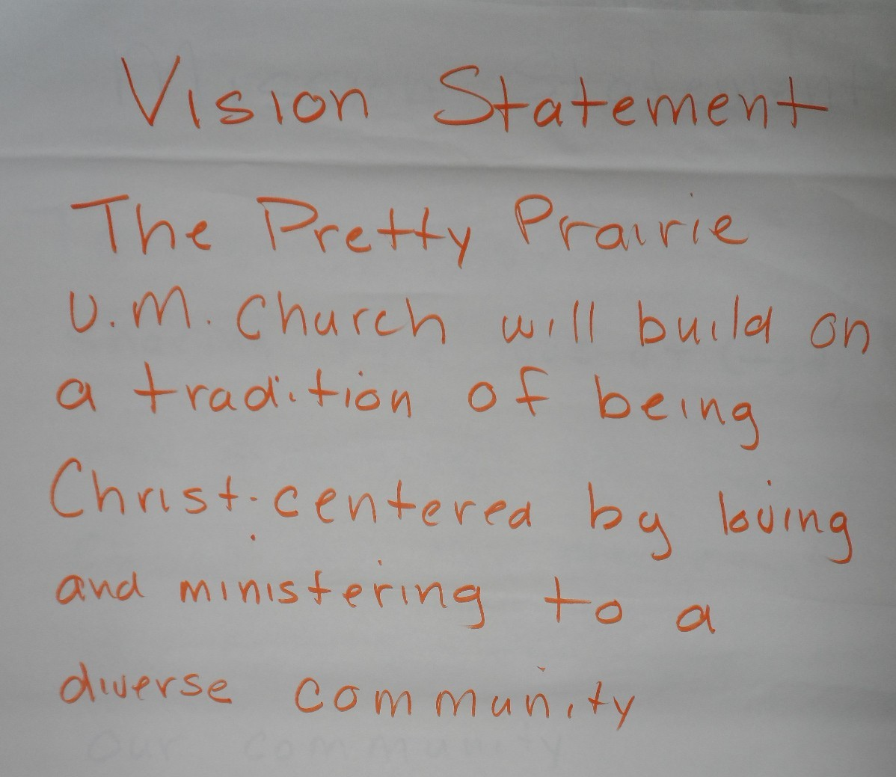

# Facilitation and User Testing

## Reverse Engineering for Success
We would use problem structuring methods to answer the following questions:

* What does a successful Pretty Prairie United Methodist Church look like?
* Whom should the church reach?
* How should the church reach them?
* How should the church measure progress?

## Facilitation 

Members of Administrative Council Committee and Nurture, Outreach, Witness (NOW) Committee, which both plan outreach for the church, began to collaborate on a new church marketing plan. Using the United Methodist Communications [Marketing Audit](http://www.umcom.org/learn/market-your-church-getting-started) and [Marketing Audit Worksheet](http://s3.amazonaws.com/Website_Properties_UGC/market-your-church/documents/UMCOM_YOUR_MARKETING_PLAN_WORKSHEET.PDF) (with a few adaptations), I would use group facilitation during the normal NOW Committee and Administrative Council Committee meetings to collect the information needed to create the marketing plan. 

### Step 1: Values and Vision Deliverables

Deliverables:
* Core Values
* Demographics
* Vision Statement
* Key Messaging/Elevator Statement

#### Core Values Brainstorming Results
* Christ-centered, ecumenical
* friendly, welcoming, inclusive
* community-centered, part of local community, diverse community, bringing community together
* open hearts, open minds, open doors

#### Demographics
A story was told by a committee member of having once been a member of a large church and being hesitant to go up to people to welcome them because there were so many people, it was difficult to tell regular church-goers from guests. It was pointed out that knowing exactly who is a regular church-goer and who isn't is one of the advantages of a smaller church. 

#### Church Vision and Mission Statements
We started by reflecting on the existing Vision and Mission Statements

Church Vision Statement

Church Mission Statement

#### Key Messaging/Elevator Statement

It was decided by the group that the Vision Statement is the Key Message/Elevator Statement. 

### Step 2: Perception and Needs
In process

### Step 3: Strategy
Homework/Marketing Plan Deliverables
* S.W.O.T. (strengths, weaknesses, opportunities, threats)
* Target Audience
* Strategic Objective
* Goals
* Resources

#### S.W.O.T
The group chose to use N.O.I.S.E instead of S.W.O.T.

#### Target Audience

It was determined through facilitation that the committees sought to target young people, including young families and single parents, perhaps using tactics that would offer practical support.

Marketing Worksheet Target Audience Deliverable

