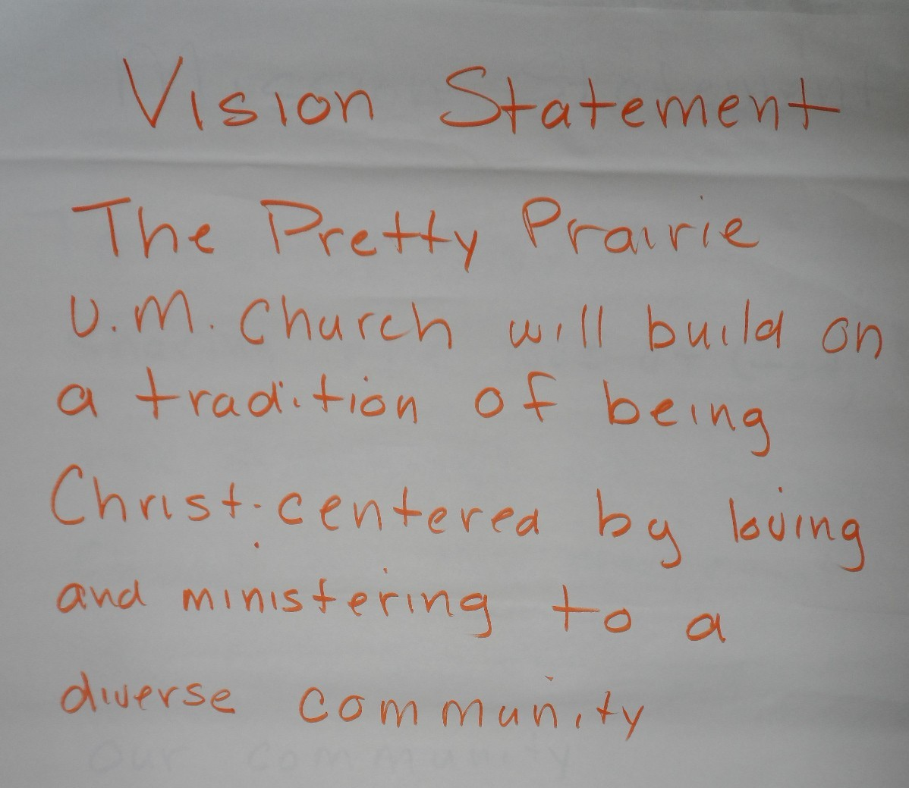
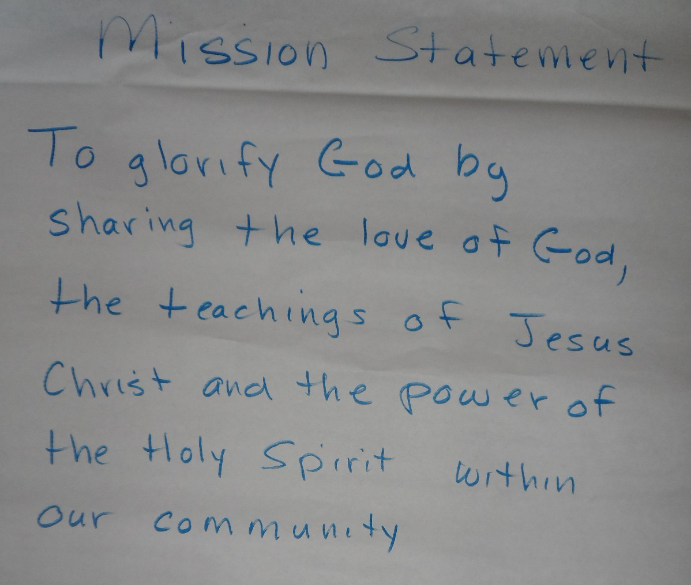
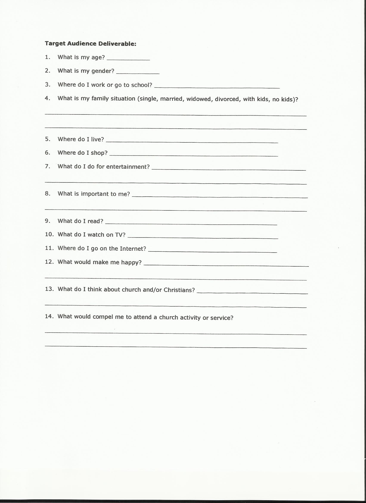
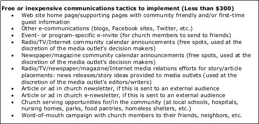
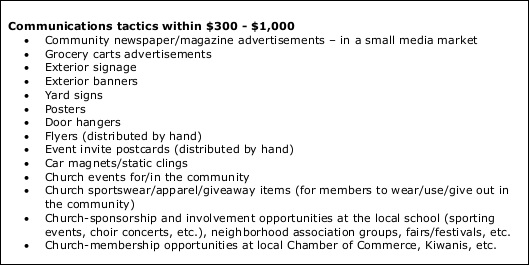
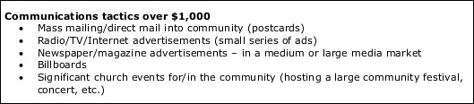

# Facilitation and User Testing

## Facilitation 

### "How might we"

Members of the Nurture, Outreach, Witness (NOW) Committee, which plans outreach for the church, would begin to collaborate on a new church marketing plan. I would be the facilitator for brainstorming and planning group work. 

We would start by reflecting on the existing Vision and Mission Statements

Church Vision Statement

Church Mission Statement

## Problem Structuring and Problem Solving Methods

### Reverse Engineering for Success
We would then seek to answer the following questions:

* What does a successful Pretty Prairie United Methodist Church look like?
* Whom should the church reach?
* How should the church reach them?

In preparation for their group work, I had provided the NOW Committee with an example plan, a [Marketing Plan Worksheet](http://s3.amazonaws.com/Website_Properties_UGC/market-your-church/documents/UMCOM_YOUR_MARKETING_PLAN_WORKSHEET.PDF), and a ["Tactics" List](http://s3.amazonaws.com/Website_Properties_UGC/market-your-church/documents/STEP_4_IMPLEMENTATION_HOMEWORK.PDF) taken from the [United Methodist Communications](http://www.umcom.org) [Marketing Audit](http://www.umcom.org/learn/market-your-church-getting-started). 
Marketing Worksheet Demographic Sheet

Tactics less than $300 

Tactics between $300 and  

Tactics over $1000 

Audiences, tactics, and resources

Look at a list of possible methods suited to available resources

Analyze target audiences to determine which methods would be suitable to each audience
Prioritize tactics

### Nielson Company Demographic Info

### Goals and Measurable Objectives Chart

[United Methodist Communications](http://www.umcom.org) suggests using a Goals and Measurable Objectives Chart as part of the [Evaluation Step](http://www.umcom.org/learn/evaluation-adjustment-resources) of its [Marketing Audit](http://www.umcom.org/learn/market-your-church-getting-started). 

United Methodist Goals and Measurable Objectives example chart

## User Testing

