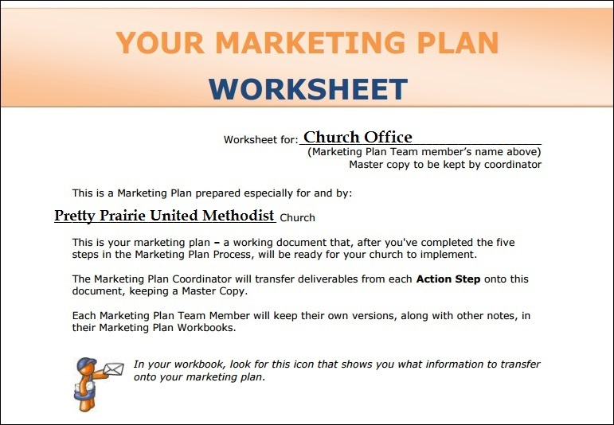
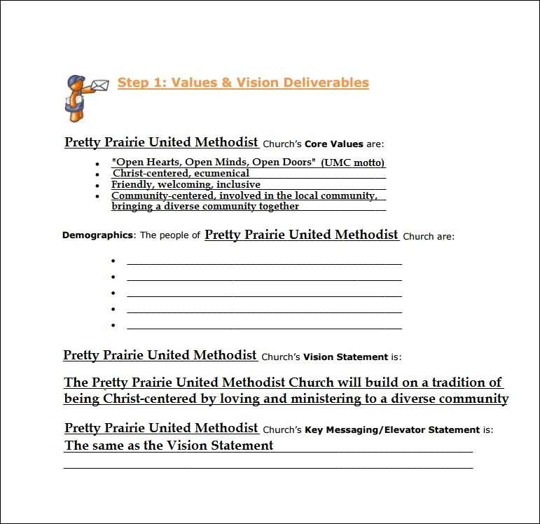
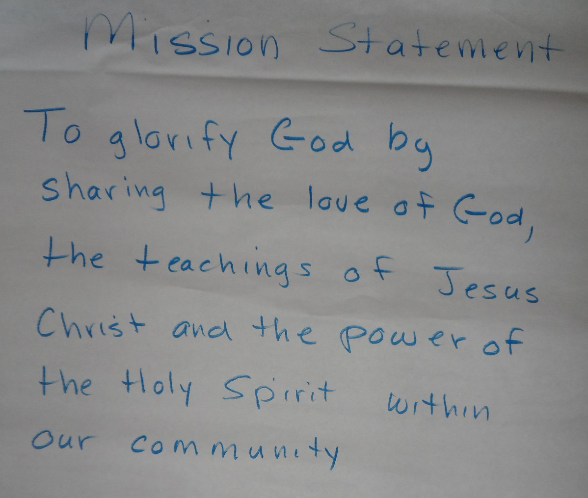
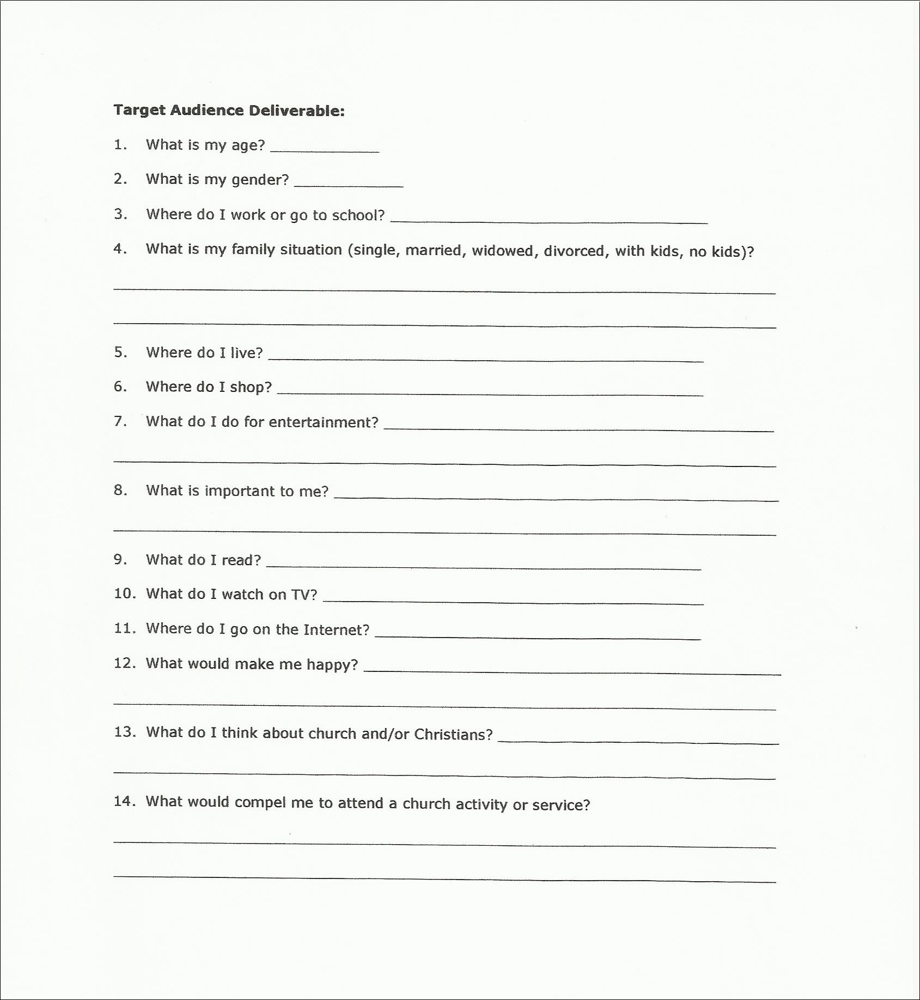
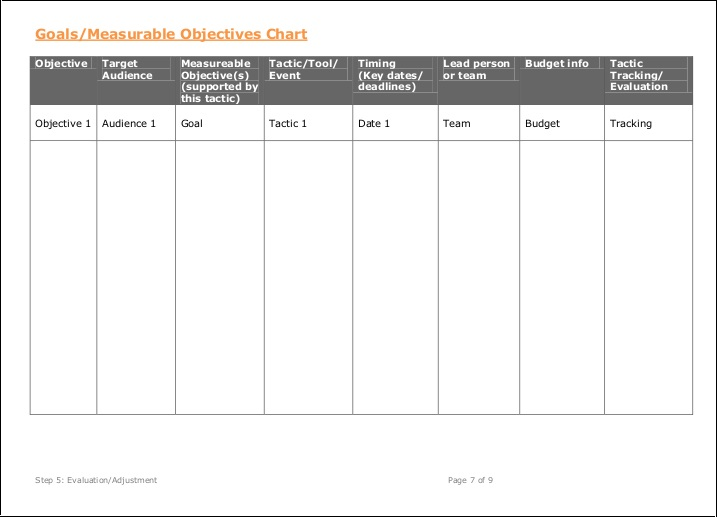

# Facilitation and User Testing

## Reverse Engineering for Success
We would use problem structuring methods to answer the following questions:

* What does a successful Pretty Prairie United Methodist Church look like?
* Whom should the church reach?
* How should the church reach them?
* How should the church measure progress?

## Facilitation 

Members of the Administrative Council Committee and the Nurture, Outreach, Witness (NOW) Committee, which both plan outreach for the church, began to collaborate on a new church marketing plan. 

In preparation for their group work, I provided them with resources from the [United Methodist Communications](http://www.umcom.org) [Marketing Audit](http://www.umcom.org/learn/market-your-church-getting-started), including a [Marketing Plan Worksheet](http://s3.amazonaws.com/Website_Properties_UGC/market-your-church/documents/UMCOM_YOUR_MARKETING_PLAN_WORKSHEET.PDF), and ["Tactics" List](http://s3.amazonaws.com/Website_Properties_UGC/market-your-church/documents/STEP_4_IMPLEMENTATION_HOMEWORK.PDF). 

I would use the [Marketing Plan Worksheet](http://s3.amazonaws.com/Website_Properties_UGC/market-your-church/documents/UMCOM_YOUR_MARKETING_PLAN_WORKSHEET.PDF) (with a few adaptations), while facilitating the NOW and Administrative Council Committees during their normal meetings to collect the information needed to create the marketing plan. 

Marketing Plan Cover Page

### Step 1: Values and Vision Deliverables

Deliverables:
* Core Values
* Demographics
* Vision Statement
* Key Messaging/Elevator Statement

Marketing Plan Values and Vision Deliverables

#### Core Values Brainstorming Results
* Christ-centered, ecumenical
* friendly, welcoming, inclusive
* community-centered, part of local community, diverse community, bringing community together
* open hearts, open minds, open doors

#### Demographics
Population: ~688

A story was told by a committee member of having once been a member of a large church and being hesitant to go up to people to welcome them because there were so many people, it was difficult to tell regular church-goers from guests. It was pointed out that knowing exactly who is a regular church-goer and who isn't is one of the advantages of a smaller church, and being able to identify who is in need is one of the advantages of a small town. 

#### Church Vision and Mission Statements
We reflected on the Vision Statement, as well as the Mission Statement

Church Vision Statement: "The Pretty Prairie United Methodist Church will build on a tradition of being Christ-centered by loving and ministering to a diverse community."

Church Mission Statement

#### Key Messaging/Elevator Statement
It was decided by the group that the Vision Statement is the Key Message/Elevator Statement. 

### Step 2: Perception and Needs
Homework
1. Perception ("Understand the church's view of itself and the community's view")
2. Community Needs ("Open your eyes to your congregation and community's needs then determine if your church already has resources/abilities to meet those needs or if new ministries need to be developed.")

### Step 3: Strategy
Homework/Marketing Plan Deliverables
* S.W.O.T. (strengths, weaknesses, opportunities, threats)
* Target Audience

#### S.W.O.T
The group chose to use [N.O.I.S.E.](http://create-learning.com/article/manager-training/noise-analysis-an-alternative-to-swot-strategic-planning) (Needs, Opportunties, Improvements, Successes, Exceptions) instead of S.W.O.T.

##### Needs (of the community)
The committee members identified "offering services where there is a gap" as a major opportunity. Examples:
* a weekly get together for kids (particularly low-income) during summer, when school is out and Community Youth Group does not meet, featuring activities (movies, songs), meals
* classes for parents, such as preparing budget-friendly meals, or finance 101
* home maintenance for the elderly
* estate planning, farm succession planning

##### Opportunities
The committee members felt that the opportunities were the same as the needs. 

##### Improvements
* Getting people to come in and possibly stay (health clinic as example)
* Finding ways to go outside of the church and minister to the community (thinking outside the box)

##### Successes
* friendly people
* lots of leadership in the community
* involved in many community initiatives and events (for instance Food Bank and all-churches VBS)

##### Exceptions
* there are many people in the church with special skills
* if you want to be in a leadership role in the church, you can; there is not a sense of territoriality. 

#### Target Audience

It was determined through facilitation that the committees sought to target young people, particularly low-income and single-parent families with little or no support system, perhaps using tactics that would offer practical support.

Example Target Audience Deliverable Worksheet

After having identified the target audiences, we would look at a list of possible tactics and compare against available resources. We would also consider which methods would be best suited to which audiences. 

### Step 4: Implementation
Prepare:
* Budget information

Action Steps
1. Tactics Brainstorming & Prioritizing Session
2. Marketing Plan Development & Review
3. Implementation

Marketing Plan Deliverables
* Goals/measurable objectives with supporting tactics
* Timing/deadlines
* Person/team coordinating

* Strategic Objective
* Goals
* Resources

United Methodist Communications suggests using a Goals and Measurable Objectives Chart as part of the [Evaluation Step](http://www.umcom.org/learn/evaluation-adjustment-resources) of its Marketing Audit. 

United Methodist Goals and Measurable Objectives example chart

#### Step 5: Evaluation/Adjustment