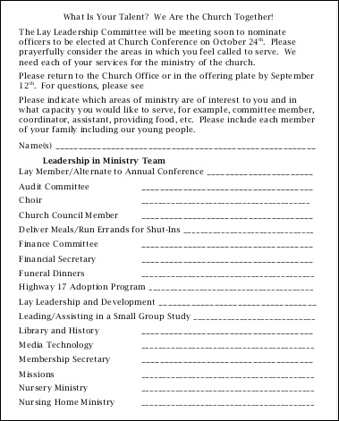
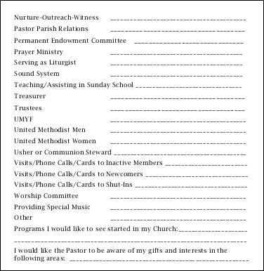
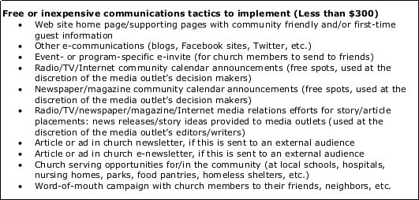
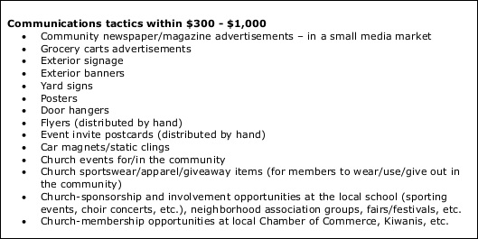
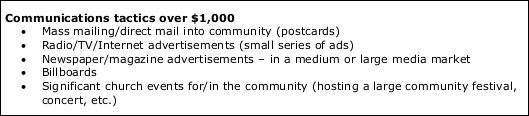

# Facilitation and User Testing

## Facilitation 

Members of Administrative Council Committee and Nurture, Outreach, Witness (NOW) Committee, which both plan outreach for the church, began to collaborate on a new church marketing plan. I facilitated the group using the following United Methodist Communications resources:

* [Annual Church Health Check Up](http://www.umcom.org/learn/take-an-annual-church-health-checkup)
* [Marketing Audit](http://www.umcom.org/learn/market-your-church-getting-started)
* [Communication Audit](http://www.umcom.org/services-products/audit-resources)
* [Re-Think Church](http://www.umcom.org/rethink-church)
* [Small Membership Church Ministries](http://www.greatplainsumc.org/smallmembershipchurchresources)

In preparation for their group work, I provided the Administative Council and NOW Committees with an example marketing plan, and a [Marketing Plan Worksheet](http://s3.amazonaws.com/Website_Properties_UGC/market-your-church/documents/UMCOM_YOUR_MARKETING_PLAN_WORKSHEET.PDF), and ["Tactics" List](http://s3.amazonaws.com/Website_Properties_UGC/market-your-church/documents/STEP_4_IMPLEMENTATION_HOMEWORK.PDF) taken from the [United Methodist Communications](http://www.umcom.org) [Marketing Audit](http://www.umcom.org/learn/market-your-church-getting-started). 

### Reverse Engineering for Success
We would use problem structuring methods to answer the following questions:

* What does a successful Pretty Prairie United Methodist Church look like?
* Whom should the church reach?
* How should the church reach them?
* How should the church measure progress?

### Church Vision and Mission Statements
We started by reflecting on the existing Vision and Mission Statements

Church Vision Statement

Church Mission Statement

Notes from previous church strategy meetings

#### What does a successful Pretty Prairie United Methodist Church look like?

#### Whom should the church reach?
Demographics List

Marketing Worksheet Target Audience Deliverable

#### How should the church reach them?

##### Skills Inventory

Members of the church would take stock of the skills of individual members. This skills inventory would be used to identify ways to optimize what the church has to offer the community. 

Old skills list 

 

##### "How might we"

Audiences, tactics, and resources

After having identified the target audiences, we would look at a list of possible tactics and compare against available resources. We would also consider which methods would be best suited to which audiences. 

Tactics less than $300 

Tactics between $300 and  

Tactics over $1000 

#### How should the church measure progress?

##### Metrics

[United Methodist Communications](http://www.umcom.org) suggests using a Goals and Measurable Objectives Chart as part of the [Evaluation Step](http://www.umcom.org/learn/evaluation-adjustment-resources) of its [Marketing Audit](http://www.umcom.org/learn/market-your-church-getting-started). 

United Methodist Goals and Measurable Objectives example chart

## User Testing

[Audit Resources](http://www.umcom.org/services-products/audit-resources)

[Suggested Steps](http://s3.amazonaws.com/Website_Properties_UGC/church-communications-audit/documents/suggested_steps.pdf)

[Sample Audit Action Plan](http://s3.amazonaws.com/Website_Properties_UGC/church-communications-audit/documents/sample_audit_action_plan.pdf)

[Sample Online Survey](http://s3.amazonaws.com/Website_Properties_UGC/church-communications-audit/documents/sample_online_survey.pdf)

[Sample Focus Group Questions](http://s3.amazonaws.com/Website_Properties_UGC/church-communications-audit/documents/sample_focus_group_questions.pdf)

[Local Church Member Assessment Survey](http://s3.amazonaws.com/Website_Properties_UGC/mycom/SURVEY_7529893.PDF)
