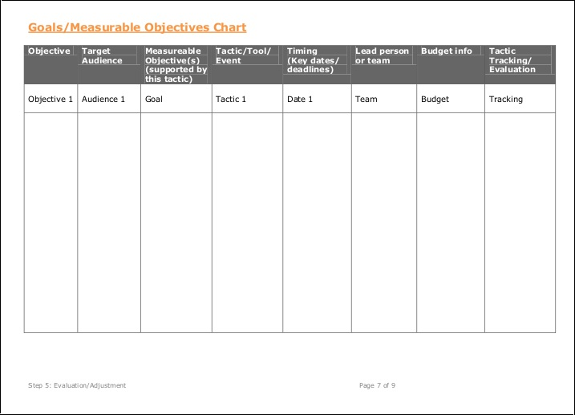

# Facilitation and User Testing

## Facilitation 

Members of the Nurture, Outreach, Witness (NOW) Committee, which plans outreach for the church, collaborated on a new church marketing plan. I facilitated brainstorming and planning group work. 

We used the following [United Methodist Communications](http://www.umcom.org) resources:
* [Annual Church Health Check Up](http://www.umcom.org/learn/take-an-annual-church-health-checkup)
* [Marketing Audit](http://www.umcom.org/learn/market-your-church-getting-started)
* [Communication Audit](http://www.umcom.org/services-products/audit-resources)
* [Re-Think Church](http://www.umcom.org/rethink-church)
* [Small Membership Church Ministries](http://www.greatplainsumc.org/smallmembershipchurchresources)

In preparation for their group work, I provided the NOW Committee with an example marketing plan, a [Marketing Plan Worksheet](http://s3.amazonaws.com/Website_Properties_UGC/market-your-church/documents/UMCOM_YOUR_MARKETING_PLAN_WORKSHEET.PDF), and a ["Tactics" List](http://s3.amazonaws.com/Website_Properties_UGC/market-your-church/documents/STEP_4_IMPLEMENTATION_HOMEWORK.PDF) taken from the [United Methodist Communications](http://www.umcom.org) [Marketing Audit](http://www.umcom.org/learn/market-your-church-getting-started). 

### Reverse Engineering for Success
We would use problem structuring methods to answer the following questions:

* What does a successful Pretty Prairie United Methodist Church look like?
* Whom should the church reach?
* How should the church reach them?
* How should the church measure progress?

### Church Vision and Mission Statements
We started by reflecting on the existing Vision and Mission Statements

Church Vision Statement

Church Mission Statement

#### What does a successful Pretty Prairie United Methodist Church look like?

#### Whom should the church reach?

Marketing Worksheet Target Audience Deliverable

#### How should the church reach them?

### "How might we"

Audiences, tactics, and resources

After having identified the target audiences, we would look at a list of possible tactics and compare against available resources. We would also consider which methods would be best suited to which audiences. 

Tactics less than $300 

Tactics between $300 and  

Tactics over $1000 

#### How should the church measure progress?

##### Metrics

[United Methodist Communications](http://www.umcom.org) suggests using a Goals and Measurable Objectives Chart as part of the [Evaluation Step](http://www.umcom.org/learn/evaluation-adjustment-resources) of its [Marketing Audit](http://www.umcom.org/learn/market-your-church-getting-started). 

United Methodist Goals and Measurable Objectives example chart

## User Testing

