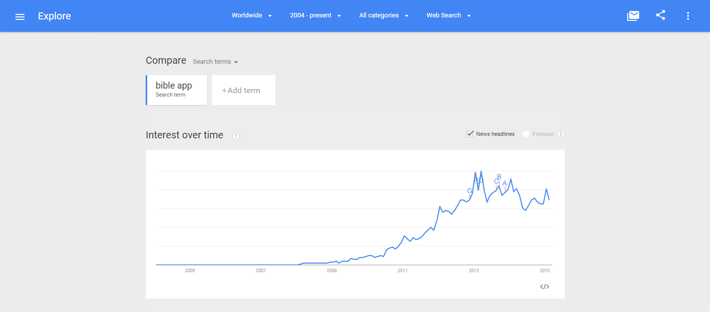
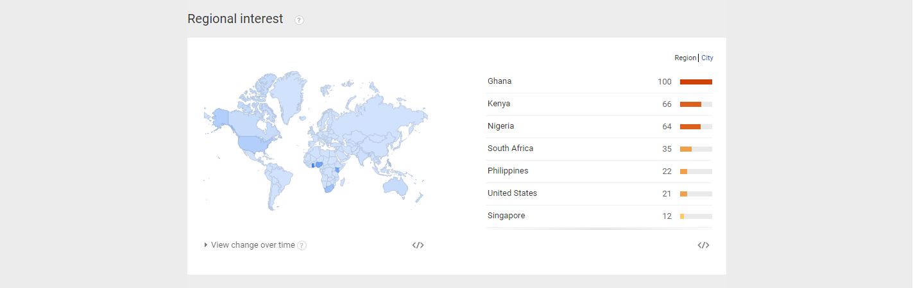
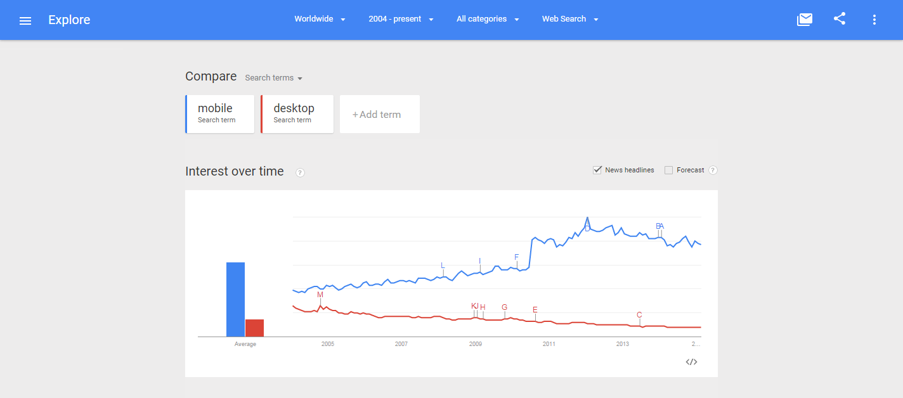
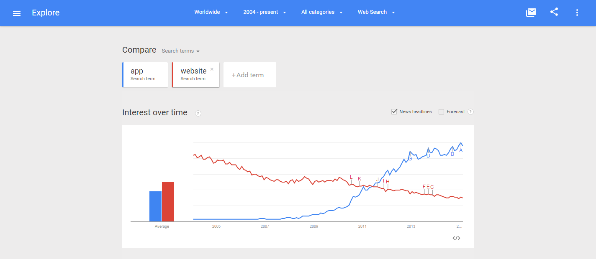

# Google Trends

## Phrase "United Methodist Church," for regions worldwide, Kansas, and Wichita/Hutchinson (Kansas)

The Google Trends graphs for the search phrase "United Methodist Church" show a steady decline in search interest. 

Google Trends graph for the phrase ["United Methodist Church" (region: worldwide)](http://www.google.com/trends/explore#q=united%20methodist%20church), from around 2004 to 2015: 

Google Trends graph for the phrase ["United Methodist Church" (region: Kansas)](http://www.google.com/trends/explore#geo=US-KS&q=united+methodist+church), from around 2004 to 2015: 

Google Trends graph for the phrase ["United Methodist Church" (region: Wichita/Hutchinson, Kansas)](http://www.google.com/trends/explore#geo=US-KS-678&q=united+methodist+church), from around 2004 to 2015: 

### Phrase "Upworthy," for region worldwide

Google Trends graph for the phrase ["Upworthy" (region: worldwide)](http://www.google.com/trends/explore#q=upworthy), beginning when Upworthy was founded in 2012, until 2015: 

### Phrase "The Bible App," for region worldwide

Google Trends graph for the phrase ["Bible App" (region: worldwide)](http://www.google.com/trends/explore#q=Bible%20App), beginning when The Bible App was founded in 2008, until 2015. The Bible App's popularity remains high: 

### Phrases "mobile" versus "desktop" for region worldwide

Google Trends graph for phrases ["mobile" versus "desktop" (region: worldwide)](http://www.google.com/trends/explore#q=mobile%2C%20desktop&cmpt=q&tz=) until 2015:

### Phrases "app" versus "website" for region worldwide

Google Trends graph for phrases ["app" versus "website" (region: worldwide)](http://www.google.com/trends/explore#q=app%2C%20website&cmpt=q&tz=) until 2015:

