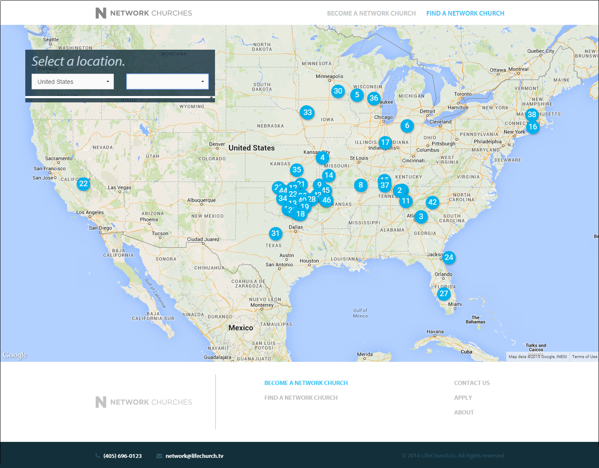
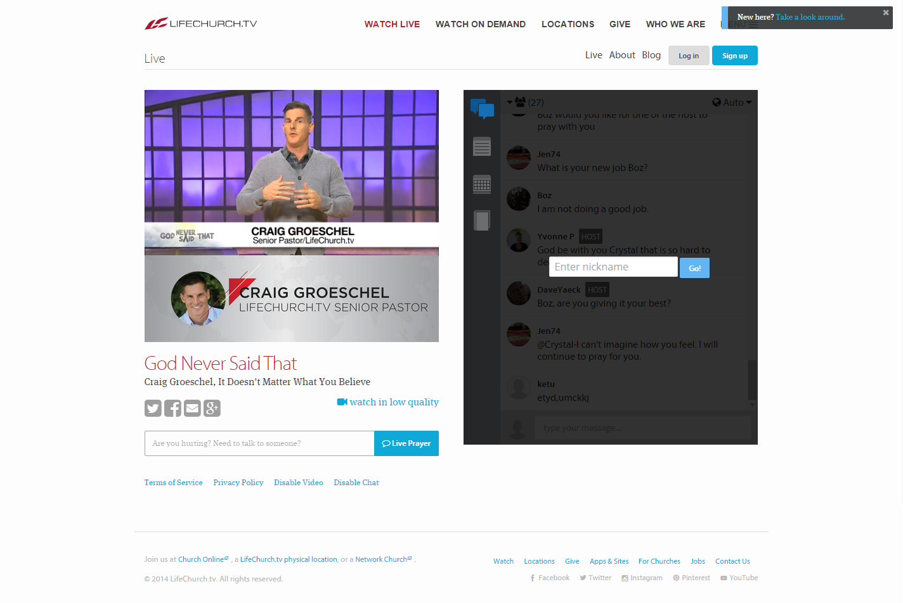
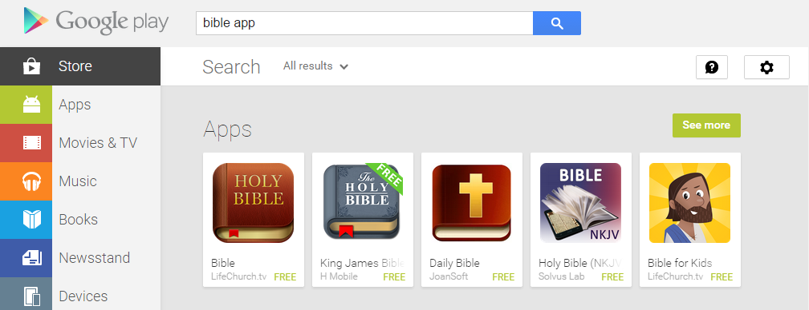
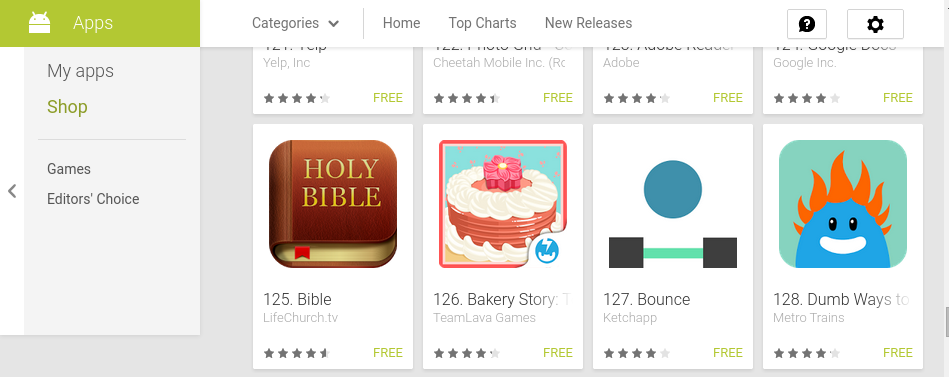
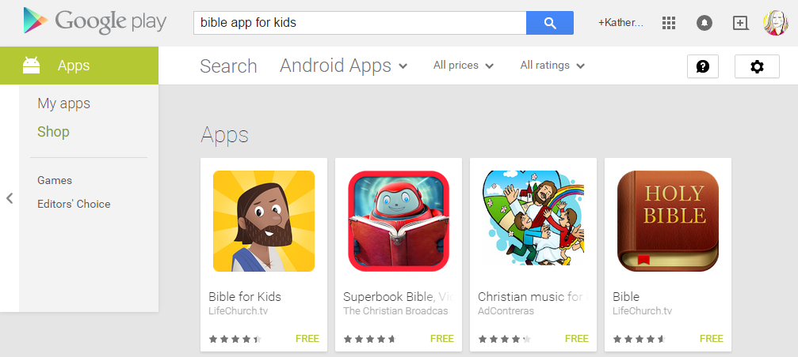

# LifeChurch and The Bible App Case Study

How has a religious app achieved [100 million+ downloads](http://www.businessinsider.com/youversion-bible-app-has-100-million-downloads-2013-7), and become a publicity engine for its parent church? Analyzing a "business" model that has the potential to disrupt traditional religion.

# LifeChurch: New Age Model

"A church isn't a building—it's the people. We meet in locations around the United States and globally online." -[LifeChurch.tv](http://www.lifechurch.tv/who-we-are)

## Google Trends Graph for Phrases "LifeChurch" and "The Bible App"

Google Trends graph for the phrases ["LifeChurch" and "The Bible App" (region: worldwide)](http://www.google.com/trends/explore#q=LifeChurch%2C%20The%20Bible%20App&cmpt=q&tz=), from 2004 to 2015. [LifeChurch](http://en.wikipedia.org/wiki/LifeChurch.tv) is The Bible App's parent organization. LifeChurch was founded in 1996, but began offering online broadcasts in 2006. [The Bible App](https://www.bible.com/app) was founded in 2008. 
 

## LifeChurch Physical Locations

## Network Churches
LifeChurch franchise...

## LifeChurch Global Live and on Demand Broadcast

## [The Bible App](https://www.bible.com/app): A LifeChurch Publicity Engine

The Bible App is the top search result for "Bible app" in Google search. 

The Bible App is the top search result for "Bible app" in the Apple Store. 

The Bible App is the top search result for "Bible app" in Google Play Store (Android), closely followed by the Kid's Bible App

The Bible App is the #40 most popular free app in the Apple Store.

The Bible App is the #125 most popular free app in the Google Play Store. 

Furthermore, The Bible App leads users to LifeChurch

### Purpose
Use desktop and mobile devices to:
* Read the Bible
* Share Bible verses on social networks
* Bookmark favorite passages

Available on all major platforms and many others: 

### [The Bible App for Kids](https://www.bible.com/kids)

Made in partnership with [OneHope](http://onehope.net/feature/bibleappforkids)

The Kid's Bible App is Google Play Store top search result for "Bible app for kids"...

