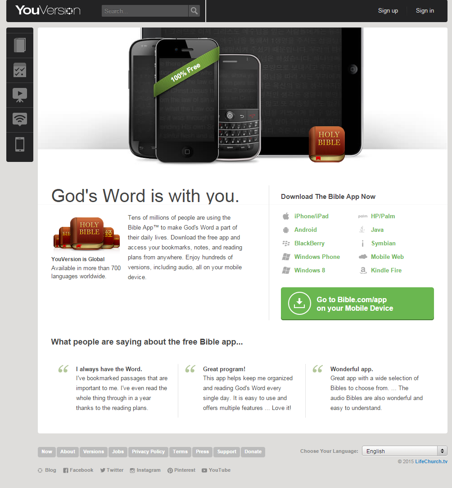
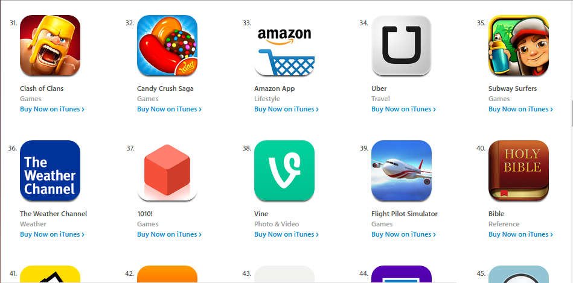
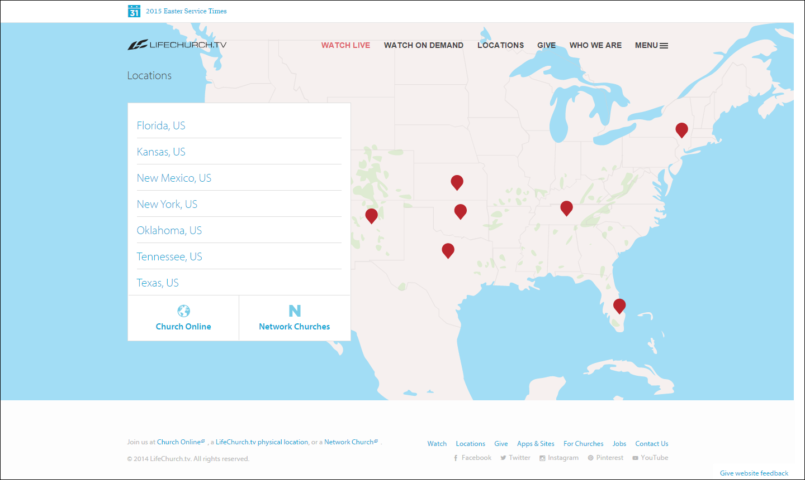

# LifeChurch and The Bible App Case Study

How has a religious app achieved [100 million+ downloads](http://www.businessinsider.com/youversion-bible-app-has-100-million-downloads-2013-7), and become a publicity engine for its parent church? Analyzing a "business" model that has the potential to disrupt traditional religion.

# LifeChurch

"A church isn't a building—it's the people. We meet in locations around the United States and globally online." -[LifeChurch.tv](http://www.lifechurch.tv/who-we-are)

### Google Trends Graph for Phrases "LifeChurch" and "Bible App"

Google Trends graph for the phrases ["LifeChurch" and "The Bible App" (region: worldwide)](http://www.google.com/trends/explore#q=LifeChurch%2C%20The%20Bible%20App&cmpt=q&tz=), from 2004 to 2015. [LifeChurch](http://en.wikipedia.org/wiki/LifeChurch.tv) is The Bible App's parent organization. LifeChurch was founded in 1996, but began offering online broadcasts in 2006. [The Bible App](https://www.bible.com/app) was founded in 2008. 
 

## [The Bible App](https://www.bible.com/app)

### Purpose
Use desktop and mobile devices to:
* Read the Bible
* Share Bible verses on social networks
* Bookmark favorite passages

### Platforms
Available on all major platforms and more: 
* iPhone/iPad
* Android
* Mobile Web
* Kindle Fire
* Blackberry
* Windows Phone
* Windows 8
* HP/Palm

And others...

### [The Bible App for Kids](https://www.bible.com/kids)

Made in partnership with [OneHope](http://onehope.net/feature/bibleappforkids)

#### Purpose

#### Platforms

### Publicity Engine

The Bible App is the top search result for "Bible App" in Google search and the Apple Store and Google Play Store (Android). The Bible App is also the #40 most popular free app in the Apple Store and the #125 most popular free app in the Google Play Store. 

Furthermore, The Bible App leads users to LifeChurch

Apple Store iTunes free apps: #40

The Kid's Bible App is the top search result...

## LifeChurch Physical Locations

## Network Churches

Networktv- like a Franchise

http://techcrunch.com/2012/05/10/bible-youversion-lifechurch

http://www.lifechurch.tv/giving

http://www.lifechurch.tv/digital-missions

https://s3.amazonaws.com/lctv-site/downloads/giving/Giving-Financial-Statements-2014-Unaudited-Updated.pdf

http://live.lifechurch.tv/

