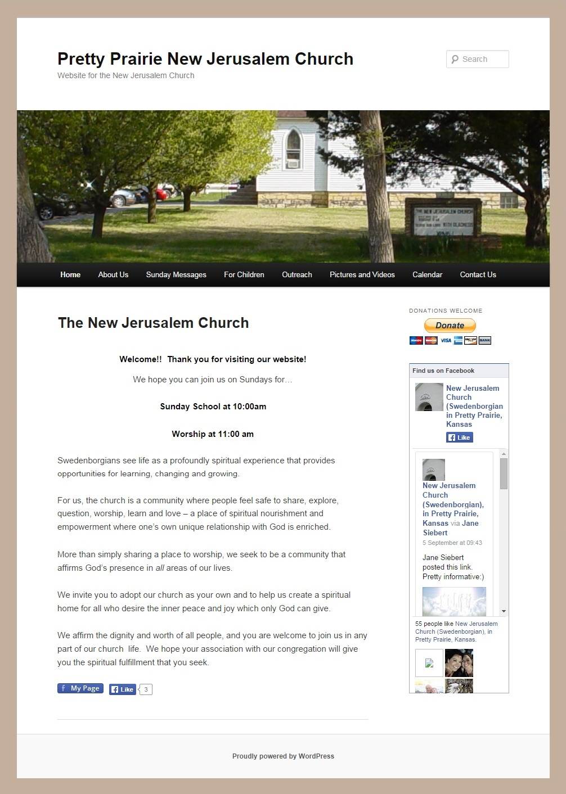

# Other Area Churches

In a [Research and Design Sprint](research_and_design_sprint.md), a "lightning demo" is a demo of a "competitor" product, or non-competitive product that offers insight

## Lightning Demos

When considering web hosting options, it was helpful to look at the websites of other area churches (see below) to see what web hosts and functionality are popular among other churches in the same demographic. 

### Calvary Chapel

http://calvarychapel-pp.com

Pros:
* Nice, logical look to website, with prairie color scheme and pictures of wheat
* Layout makes good use of white space
* Easy to navigate menu
* Sermon MP3 files posted weekly
* Up-to-date calendar
* Photo albums hosted directly on website
* Prayer requests accepted online

Cons: 
* Blog out-of-date
* Sparse photos with no reference to year
* Lack of link to Calvary Chapel's often-updated [Facebook Page](https://www.facebook.com/CalvaryChapelOfPrettyPrairie)
* Lack of share buttons
 
### First Mennonite Church

http://www.fmcprettyprairie.org

Pros:
* Live video streaming with video archive and "message" resources updated weekly
* Share buttons
* Up-to-date calendar
* Messages accepted online

Cons: 
* Somewhat outdated looking design; gimmicky lighthouse gif at the top of site; use of whitespace could be better
* Drop-down menu slightly convoluted 
* Lack of obvious photos = missed opportunity 
* Apparent lack of a blog
* Archive that looks as though it stopped being updated years ago

### New Jerusalem Church

http://prettyprairiechurch.org

Pros:
* Up-to-date blog posts
* Up-to-date calendar
* Online donations
* Share buttons

Cons: 
* Commonly seen WordPress template used
* Color and photo choice/editing could at times be used to better effect
* Pictures and Videos page that looks as though it stopped being updated years ago

Notably, New Jerusalem Church is using the very popular WordPress [Twenty Eleven](https://wordpress.org/themes/twentyeleven) theme. I also considered this template for Pretty Prairie United Methodist Church because the national United Methodist Church offers this template as part of its hosting platform. But, I decided to forgo it in order to have something unique to Pretty Prairie United Methodist Church. 
