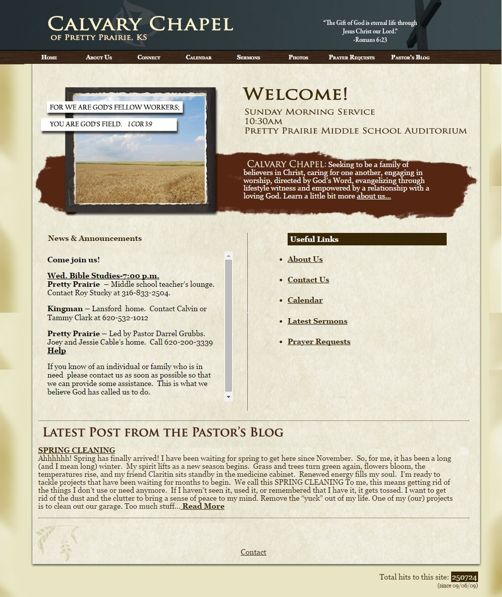

# Other Area Churches

In a [Research and Design Sprint](research_and_design_sprint.md), a "lightning demo" is a demo of a "competitor" product, or non-competitive product that offers insight

## Lightning Demos

When considering web hosting options, it was helpful to look at the websites of other area churches (see below) to see what web hosts and functionality are popular among other churches in the same demographic. 

### Calvary Chapel

Pros:
* Nice, logical look to website, with prairie color schemes and pictures of wheat
* Layout makes good use of white space
* Easy to navigate menu
* Sermon MP3 files posted weekly
* Up-to-date calendar
* Photos albums hosted directly on website
* Prayer requests accepted online

Cons: 
* Blog out-of-date
* Sparse photos with no reference to year
* Lack of link to Calvary Chapel's often-updated Facebook Page

### First Mennonite Church

Pros:
* Service livestreaming
* Weekly content

Cons: 

### New Jerusalem Church

Pros:
* Online donations

Cons: 
* Commonly seen WordPress template used
* Color and photo choice could be more attractive
 
Notably, New Jerusalem Church is using the very popular WordPress [Twenty Eleven](https://wordpress.org/themes/twentyeleven) theme. I also considered this template for Pretty Prairie United Methodist Church because the national United Methodist Church offers this template as part of its hosting platform. But, I decided to forgo it in order to have something unique to Pretty Prairie United Methodist Church. 
