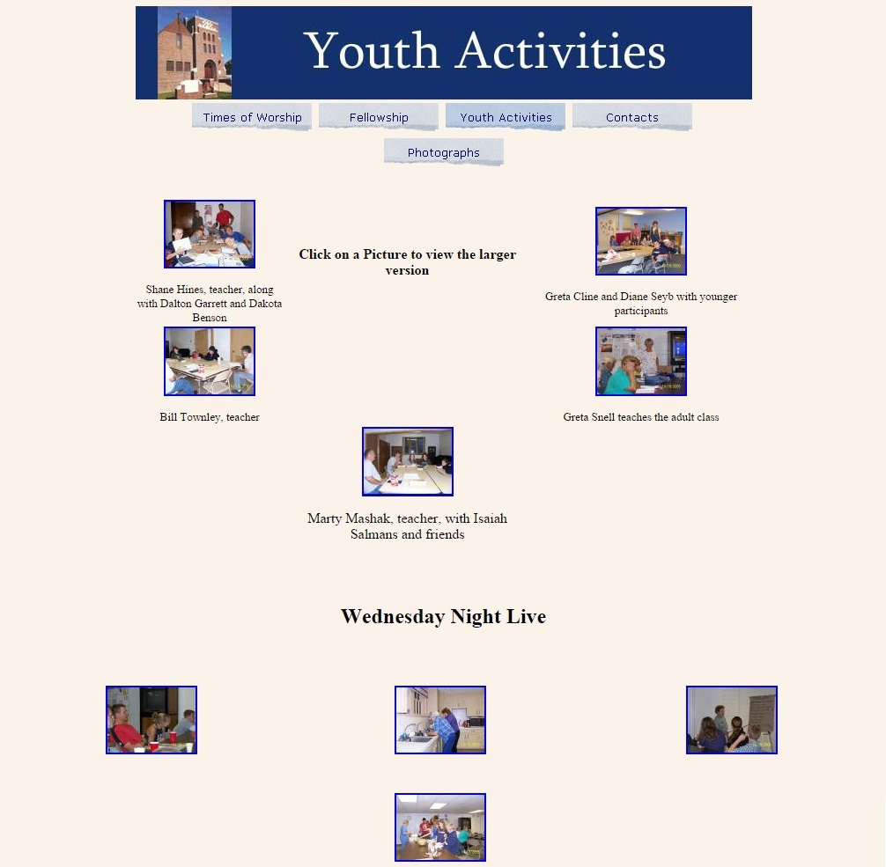
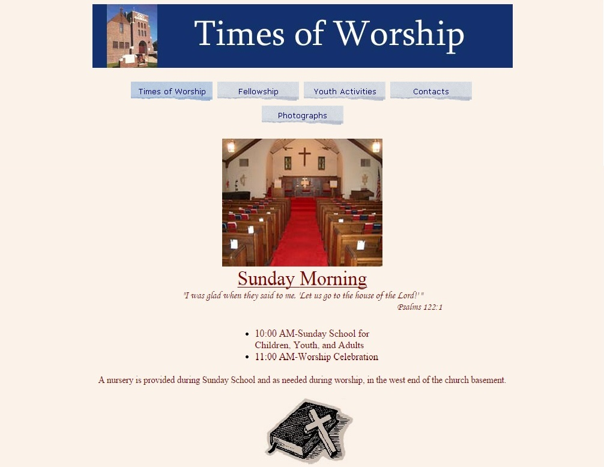
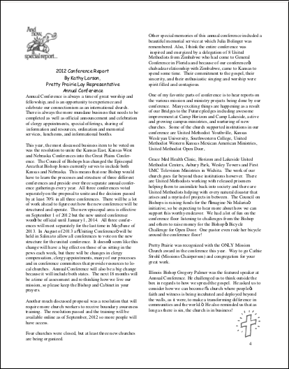
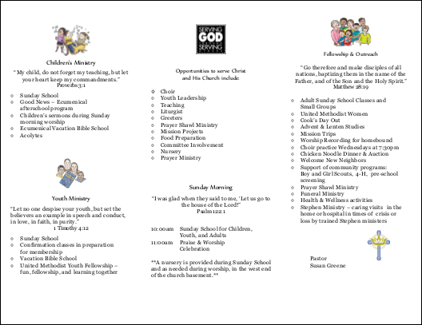
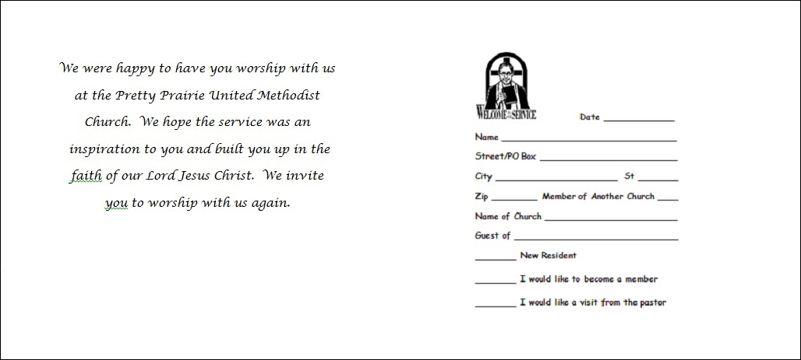
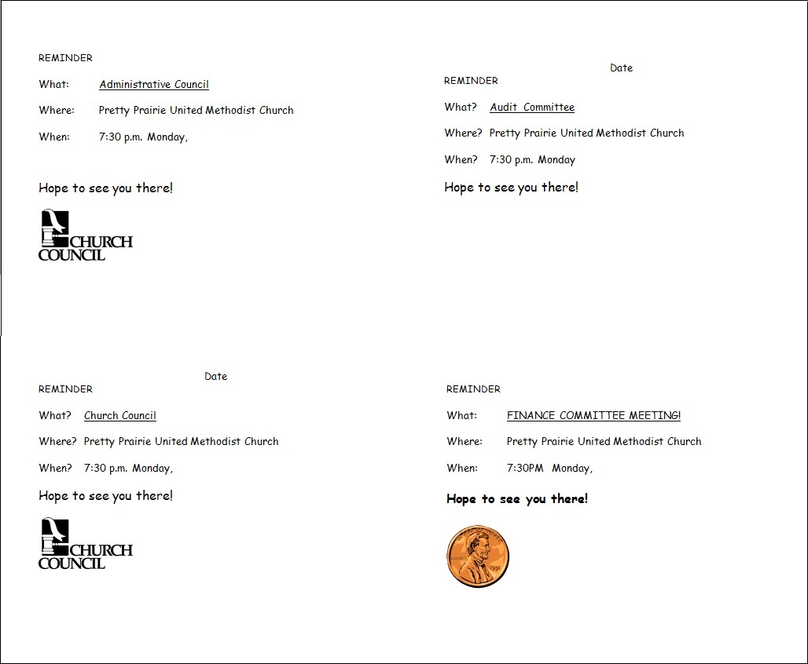
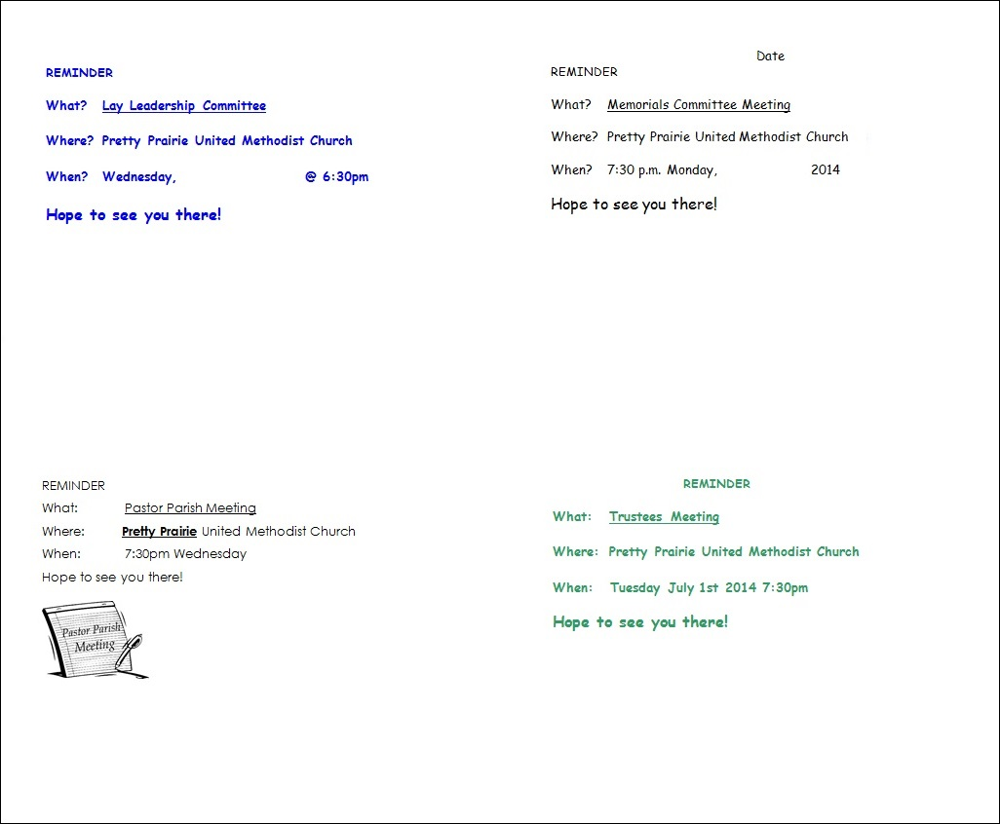
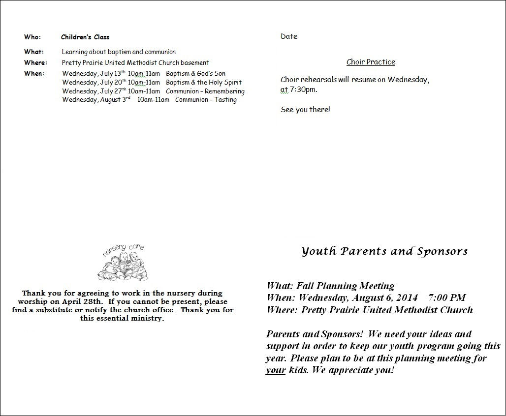
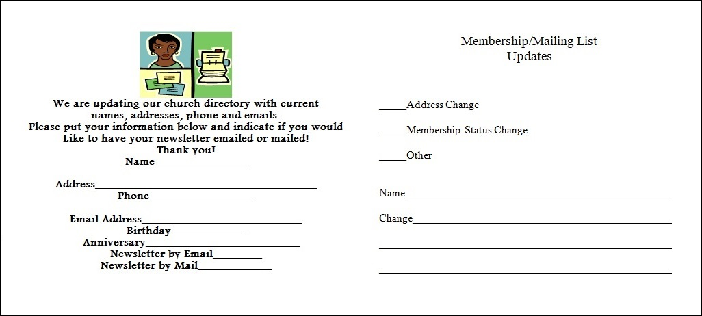
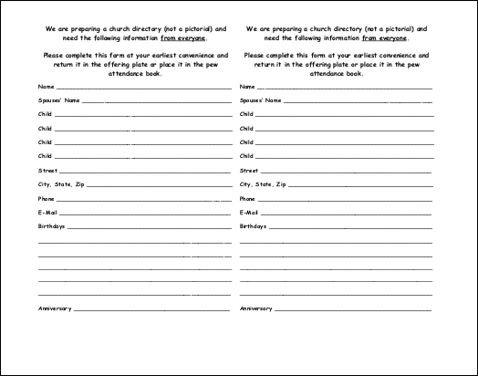

# Marketing As Is

The old Pretty Prairie United Methodist Church website and marketing materials were created by different people, at different times, with no thought to creating one consistent church brand experience spanning all materials, and one consistent marketing plan spanning all channels available to the church. See below for a critique. 

## Old Marketing Materials

### Old Website

Pros: 
* Straight forward design that could lend itself to mobile responsiveness
* Use of photos and photo albums is positive, if only execution were better
* Representation of a variety of church activities

Cons:
* Non-complimentary color scheme
* Poor use of white space throughout
* Ragged, amateurish looking menu bar
* The welcome page is a "data dump"
* Unnecessary use of clip art
* Overly simplistic photo album layout
* Lack of many modern features (blog, calendar, share/like buttons, video/audio, donations, messaging)

Note: lack of any social media presence (i.e. Facebook)

### Old Newsletter

### Old Brochure

Outside 

Inside 

### Old Visitor Postcards

### Old Reminder Postcards

### Old Update Cards 

