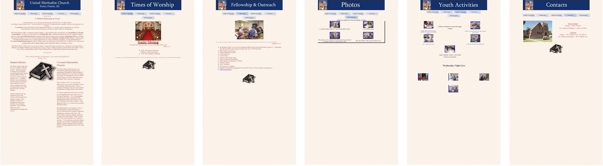

# Marketing As Is

The old Pretty Prairie United Methodist Church website and marketing materials were created by different people, at different times, with no thought to creating one consistent church brand experience spanning all materials, and one consistent marketing plan spanning all channels available to the church. See below for a critique. 

The church did not have a formal, coordinated marketing plan. 

## Old Marketing Materials

### Old Website

Mobile view

Pros: 
* Straight forward design
* Use of photos and photo albums is positive, if only execution were better

Cons:
* Poor color choice (blue and pink are not complementary colors)
* Content not representative of full range of church demographics, groups, activities
* Wasted space (especially on mobile view)
* Ragged, antiquated looking menu bar
* The welcome page is a "data dump"
* Unnecessary use of clip art (should be avoided, if possible)
* Overly simplistic (and not aesthetically pleasing) photo album grid layout
* Lack of many modern features (blog, calendar, share/like buttons, video/audio, donations, messaging)

Note: lack of any social media presence (i.e. Facebook) although I do not know when this website was originally made

### Old Newsletter

### Old Brochure

Outside 

Inside 

### Old Visitor Postcards

### Old Reminder Postcards

### Old Update Cards 

