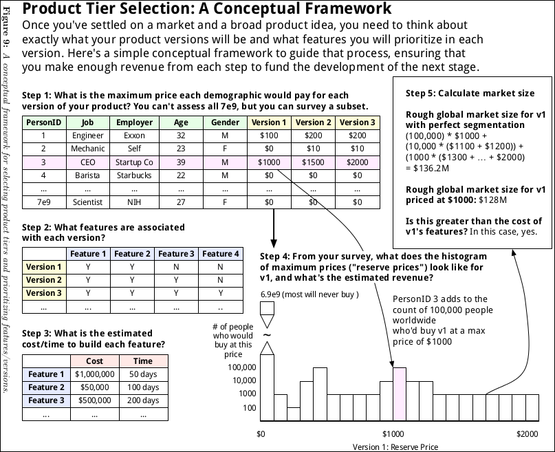

# Marketing Strategy

### Church Communication Definition

Church Communication is church outreach to church members and other potentially interested parties

### Church Marketing Definition

Church Marketing is strategic planning for said outreach

### Church Elevator Statement

Product Tier

[Goals and Measurable Objectives Chart Example 1](marketing-strategy/goals-measurable-objectives-chart-example-1.png)

[Goals and Measurable Objectives Chart Example 2](marketing-strategy/goals-measurable-objectives-chart-example-2.png)

### Growth Hacking

SEO

http://www.umcom.org/tools/update-your-find-a-church