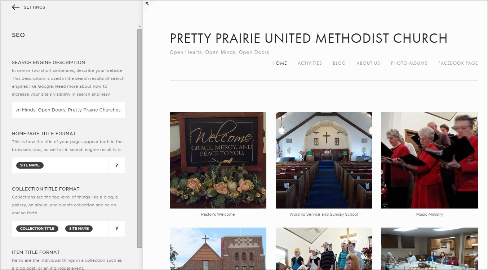
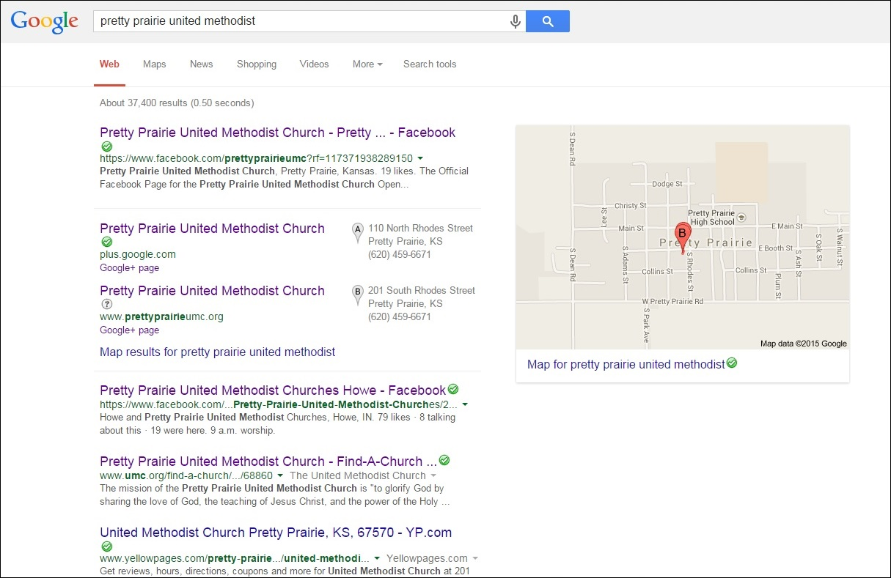
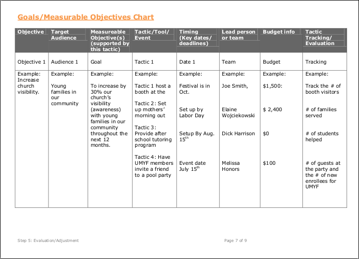

# Marketing Strategy

## Church Mission Statement

"To glorify God by sharing the love of God, the teachings of Jesus Christ and the power of the Holy Spirit within our community"

### Church Communication and Marketing Definitions

Church Communication is church outreach to church members and other potentially interested parties

Church Marketing is strategic planning for said outreach

## Marketing Plan

Members of the NOW (Nurture, Outreach, Witness) Committee, which handles community outreach for the church, would begin to collaborate on a new church marketing plan. 

I provided a list of 'tactics' by cost taken from the United Methodist Marketing Plan Audit Implementation Step.

Tactics less than $300

Tactics from $300 to $1000

Tactics over $1000

# Sample Plan

## Example Budget

## Low-Hanging Fruit

All of the traditional methods of advertisement should continue to be updated on an ongoing basis, including the new website info.

* Website/Facebook Page
* Find-a-Church
* Bulletin
* Local newspaper
* Email signature
* Ads and fliers in high traffic locations

### Outreach Calendar

The church purchased a 2015 wall calendar. The calendar would be hung on a hook on the wall in a high traffic area of the church where it would not be forgotten. A pencil would be nearby so that the calendar could be easily updated. The calendar could be removed from the wall and taken to meetings too.  

### Skills Inventory

Members of the church would take stock of the skills of individual members. This skills inventory would be used to identify ways to optimize what the church has to offer the community. 

### Contacting Inactive Members

A good starting point for outreach would be for the church to contact church-goers of the past who are now inactive, and invite them back. 

### Telephone Book

Setting aside pre-existing assumptions, members of the church would go through the Pretty Prairie section of the phone book to identify people for outreach. 

## SEO (Search Engine Optimization)

SEO is an important aspect of ensuring that people 'discover' your website. Identify the SEO functionality of your website and verify that it is enabled and optimized. Search engines will 'crawl' the content of your website and give your site a page ranking. 

Website SEO

Google is the most popular search engine in most countries, often followed by Yahoo. Identify the most important search phrases associated with your website and test the search results. Make sure that cookies are not enabled. Otherwise, your search results might be skewed due to the search history of the computer. 

Example Google search: "Pretty Prairie United Methodist"

Example Google search result: "Pretty Prairie United Methodist"

Verify that the Google map info for the church is correct. If possible, link the website to the map. Consider creating a Google+ organization page, and/or Google rich snippet for support

Correcting incorrect Google Map info

And most important of all, encourage church members to use the website! The search ranking of the website will rise naturally as a result.

## Online Sharing and Advertising

### Google Adwords

Google Adwords Pretty Prairie "Limited reach"

Google Adwords Pretty Prairie targeting

### Facebook Sharing and Advertising

Facebook is the 'king' of social traffic, with other networks such as Twitter, Instagram and Pinterest close behind. 

Based on feedback, members of the church and surrounding community are most likely to be on Facebook. So, we would first consider the option of advertising the church via Facebook. This could be done for free through Facebook sharing

This could also be done by paying to advertise the church's Facebook page to people located within Pretty Prairie and its surrounding area, using Facebook's "Reach people near your business" a.k.a. "Local Awareness" ad option.

Choose the objective for your campaign: "Local Awareness"

Notably, this may reach a different demographic segment than other forms of advertisement. 

The Facebook advertisement program defaults to $50 spend for 1 week, advertising to both genders, ages 18 to 65+.

Facebook Page advertisement preview

Suggested target audience ranges from 50 km to... 

Down to 3 km ... 

Or 1 km...

### Twitter Advertising

Twitter has a media playbook devoted to faith and religious ads can be occasionally found on Twitter. 

Twitter for Faith Playbook

Example religious ad on Twitter

Members of the church are less likely to use Twitter. However, Twitter is an option to keep in mind, particularly for reaching the public at large. 

## Sample Metrics

The national United Methodist Church suggests using a Goals and Measurable Objectives Chart as part of its Marketing Plan Audit process. 

