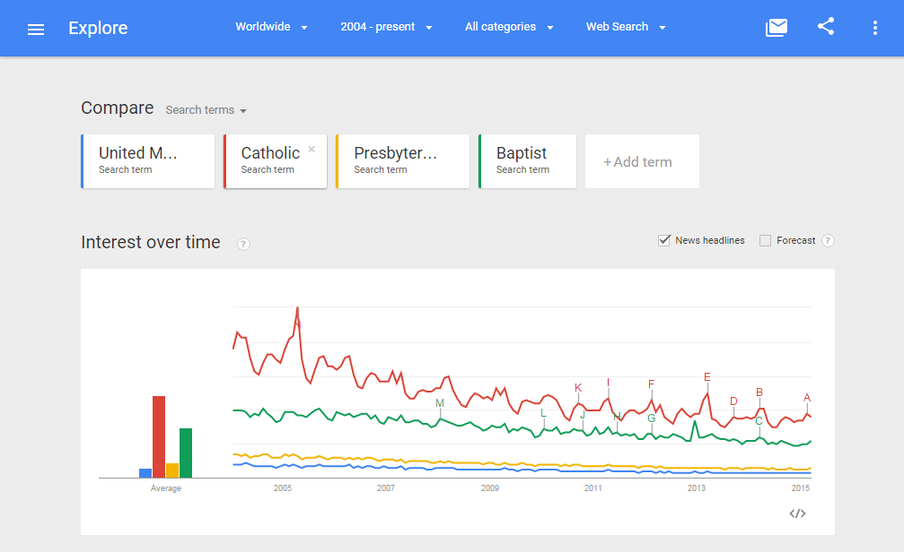
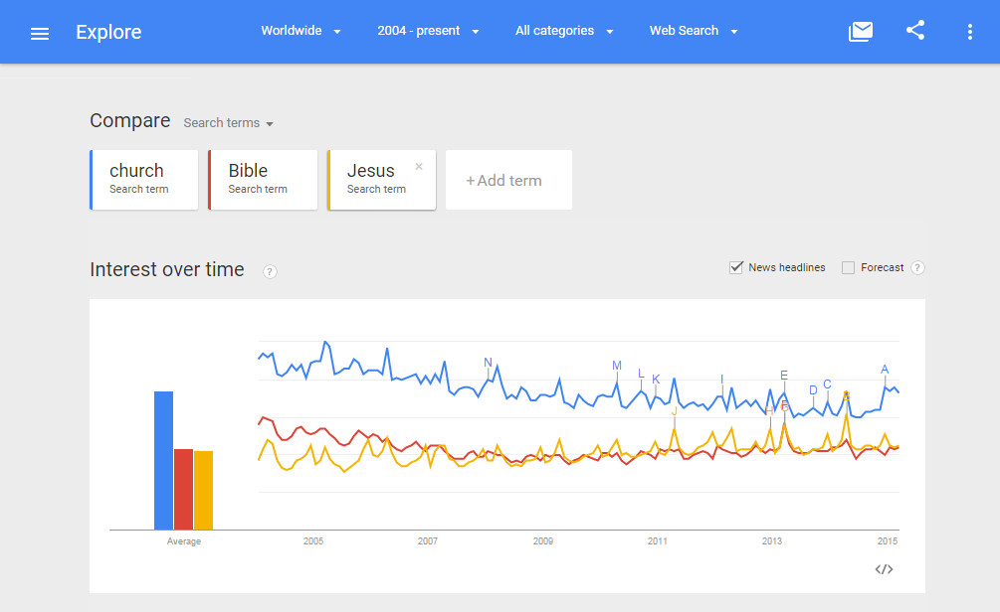
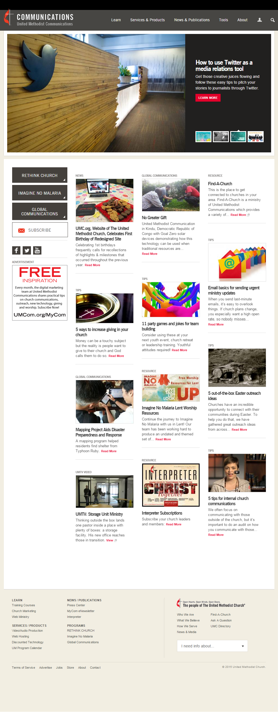
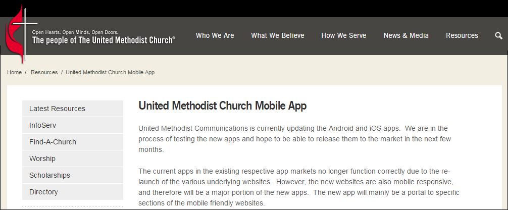

# The National United Methodist Church Case Study

What's the matter with the [United Methodist Church](http://www.umc.org)? Looking at the steady decline of interest in the United Methodist Church and how it can be fixed.

## Google Trends Graph for Phrases "United Methodist" "Catholic" "Presbyterian" "Baptist"

This problem of declining interest is not exclusive to the United Methodist Church. Mainline churches in general are struggling stay relevant. 

Google Trends graph for the phrases ["United Methodist" "Catholic" "Presbyterian" "Baptist" (region: worldwide)](http://www.google.com/trends/explore#q=United%20Methodist%2C%20Catholic%2C%20Presbyterian%2C%20Baptist&cmpt=q&tz=), from around 2004 to 2015:

## Google Trends Graph for Phrases "church" "Bible" and "Jesus"  

Google Trends graph for the phrases ["church" "Bible" and "Jesus" (region: worldwide)](http://www.google.com/trends/explore#q=church%2C%20Bible%2C%20Jesus&cmpt=q&tz=), from around 2004 to 2015. Wavering, but not exactly down and to the right. This graph does not reflect increasing world population/increasing access to search tools. 

## Critique of [umc.org](http://www.umc.org) 

The website has an appealing design. The color scheme is a nod to the United Methodist cross and flame logo and the colors are repeated throughout the website. The layout is appealing, including a "carousel" of photos "above the fold" and a newspaper like homepage below, all designed to attract attention. The main shortcoming of the United Methodist online presence is the convoluted nature of the content. 

## Jesus and John Wesley, Social Pioneers

Maybe the United Methodist Church need look no further than [social network](http://en.wikipedia.org/wiki/Social_network) pioneers Jesus and John Wesley for inspiration. 

Jesus grew a social network that consisted of family, friends, and followers, who spread his message by word of mouth until it became viral the world over. 

[John Wesley](http://en.wikipedia.org/wiki/John_Wesley) spread the Methodist religion across the United States by creating a social network of followers who were organized into "Class Meetings" across geographic territories and ministered to by "Circuit Riders." 

"I look upon all the world as my parish" -John Wesley, founder of Methodism

