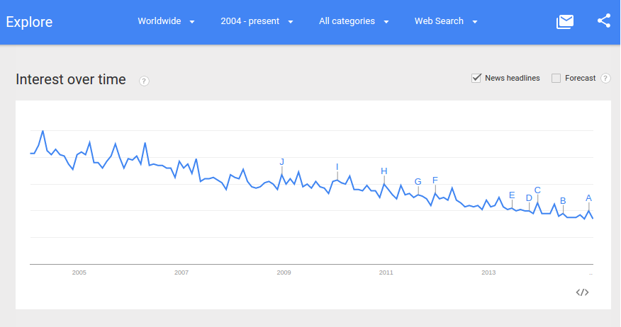
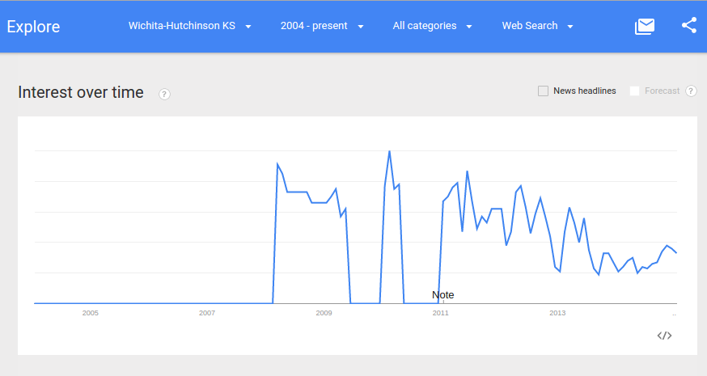
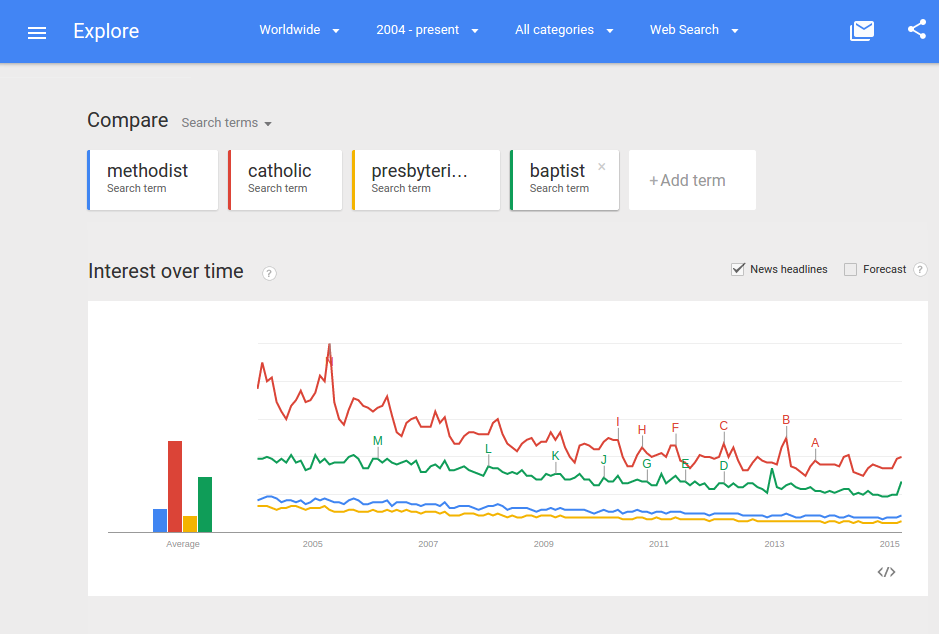
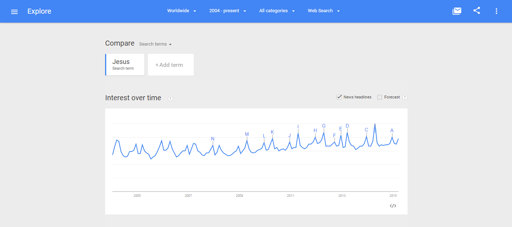
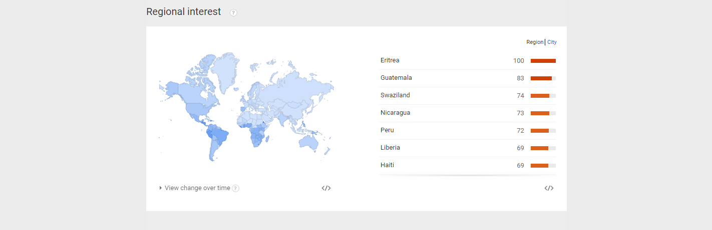
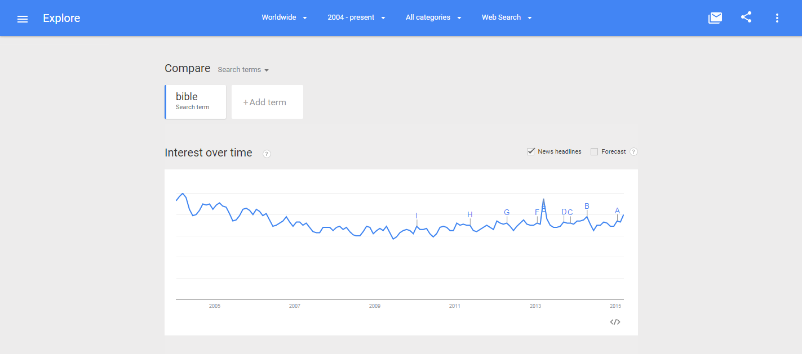
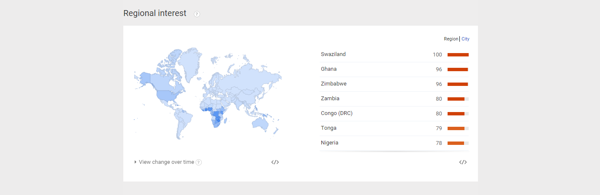

# National United Methodist Church

What's the matter with the [United Methodist Church](http://www.umc.org)? Looking at the steady decline of interest in the United Methodist Church and how it can be fixed.

## Google Trends Graph for Phrase "United Methodist Church"

Google Trends graph for the phrase ["United Methodist Church" (region: worldwide)](http://www.google.com/trends/explore#q=united%20methodist%20church), from around 2004 to 2015: 

Google Trends graph for the phrase ["United Methodist Church" (region: Kansas)](http://www.google.com/trends/explore#geo=US-KS&q=united+methodist+church), from around 2004 to 2015: 

Google Trends graph for the phrase ["United Methodist Church" (region: Wichita/Hutchinson, Kansas)](http://www.google.com/trends/explore#geo=US-KS-678&q=united+methodist+church), from around 2004 to 2015: 

## Google Trends Graph for Phrases "methodist" "catholic" "presbyterian" "baptist"

Churches in general are struggling to stay relevant. This problem is not exclusive to the United Methodist Church. 

Google Trends graph for the phrases ["methodist" "catholic" "presbyterian" "baptist" (region: worldwide)](http://www.google.com/trends/explore#q=methodist%2C%20catholic%2C%20presbyterian%2C%20baptist&cmpt=q&tz=), from around 2004 to 2015: 

## Google Trends Graph for Phrases "Jesus" and "bible"

Google Trends graph for the phrases ["Jesus" (region: worldwide)](http://www.google.com/trends/explore#q=Jesus), from around 2004 to 2015: 

Google Trends graph for the phrases ["bible" (region: worldwide)](http://www.google.com/trends/explore#q=Jesus), from around 2004 to 2015: 

## Jesus and John Wesley, Social Pioneers

Maybe the United Methodist Church need look no further than [social network](http://en.wikipedia.org/wiki/Social_network) pioneers Jesus and John Wesley for inspiration. 

Jesus grew a social network that consisted of family, friends, and followers, who spread his message by word of mouth until it became viral the world over. 

[John Wesley](http://en.wikipedia.org/wiki/John_Wesley) spread the Methodist religion across the United States by creating a social network of followers who were organized into "Class Meetings" across geographic territories and ministered to by "Circuit Riders." 

"I look upon all the world as my parish" -John Wesley, founder of Methodism

