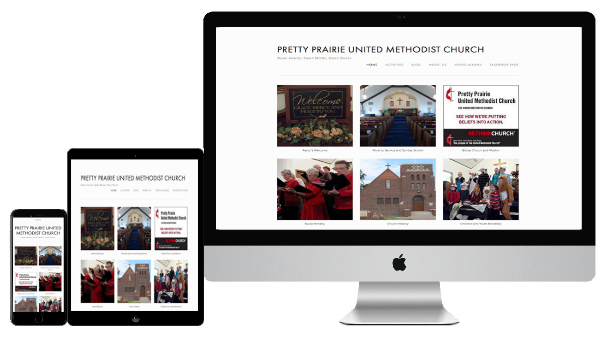

# New Website

The new church website is very reasonably priced. The design has a clean, modern, minimalistic look, with a lightweight, responsive layout that adapts well from desktop to mobile. The user experience (UI) is intuitive.

New website address: 
http://www.prettyprairieumc.org

New website responsive design

New website home page

Rather than one prominent homepage photo, the homepage features a charming patchwork quilt of photos that represent a variety of people and activities in the church. Clicking on a photo brings up a small bite of info about the photo subject. This format is straight forward, easy to navigate, and highly mobile optimized. 

New website home page detail

New website mobile menu 

New website mobile home page 

New website mobile home page detail 

