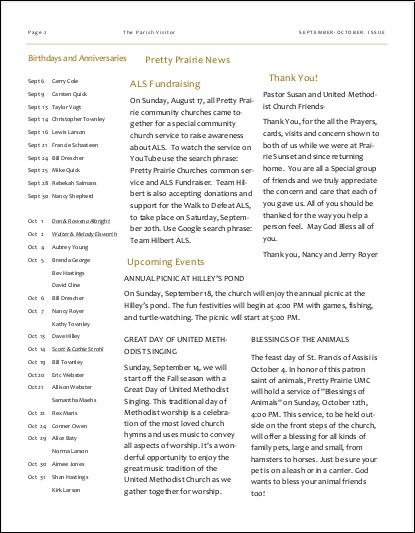
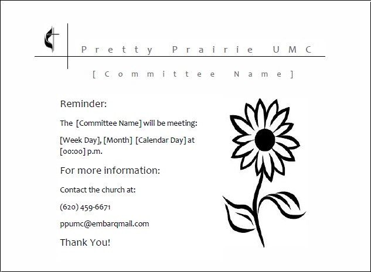

# New Marketing Materials

The number of church outreach materials has been streamlined, with a common brand experience incorporated into them all. For example, instead of twelve inconsistently designed post cards, one beautiful postcard template can be altered to suit the purpose at hand. 

Templates in both color and black-and-white are used to address the impracticality of printing color copies versus sending electronically.

## New Website
(See New Website chapter for a more detailed explanation of the new website)

New website address: 
http://www.prettyprairieumc.org

New website responsive design

New website home page (the sunflower thumbnail reinforces the brand experience): 

## New Facebook Page

https://www.facebook.com/prettyprairieumc

## Facebook Page Ad

## New e-Newsletter

## New Bulletin (example)

Front cover

Inside

## New Multi-Purpose Greeting Card (example)

Front cover 

Inside 

Back cover 

## New Multi-Purpose Postcard

## Twitter Ad Mockup

