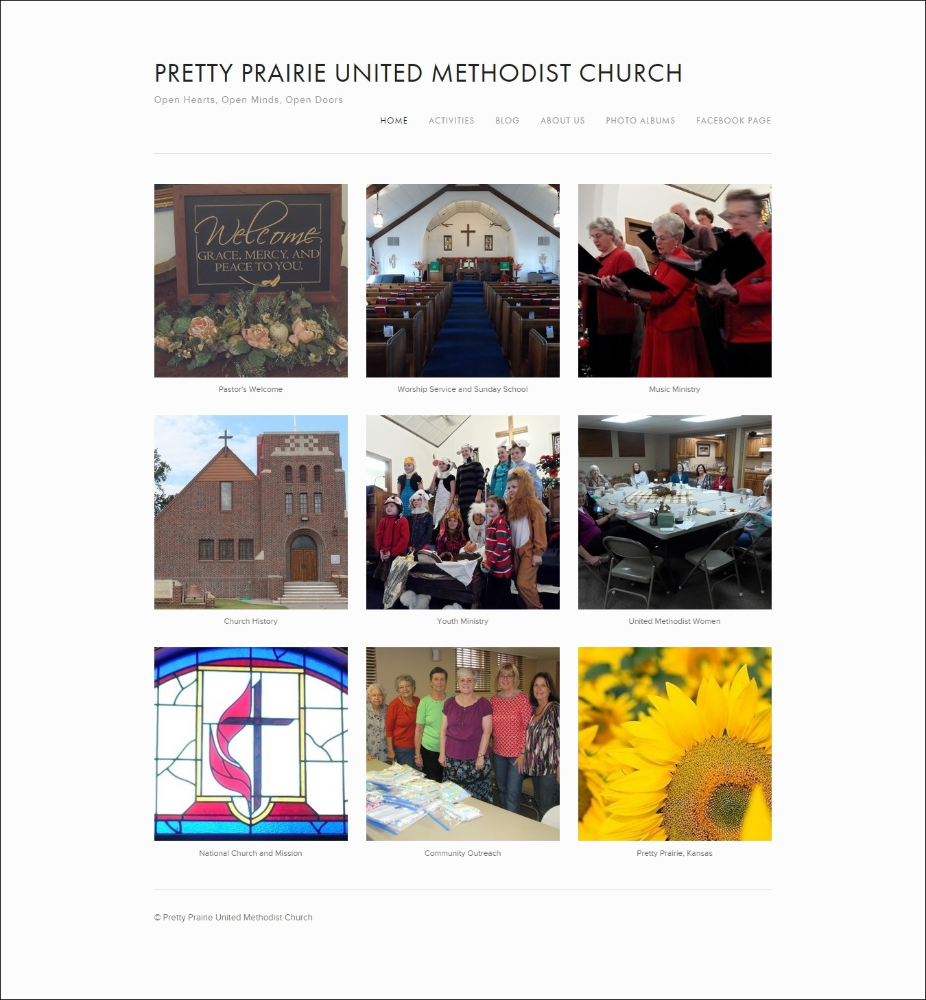

# New Marketing Materials

The number of church outreach materials will be streamlined, with a common brand experience incorporated into them all. For example, instead of twelve inconsistently designed post cards, one beautiful postcard template will be altered to suit the purpose at hand. See [Marketing As Is](marketing_as_is.md) to view the old materials.

Templates in both color and black-and-white will be used to address the impracticality of printing color copies versus sending electronically.

## New Website
 
New website home page: [www.prettyprairieumc.org](www.prettyprairieumc.org) 
See [New Website](new_website.md) for a more detailed explanation of the new website

## New Facebook Page

## Facebook Page Ad

## New e-Newsletter
(Some information altered to protect privacy) 

## New Bulletin (example)

Front cover

Inside

## New Multi-Purpose Greeting Card (example)

Front cover 

Inside 

Back cover 

## New Multi-Purpose Postcard (example)

## Twitter Ad

