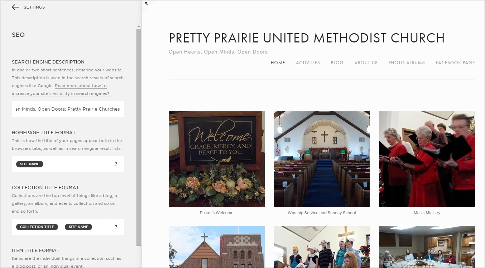
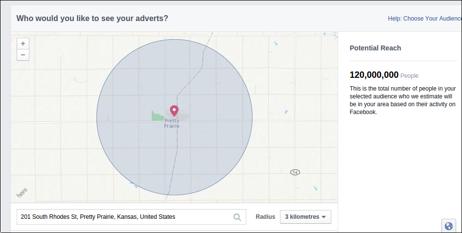
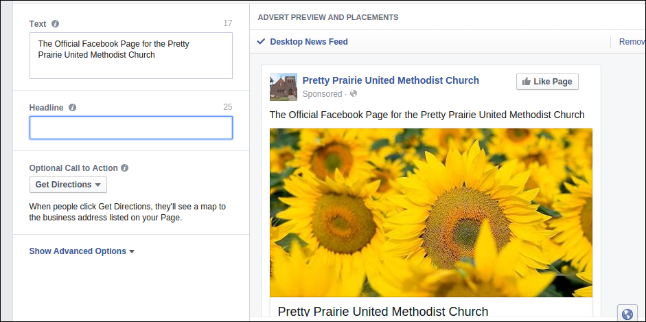

# New Marketing Strategy

The new marketing strategy would incorporate both traditional and modern methods in order to fit with changing lifestyles, and to reach the most people possible, perhaps even beyond city boundaries. 

### "How might we"

Members of the Nurture, Outreach, Witness (NOW) Committee would begin to collaborate on a new church marketing plan. In preparation for their group work, I provided the NOW Committee with an example plan, a [Marketing Plan Worksheet](http://s3.amazonaws.com/Website_Properties_UGC/market-your-church/documents/UMCOM_YOUR_MARKETING_PLAN_WORKSHEET.PDF), and a ["Tactics" List](http://s3.amazonaws.com/Website_Properties_UGC/market-your-church/documents/STEP_4_IMPLEMENTATION_HOMEWORK.PDF) taken from the [United Methodist Communications](http://www.umcom.org) [Marketing Audit](http://www.umcom.org/learn/market-your-church-getting-started).

Example tactics less than $300

Example tactics from $300 to $1000

Example tactics over $1000

See also [Advanced Marketing Options](advanced_marketing_options.md) for a list of advanced marketing options :).

## New Sanctuary Equipment

## Publicity Engine

Self-sustaining

Website easy to use

Multiple Admin

Youth Leadership Initiative

Involving various areas of the church

## Example Budget and Plan

Special occassions

The Facebook advertisement program defaults to $50 spend for 1 week, advertising to both genders, ages 18 to 65+.

## Traditional Methods

All of the traditional methods of advertisement should continue to be updated on an ongoing basis, including the new website info. This is low-hanging fruit. 

* Website/Facebook Page
* Find-a-Church
* Bulletin
* Local newspaper
* Email signature
* Ads and fliers in high traffic locations

### Outreach Calendar

The church purchased a 2015 wall calendar. The calendar would be hung on a hook on the wall in a high traffic area of the church where it would not be forgotten. A pencil would be nearby so that the calendar could be easily updated. The calendar could be removed from the wall and taken to meetings too.  

### Skills Inventory

Members of the church would take stock of the skills of individual members. This skills inventory would be used to identify ways to optimize what the church has to offer the community. 

### Contacting Inactive Members

A good starting point for outreach would be for the church to contact church-goers of the past who are now inactive, and invite them back. 

Updating directory/letter

### Telephone Book

Setting aside pre-existing assumptions, members of the church would go through the Pretty Prairie section of the phone book to identify people for outreach. 

## Advanced Marketing Options

### Search Engine Optimization (SEO) and Webmaster

### Website SEO

### Google Rich Snippet
Example Google search: "Pretty Prairie United Methodist"

Example Google search result: "Pretty Prairie United Methodist"

Correcting incorrect Google Map info

### Google's Reach 

Google Adwords Pretty Prairie targeting

### Google Adwords

### Facebook 

In general, Facebook is considered to be the 'king' of social traffic, with other networks such as Twitter, Instagram and Pinterest close behind.

Based on feedback, members of the church and surrounding community are more likely to be on Facebook than Twitter. So, we would first consider the option of reaching people via Facebook, by advertising the church's Facebook page to people located within Pretty Prairie and its surrounding area through free sharing and paid advertisements.

#### Facebook's Reach
Facebook advertises a "potential reach" of 120,000,000 people

Suggested target audience ranges from radius of 50 km around Pretty Prairie... 

Down to 3 km ... 

Or 1 km...

#### Facebook Sharing

#### Facebook Advertisement

Facebook page "Local Awareness" advertisement preview to "reach people near your business" 

##Public at Large

### Twitter Advertising

Twitter has a media playbook devoted to faith and religious ads can be occasionally found on Twitter. 

Twitter for Faith Playbook

Members of the church are less likely to use Twitter. However, Twitter is an option to keep in mind, particularly for reaching the public at large. 

