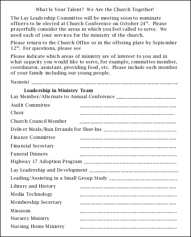
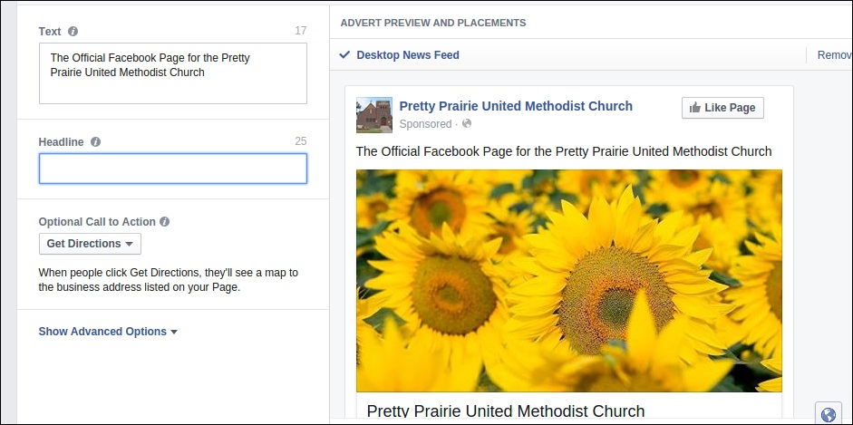
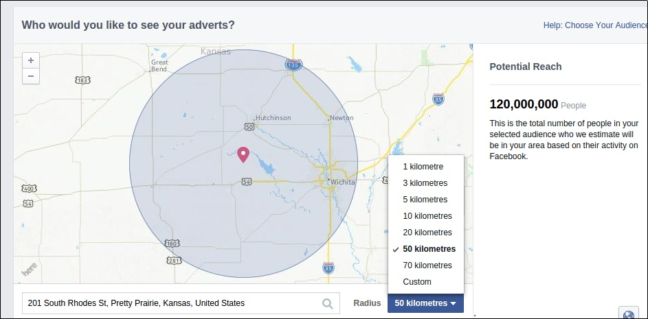
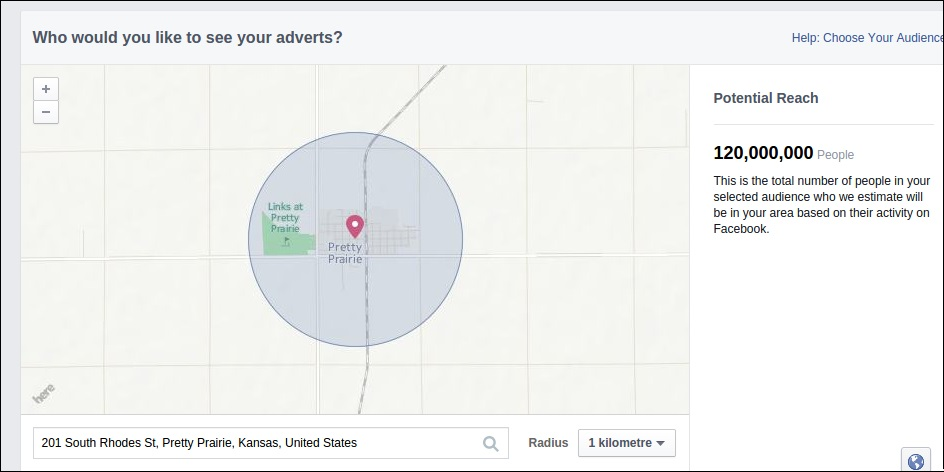
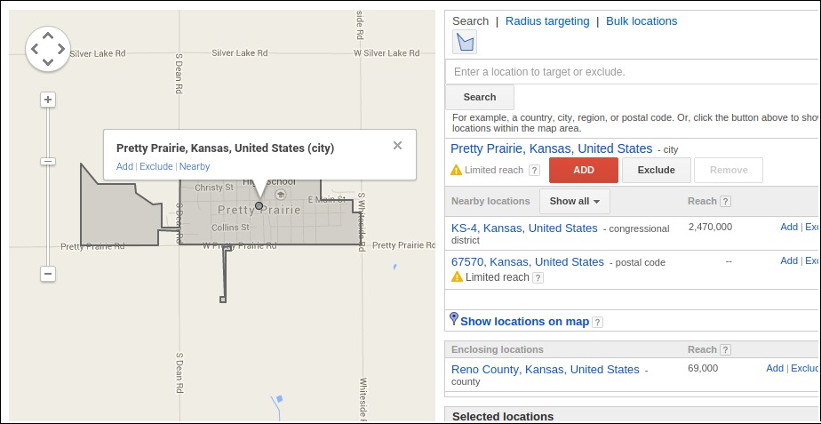

# New Marketing Strategy
The new marketing strategy incorporates both traditional and modern methods in order to fit with changing lifestyles, and reach the most people possible, perhaps even beyond city boundaries. The strategy is also be as cost effective as possible. 

## Budget

## New Sanctuary Equipment
As part of the church's revitalization effort, in addition to the new website, a generous donation was made by an anonymous donor to purchase new, large flat-screen televisions and a laptop for the church sanctuary, to be used to play contemporary videos and music, and to project the words of the hymns. 

## Publicity Engine
A self-sustaining publicity engine would be created, involving a variety of church leaders and members. Duties could include brainstorming, planning outreach activities, admin status for website/social media, help creating content. 

In particular: 

### Outreach Calendar
The church purchased a 2015 wall calendar. The calendar is hung on a hook on the wall in a high traffic area of the church where it will not be overlooked. A pen and post it notes are nearby so that the calendar can be easily updated. The calendar can be removed from the wall and taken to meetings too.  

### Committee Coordination
Coordinating committee leaders and members will help to keep everyone in the church on the same page. 

### Youth Leadership Initiative
Youth will assist with duties such as running the new screen videos and music during worship, taking photos and/or writing blog posts. 

#### Youth Training 
I developed a set of training materials.

## Example Marketing Plan

### Tier 1 Outreach (Basic)
Up to date marketing materials 
* Website/blog
* Website Search Engine Optimization (SEO)/Google Rich Snippet
* Facebook page
* Newsletter (electronic and mail)
* Find-a-Church
* Bulletin
* Postcards
* Greeting card
* Email signature
* Permanent local newspaper ad
* Word of mouth

### Tier 2 Outreach (Proactive)

#### Contacting Inactive Members

Church members will contact church-goers of the past who are now inactive, and invite them back. 

##### Updating Directory

##### Letter

#### Contacting Potential Newcomers

##### Pooling Individual Knowledge

##### Telephone Book

Setting aside pre-existing assumptions, members of the church would go through the Pretty Prairie section of the phone book to identify people for outreach. 

##### Cold Call/Visit/Letter

#### Skills Inventory

Members of the church would take stock of the skills of individual members. This skills inventory would be used to identify ways to optimize what the church has to offer the community. 

Old skills list 

 

#### Special Occasion Advertisement

##### Traditional Advertisement
* Newspaper ad/article
* Ads and fliers in high traffic locations

##### Facebook Advertising (Free Sharing)

Based on feedback, members of the church and surrounding community are more likely to be on Facebook than Twitter. So, we would first consider the option of reaching people via Facebook, first through free sharing.

### Tier 3 Outreach (Special Advertising)

#### Local Events and Organizations
* [Pretty Prairie Rodeo advertisement](http://www.pprodeo.com/#!sponsors/c1v7y)
* Other local sponsorships

#### Facebook Advertising (Paid)

In addition to free sharing, Facebook also offers paid advertising to people located within a target area. 

One option would be to advertise the church's Facebook Page via the "Local Awareness" option to "reach people near your business." 

Facebook advertisement preview

The Facebook advertisement program defaults to $50 spend for 1 week, advertising to both genders, ages 18 to 65+.

Suggested target audience ranging from a radius of 50 km around Pretty Prairie... 

Down to 3 km or 1km (shown here)... 

#### Google AdWords (Paid)
Google AdWords targeting Pretty Prairie 

Google AdWords reach

#### Interpreter Ad (Paid)

### Tier 4 Outreach (Public at Large)

#### United Methodist Communications Article

#### Twitter Advertising (Paid)

Members of the church are less likely to use Twitter. However, Twitter is an option to keep in mind, particularly for reaching the public at large. 

Twitter has a [Faith Playbook](https://media.twitter.com/playbook/faith-organizations) for faith organizations, and religious ads can be occasionally found on Twitter. 

