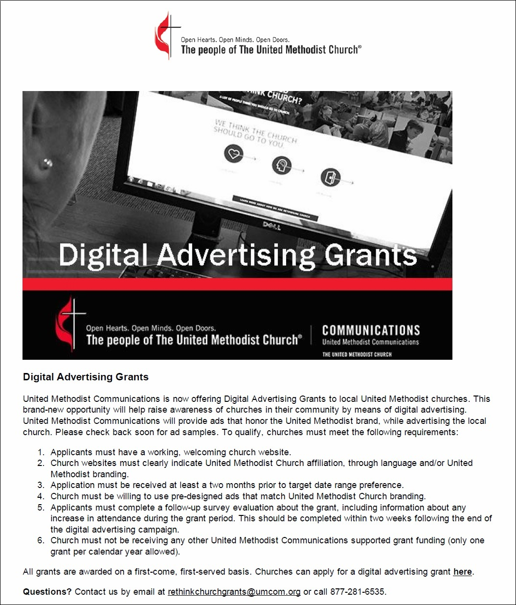

# New Marketing Strategy
The new marketing strategy incorporates both traditional and modern methods in order to fit with changing lifestyles, and to reach the most people possible, perhaps even beyond city boundaries. 

The strategy would be as cost effective as possible by first identifying and taking advantage of "low-hanging fruit" previously overlooked. Beyond low-hanging fruit, we would consider the cost versus potential benefit. 

## Example Marketing Plan

### Example Budget and Costs

New Sanctuary Equipment

| Tactic | Cost |
| -- | -- |
| Screens and Computer | Private Donation |

Website

| Tactic | Cost |
| -- | -- |
| Website | $96/year |
| Search Engine Optimization | Included |
| Google Rich Snippet | Free |

Low-Hanging Fruit

| Tactic | Cost |
| -- | -- |
| Word of Mouth | Free |
| Contacting Inactive/Potential New-Comers | Free |
| Fliers in High Traffic Locations | Free |
| Social Media Sharing | Free |
| Newspaper Articles/Church Info | Free |

Cost Benefit Analysis

| Tactic | Cost |
| -- | -- |
| Partnerships | Cost Varies/Currently No Cost |
| Professionally Made Banners/Signs | TBD |
| Google AdWords | Possible Grant |
| Facebook Ads | Possible Grant |
| Twitter Ads | Possible Grant |
| Special Occasion Ads/Sponsorships | TBD |

## Main Tactics

### New Sanctuary Equipment
As the revitalization effort generated momentum, an anonymous donor made a generous donation to purchase new, large flat-screen televisions and a laptop for the church sanctuary, to be used to play contemporary videos and music, and to project the words of the hymns. 

### Worship Committee
It was decided that a new Worship Committee would be formed to oversee worship service design. 

### Youth Leadership Initiative
A Youth Leadership Initiative would be formed to assist with publicity duties such as running the new screen videos and music during worship. 

### Digitally Empowered Congregation
Though something of an experiment, I would develop a manual to give to members of the church, with the goal of empowering the congregation to become a self-sustaining publicity engine. The manual would explain in simple terms how to:

Training manual

### Outreach Calendar
The church purchased a 2015 wall calendar to be used as an outreach calendar. This outreach calendar is hung on a hook on the wall in a high traffic area of the church where it will not be overlooked. A pen and post it notes are nearby so that the calendar can be easily updated. The calendar can be removed from the wall and taken to meetings too. The calendar would help to keep everyone "on the same page."

### Contacting Inactive/Potential New-Comers
A campaign was begun to personally invite inactive church-goers back, and to invite potential newcomers for the first time, including making a new, professional photo directory.

### Local Newspaper
The church had not been fully makinge use of its information space in the Church Calendar section of the local newspaper, The Ninnescah Valley News. 

Pretty Prairie United Methodist Church website address added to local newspaper Church Calendar to boost traffic and rankings

Also, the church could submit articles and general information to the newspaper. Although individual church members were occasionally submitting articles, this was being done ad hoc, without a coordinated strategy. Anytime possible, the Pretty Prairie United Methodist Church website address and/or Facebook address would be included in articles to increase traffic and rankings.

Photo at Pretty Prairie Sunset Home afternoon tea hosted by United Methodist Women

On the left, story made from photo with a link to the church's Facebook Page; On the right, a story about the church's new mobile healthcare clinic (see below)

### Partnering with Other Community Orgs to Provide Services (Cost Varies)

After the revitalization effort began, an opportunity became available to partner with community organization Ubuntu to bring a weekly medical clinic to Pretty Prairie through [Advanced Mobile Healthcare](http://www.advancedmobilehealthcare.com), including in-home visits. Ubuntu needed a location for the clinic and the Pretty Prairie United Methodist Church basement was a perfect fit. This is an example of a partnership that would service the community and get people through the doors. 

### Signs (Paid)

Banners and signs would be placed in front of the church to raise awareness about special events (special worship services, medical clinic, ect.)

Mobile healthcare clinic sign

Easter banner

### Online Advertising (Possible Grant)

#### Facebook Advertising
In addition to the ability to share Facebook page posts and website blog posts for free, Facebook also offers paid advertising to target people located within a region. Additional advertising filters include gender and age ranges between 18 and 65+.

One option would be to advertise the church's Facebook Page via the "Local Awareness" option to "reach people near your business." Suggested target audiences range from a radius of 50 km around Pretty Prairie, down to 3 km, or 1km (as shown here)... 

#### Google AdWords 
In additional to creating a free Google Rich Snippet, the church can use Google AdWords to create ads that people in the Pretty Prairie region see when they do a Google search.

Google AdWords targeting Pretty Prairie 

#### Twitter Advertising 

Members of the church are less likely to use Twitter than Facebook. However, Twitter is an option to keep in mind, particularly for reaching the public at large, including identifying people who are more likely to make donations. 

Twitter has a [Faith Playbook](https://media.twitter.com/playbook/faith-organizations) for faith organizations, and religious ads can be occasionally found on Twitter.

