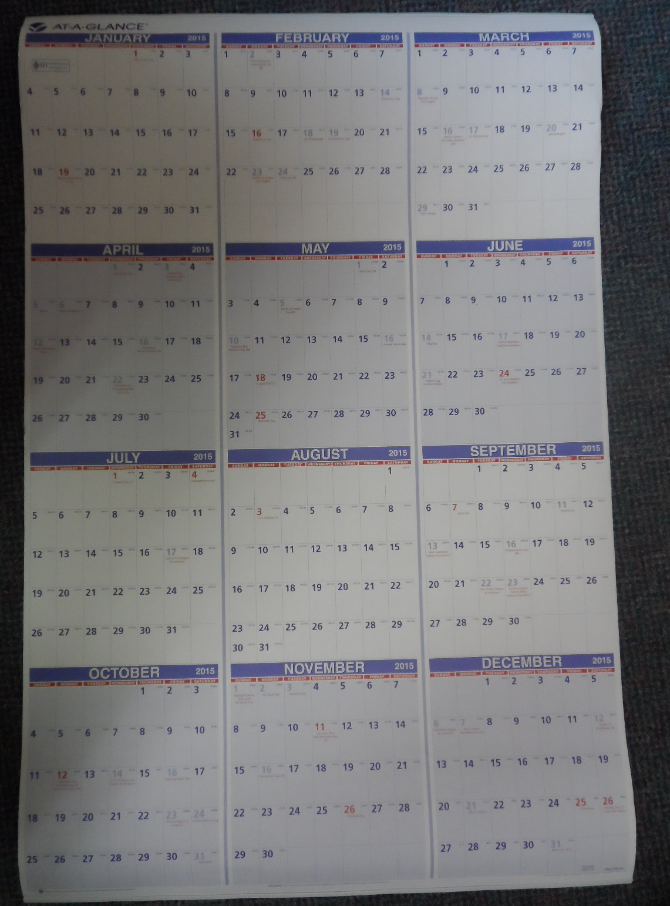
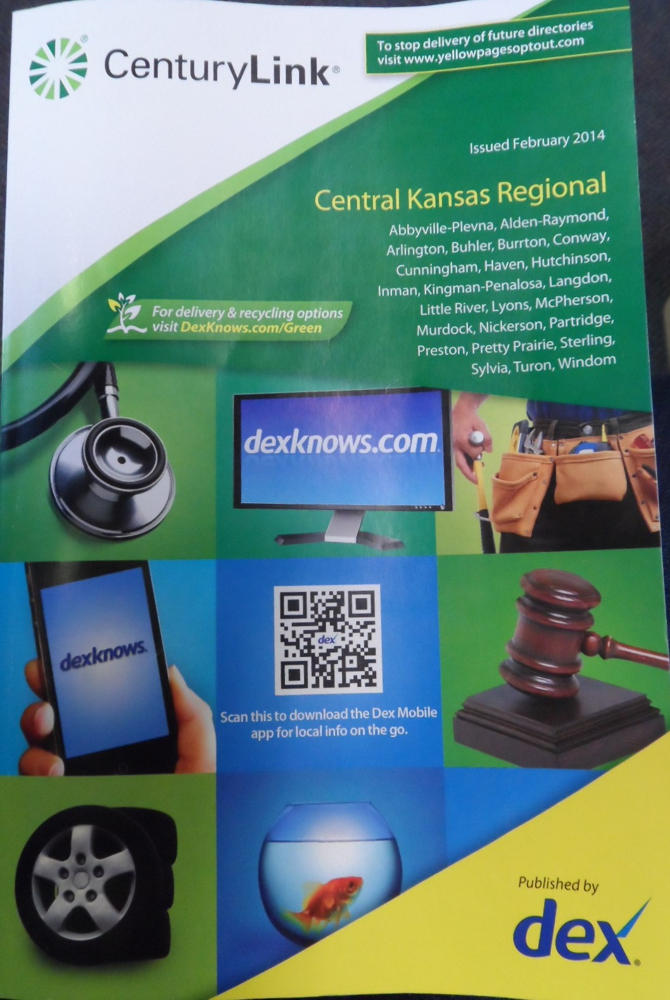
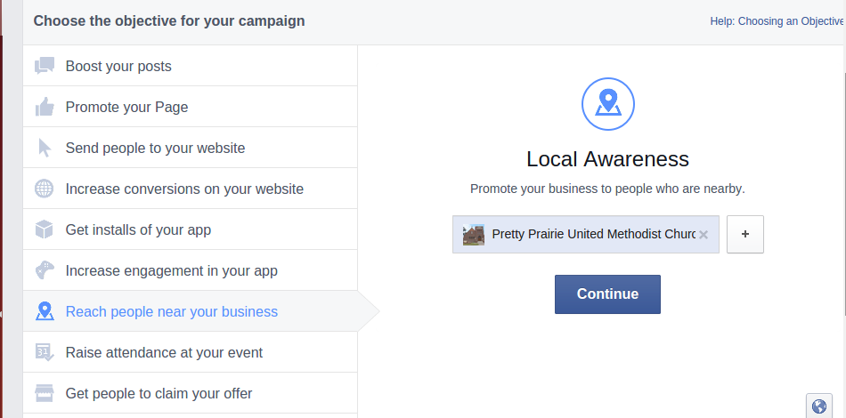

# New Marketing Strategy

The new marketing strategy would incorporate both traditional and modern methods in order to fit with changing lifestyles, and to reach the most people possible, perhaps even beyond city boundaries. 

## Example Budget

## Example Plan

## Traditional Methods

All of the traditional methods of advertisement should continue to be updated on an ongoing basis, including the new website info.

* Website/Facebook Page
* Find-a-Church
* Bulletin
* Local newspaper
* Email signature
* Ads and fliers in high traffic locations

### Outreach Calendar

The church purchased a 2015 wall calendar. The calendar would be hung on a hook on the wall in a high traffic area of the church where it would not be forgotten. A pencil would be nearby so that the calendar could be easily updated. The calendar could be removed from the wall and taken to meetings too.  

### Skills Inventory

Members of the church would take stock of the skills of individual members. This skills inventory would be used to identify ways to optimize what the church has to offer the community. 

### Contacting Inactive Members

A good starting point for outreach would be for the church to contact church-goers of the past who are now inactive, and invite them back. 

### Telephone Book

Setting aside pre-existing assumptions, members of the church would go through the Pretty Prairie section of the phone book to identify people for outreach. 

## Advanced Marketing Options

### Website SEO

### Google Rich Snippet
Example Google search: "Pretty Prairie United Methodist"

Example Google search result: "Pretty Prairie United Methodist"

Correcting incorrect Google Map info

### Facebook

#### Facebook Sharing

#### Facebook Advertisement

Facebook's "Reach people near your business" a.k.a. "Local Awareness" ad option

Facebook page advertisement preview

##Public at Large

