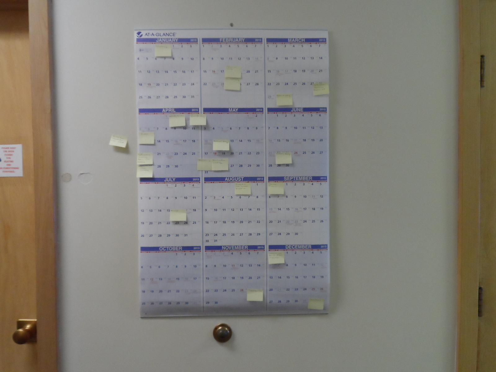
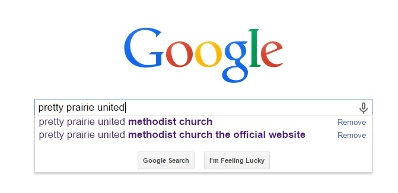
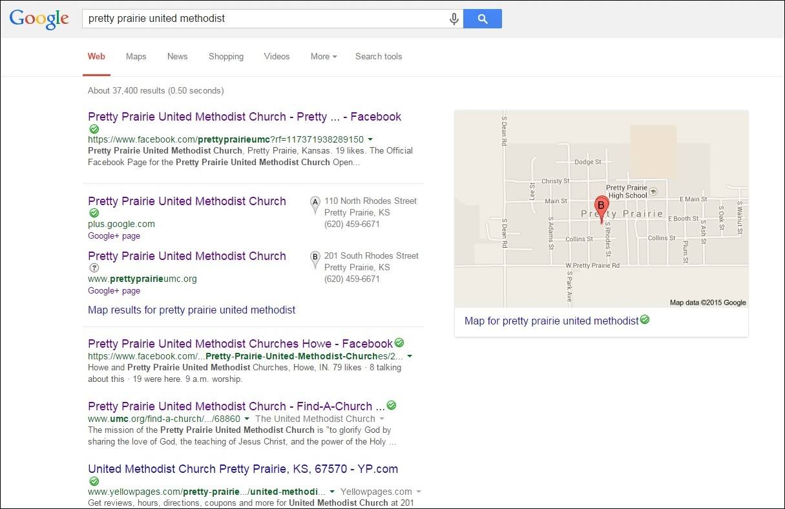
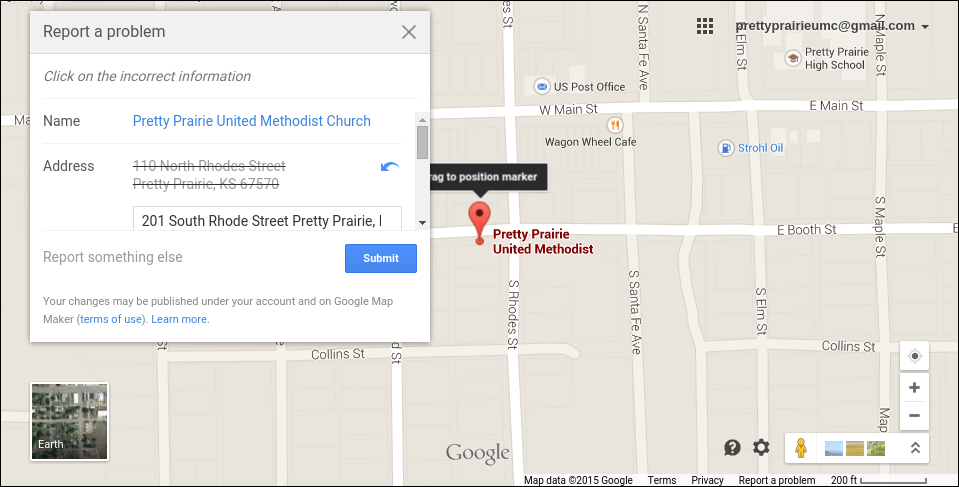
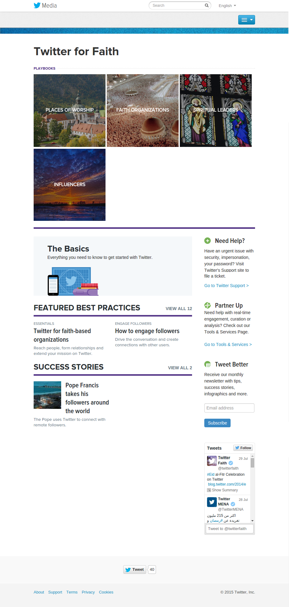

# New Marketing Strategy

The new marketing strategy would incorporate both traditional and modern methods in order to fit with changing lifestyles, and to reach the most people possible, perhaps even beyond city boundaries. 

## Pretty Prairie United Methodist Church Mission Statement

"To glorify God by sharing the love of God, the teachings of Jesus Christ and the power of the Holy Spirit within our community"

## What Does a Successful Pretty Prairie United Methodist Church Look Like?

### Whom Should the Church Reach?

### How Should the Church Reach Them?

#### "How might we"

Members of the Nurture, Outreach, Witness (NOW) Committee would begin to collaborate on a new church marketing plan. In preparation for their group work, I provided the NOW Committee with an example plan, a [Marketing Plan Worksheet](http://s3.amazonaws.com/Website_Properties_UGC/market-your-church/documents/UMCOM_YOUR_MARKETING_PLAN_WORKSHEET.PDF), and a ["Tactics" List](http://s3.amazonaws.com/Website_Properties_UGC/market-your-church/documents/STEP_4_IMPLEMENTATION_HOMEWORK.PDF) taken from the [United Methodist Communications](http://www.umcom.org) [Marketing Audit](http://www.umcom.org/learn/market-your-church-getting-started). 

See [New Marketing Strategy](new_marketing_strategy.md) for the finished result. 
See [Research Sprint](research_sprint.md) for more information about the Nurture Outreach Witness (NOW) Committee's involvement. 

## Example Budget and Plan

The Facebook advertisement program defaults to $50 spend for 1 week, advertising to both genders, ages 18 to 65+.

## Publicity Engine

Self-sustaining

Website easy to use

Multiple Admin

Youth Leadership Initiative

Involving various areas of the church

### Traditional Outreach

* Up to date marketing materials (newsletter, bulletin, email signature, ect.)
* Word of mouth/visit/call/letter
* Local newspaper (permanent ad and special occasions)
* Ads and fliers in high traffic locations

### Contacting Inactive Members

A good starting point for outreach would be for the church to contact church-goers of the past who are now inactive, and invite them back. 

#### Updating Directory

#### Letter

### Cold Calling

#### Individual Knowledge

#### Telephone Book

Setting aside pre-existing assumptions, members of the church would go through the Pretty Prairie section of the phone book to identify people for outreach. 

### Outreach Calendar

The church purchased a 2015 wall calendar. The calendar would be hung on a hook on the wall in a high traffic area of the church where it would not be forgotten. A pencil would be nearby so that the calendar could be easily updated. The calendar could be removed from the wall and taken to meetings too.  

### Skills Inventory

Members of the church would take stock of the skills of individual members. This skills inventory would be used to identify ways to optimize what the church has to offer the community. 

Skills list

#### Update
* Website
* Facebook Page
* Find-a-Church

## Website SEO

### Search Engine Optimization (SEO)
SEO is an important aspect of ensuring that people 'discover' your website. Identify the SEO functionality of your website and verify that it is enabled and optimized. Search engines will 'crawl' the content of your website and give your site a page ranking. 

In some websites, SEO will be optimized manually via the "head" part of the code. In other websites, SEO will be automatic. 

Google is the most popular search engine in most countries, often followed by Yahoo. Identify the most important search phrases associated with your website and test the search results. Make sure that cookies are not enabled. Otherwise, your search results might be skewed due to the search history of the computer. 

And most important of all, encourage people to use the website! The search ranking of the website will rise naturally as a result.

## Google+ and Google Rich Snippets
Verify that the Google map info is correct. If possible, link the website to the map. Consider creating a Google+ organization page, and/or Google rich snippet for support

### Google Rich Snippet
Example Google search: "Pretty Prairie United Methodist"

Example Google search result: "Pretty Prairie United Methodist"

Correcting incorrect Google Map info

### Facebook 

In general, Facebook is considered to be the 'king' of social traffic, with other networks such as Twitter, Instagram and Pinterest close behind.

Based on feedback, members of the church and surrounding community are more likely to be on Facebook than Twitter. So, we would first consider the option of reaching people via Facebook, by advertising the church's Facebook page to people located within Pretty Prairie and its surrounding area through free sharing and paid advertisements.

Facebook page "Local Awareness" advertisement preview to "reach people near your business" 

### Twitter Advertising

Twitter has a Faith Playbook devoted to faith and religious ads can be occasionally found on Twitter. 

Twitter for Faith Playbook

Members of the church are less likely to use Twitter. However, Twitter is an option to keep in mind, particularly for reaching the public at large. 

## New Sanctuary Equipment

