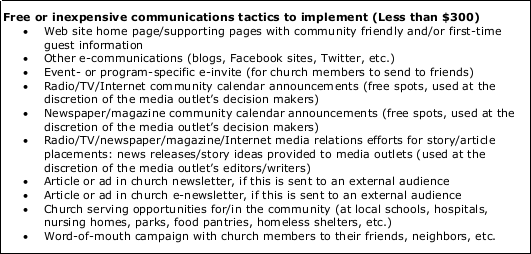
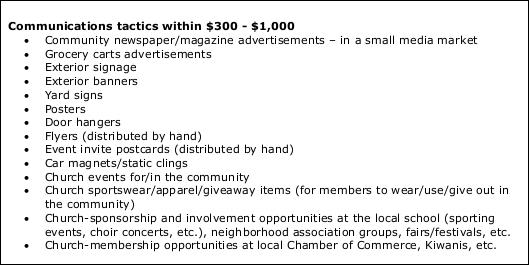
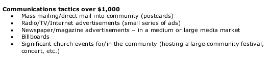
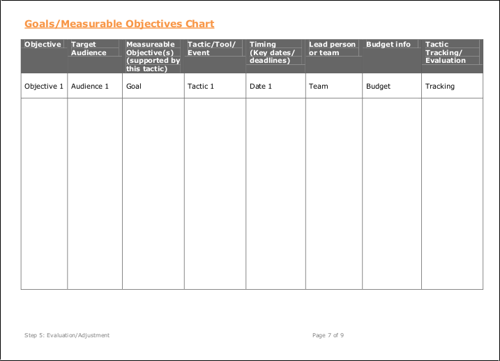

# New Marketing Strategy
The new marketing strategy would incorporate both traditional and modern methods in order to fit with changing lifestyles, and to reach the most people possible, perhaps even beyond city boundaries. 

## Reverse Engineering for Success
* What does a successful Pretty Prairie United Methodist Church look like?
* Whom should the church reach?
* How should the church reach them?

## "How might we"

Members of the Nurture, Outreach, Witness (NOW) Committee would begin to collaborate on a new church marketing plan. In preparation for their group work, I provided the NOW Committee with an example plan, a [Marketing Plan Worksheet](http://s3.amazonaws.com/Website_Properties_UGC/market-your-church/documents/UMCOM_YOUR_MARKETING_PLAN_WORKSHEET.PDF), and a ["Tactics" List](http://s3.amazonaws.com/Website_Properties_UGC/market-your-church/documents/STEP_4_IMPLEMENTATION_HOMEWORK.PDF) taken from the [United Methodist Communications](http://www.umcom.org) [Marketing Audit](http://www.umcom.org/learn/market-your-church-getting-started). 

Tactics less than $300

Tactics between $300 and $1000

Tactics over $1000

### Goals and Measurable Objectives Chart

[United Methodist Communications](http://www.umcom.org) suggests using a Goals and Measurable Objectives Chart as part of the [Evaluation Step](http://www.umcom.org/learn/evaluation-adjustment-resources) of its [Marketing Audit](http://www.umcom.org/learn/market-your-church-getting-started). 

United Methodist Goals and Measurable Objectives example chart

### Pretty Prairie United Methodist Church Mission Statement

"To glorify God by sharing the love of God, the teachings of Jesus Christ and the power of the Holy Spirit within our community"

## Example Budget and Plan

### Tier 1 Outreach (Basic)
Up to date marketing materials 
* Website/blog
* Website Search Engine Optimization (SEO)/Google Rich Snippet
* Facebook page
* Newsletter (electronic and mail)
* Find-a-Church
* Bulletin
* Postcards
* Greeting card
* Email signature
* Permanent local newspaper ad
* Word of mouth

### Tier 2 Outreach (Proactive)

#### Publicity Engine
A self-sustaining publicity engine would be created, involving a variety of church leaders and members. Duties could include brainstorming, planning outreach activities, admin status for website/social media, help creating content. In particular: 

##### Committee Leaders
Involving committee leaders would help to keep everyone on the same page. 

##### Youth Leadership Initiative
Youth could assist with duties such as taking photos and/or writing blog posts. 

#### Outreach Calendar
The church purchased a 2015 wall calendar. The calendar is hung on a hook on the wall in a high traffic area of the church where it will not be overlooked. A pencil is nearby so that the calendar can be easily updated. The calendar can be removed from the wall and taken to meetings too.  

#### Contacting Inactive Members

Church members will contact church-goers of the past who are now inactive, and invite them back. 

##### Updating Directory

##### Letter

#### Contacting Potential Newcomers

##### Pooling Individual Knowledge

##### Telephone Book

Setting aside pre-existing assumptions, members of the church would go through the Pretty Prairie section of the phone book to identify people for outreach. 

##### Cold Call/Visit/Letter

#### Skills Inventory

Members of the church would take stock of the skills of individual members. This skills inventory would be used to identify ways to optimize what the church has to offer the community. 

Skills list

#### Special Occasion Advertisement

##### Traditional Advertisement
* Newspaper ad 
* Ads and fliers in high traffic locations

##### Facebook Advertising (Free Sharing)

### Tier 3 Outreach (Special Advertising)

#### Local Events and Organizations
* Pretty Prairie Rodeo advertisement
* Other local sponsorships

#### Facebook Advertising (Paid)

Based on feedback, members of the church and surrounding community are more likely to be on Facebook than Twitter. So, we would first consider the option of reaching people via Facebook, by advertising the church's Facebook page to people located within Pretty Prairie and its surrounding area through free sharing and paid advertisements.

Facebook page "Local Awareness" advertisement preview to "reach people near your business" 

The Facebook advertisement program defaults to $50 spend for 1 week, advertising to both genders, ages 18 to 65+.

Suggested target audience ranging from a radius of 50 km around Pretty Prairie... 

Down to 3 km or 1km (shown here)... 

### Tier 4 Outreach (Public at Large)

#### Twitter Advertising (Paid)

Twitter has a Faith Playbook devoted to faith and religious ads can be occasionally found on Twitter. 

Twitter for Faith Playbook

Members of the church are less likely to use Twitter. However, Twitter is an option to keep in mind, particularly for reaching the public at large. 

## New Sanctuary Equipment

