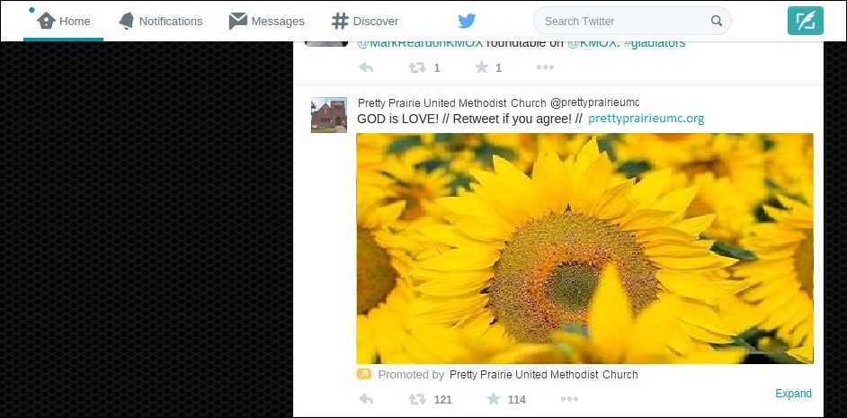

# New Marketing Strategy
The new marketing strategy incorporates both traditional and modern methods in order to fit with changing lifestyles, and reach the most people possible, perhaps even beyond city boundaries. 

## Digitally Empowered Congregation
I developed a manual to give to members of the church explaining in simple terms how to do things such as:

Training Manual

Though something of an experiment, the goal of this would be to create a self-sustaining publicity engine among the membership. 

## New Sanctuary Equipment
As the revitalization effort generated momentum, an anonymous donor made a generous donation to purchase new, large flat-screen televisions and a laptop for the church sanctuary, to be used to play contemporary videos and music, and to project the words of the hymns. 

## Worship Committee
It was decided that a new Worship Committe would be formed to oversee worship service design. 

## Youth Leadership Initiative
A Youth Leadership Initiative would be formed to assist with publicity duties such as running the new screen videos and music during worship. 

## Outreach Calendar
The church purchased a 2015 wall calendar to be used as an outreach calendar. This Outreach Calendar Calendar is hung on a hook on the wall in a high traffic area of the church where it will not be overlooked. A pen and post it notes are nearby so that the calendar can be easily updated. The calendar can be removed from the wall and taken to meetings too. The calendar would help to keep everyone "on the same page."

## Example Marketing Plan

### Example Budget and Costs

Website

| Tactic | Cost |
| -- | -- |
| Website | $96/year |
| Search Engine Optimization | Included |
| Google Rich Snippet | Free |

Low-Hanging Fruit

| Tactic | Cost |
| -- | -- |
| Word of Mouth | Free |
| Contacting Inactive/Potential New-Comers | Free |
| Fliers in High Traffic Locations | Free |
| Social Media Sharing | Free |
| Newspaper Articles/Church Info | Free |

Cost Benefit Analysis

| Tactic | Cost |
| -- | -- |
| Professionally Made Banners/Signs | Placeholder |
| Google AdWords | TBD |
| Facebook Ads | TBD |
| Twitter Ads | TBD |
| Special Occasion Ads/Sponsorships | TBD |

### "Low-Hanging Fruit"

The Facebook advertisement program defaults to $50 spend for 1 week

taking photos and/or writing blog posts.

Church leaders, committee leaders and members, and congregation members (of all ages and backgrounds) working together in synergy. This would include:

* Church Leaders
* Administrative Council
* Worship Committee
* NOW Committee (Nurture, Outreach, Witness)
* A new Youth Leadership Initiative

Example duties: brainstorming, helping to plan outreach activities, admin status for website/social media 

The strategy is also as cost effective as possible. We would first begin to identify and take advantage of all "low-hanging fruit" previously overlooked. Beyond low-hanging fruit, we would consider the cost versus potential benefit. The church first and foremost would seek to have more people walking through its doors, whether to worship or use a service offered by the church. 

In addition to the Example Marketing Plan below, the church would: 
* Maintain up to date basic info on marketing materials (Website, Find-a-Church, Newsletter, Bulletin, Postcards, Greeting card, Email signature)
* Continue a Word of Mouth Ministry
* 
#### Outreach

Individual knowledge was pooled to personally invite inactive church-goers back, and to invite potential newcomers for the first time. 

#### Local Newspaper

The church could submit articles and general information to the local newspaper. Although individual church members were occasionally submitting articles, this was being done ad hoc, without a coordinated strategy.  

Photo at Pretty Prairie Sunset Home afternoon tea hosted by United Methodist Women

On the left, story made from photo next to a story on the right about the church's new mobile healthcare clinic

Also, the church had not fully made use of its information space in the newspaper's Church Calendar section.

Pretty Prairie United Methodist Church website address added into the local newspaper Church Calendar to boost traffic and rankings

Anytime possible, the Pretty Prairie United Methodist Church website address and/or Facebook address would be included to increase traffic and rankings.

#### Partnering with Other Community Orgs to Provide Services

After the revitalization effort began, an opportunity became available to partner with community organization Ubuntu to bring a weekly medical clinic to Pretty Prairie through [Advanced Mobile Healthcare](http://www.advancedmobilehealthcare.com), including in-home visits. Ubuntu needed a location for the clinic and the Pretty Prairie United Methodist Church basement was a perfect fit. This is an example of a partnership that would service the community and get people through the doors. 

#### Signs

Banners and signs would be placed in front of the church to raise awareness about special events (special services, medical clinic, ect.)

Mobile healthcare clinic banner

Easter banner

Fliers would be placed in high traffic locations

#### Search Engine Optimization (SEO) and Google Rich Snippet

#### Social Media Sharing (ex. Facebook)

We would consider the option of reaching people via free social media sharing before considering paid social media advertisement.

Example sharing
* Blog post on website
* Facebook page post
* Posts on congregation members' personal social media profiles

#### Special Occasion Advertisement
Local Events and Organizations
* [Pretty Prairie Rodeo advertisement](http://www.pprodeo.com/#!sponsors/c1v7y)
* Other local sponsorships

### Online Advertising

#### Facebook Advertising (Paid)

In addition to free sharing, Facebook also offers paid advertising to people located within a target area. Additional advertising filters include gender and age ranges between 18 and 65+.

One option would be to advertise the church's Facebook Page via the "Local Awareness" option to "reach people near your business." 

Facebook advertisement preview

Suggested target audience ranging from a radius of 50 km around Pretty Prairie... 

Down to 3 km or 1km (shown here)... 

#### Google AdWords (Paid)
Google AdWords targeting Pretty Prairie 

Google AdWords reach

#### Twitter Advertising (Paid)

Members of the church are less likely to use Twitter. However, Twitter is an option to keep in mind, particularly for reaching the public at large. 

Also, Twitter has a [Faith Playbook](https://media.twitter.com/playbook/faith-organizations) for faith organizations, and religious ads can be occasionally found on Twitter.

