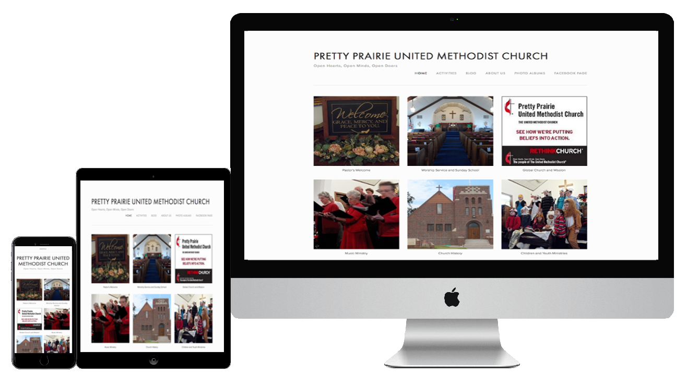
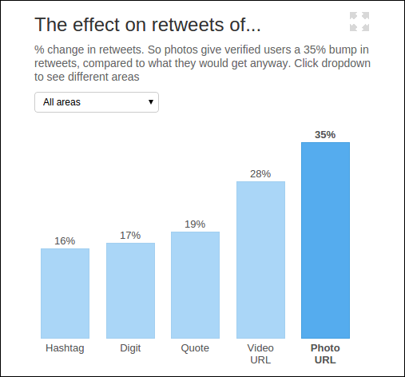
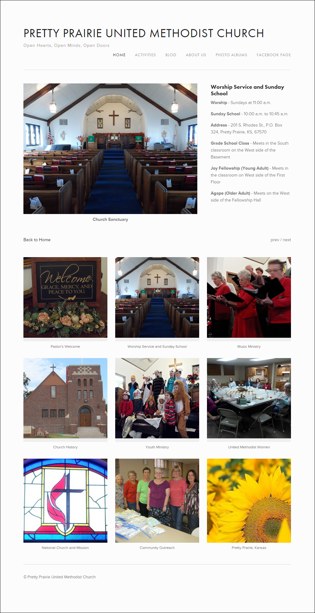
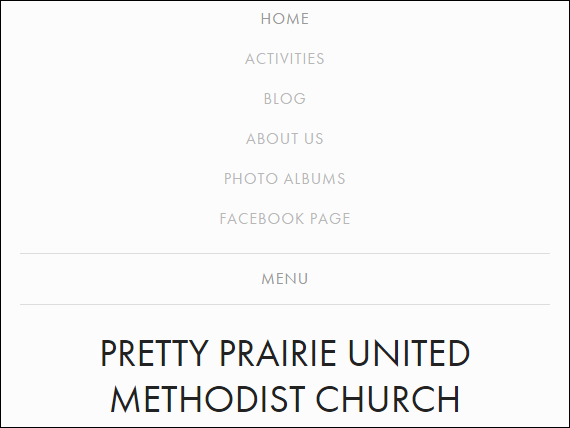
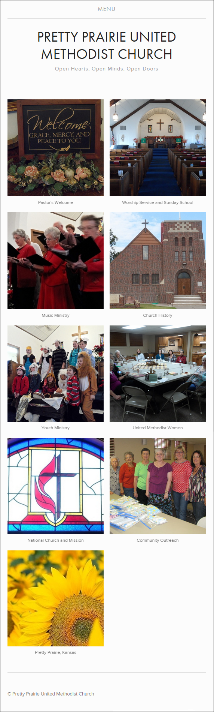
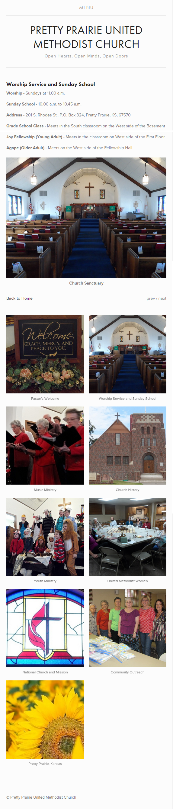

# New Website

The church website was very reasonably priced. The design has a clean, modern, minimalistic look, with a lightweight, responsive layout that adapts well from desktop to mobile. The user experience (UI) is intuitive.
For more info about the selection process, go to [Website Options](website_options.md). 

New website home page: [www.prettyprairieumc.org](www.prettyprairieumc.org) 

Rather than one prominent homepage photo, the homepage features a patchwork quilt of photos that represent a number of people and activities in the church. Not only this, but it has been shown by Twitter that [photos dramatically increase engagement](https://blog.twitter.com/2014/what-fuels-a-tweets-engagement).

Clicking on a photo brings up a small bite of info about the photo subject. This format is straight forward, easy to navigate, and highly mobile optimized. 

New website home page detail

New website mobile menu

New website mobile home page

New website mobile home page detail

