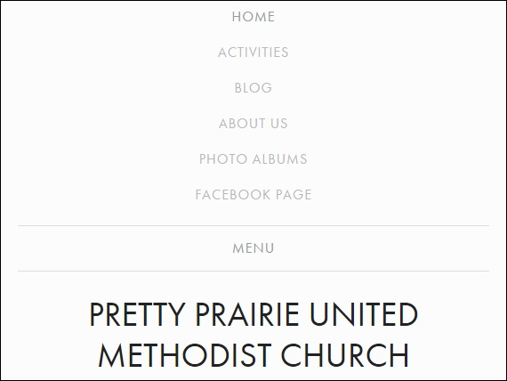
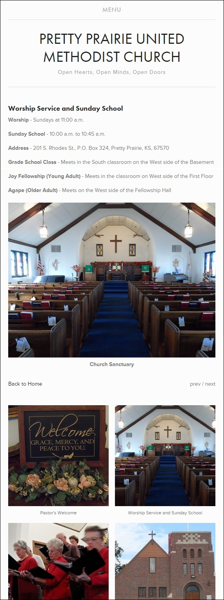

# New Website

The church website is very reasonably priced. The design has a clean, modern, minimalistic look, with a lightweight, responsive layout that adapts well from desktop to mobile. The user experience (UI) is intuitive.

New website home page: [www.prettyprairieumc.org](www.prettyprairieumc.org) 

Rather than one prominent homepage photo, the homepage features a charming patchwork quilt of photos that represent a variety of people and activities in the church. This design was not just chosen for its variety though. It has been shown by Twitter that [photos dramatically increase engagement](https://blog.twitter.com/2014/what-fuels-a-tweets-engagement).

Clicking on a photo brings up a small bite of info about the photo subject. This format is straight forward, easy to navigate, and highly mobile optimized. 

New website home page detail

New website mobile menu

New website mobile home page

New website mobile home page detail

