# Old Design

The old church website and marketing materials were created by different people, at different times, with no thought to creating one consistent church brand experience spanning all materials.

## Old website

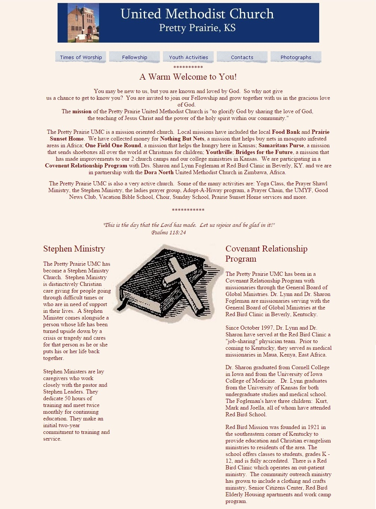

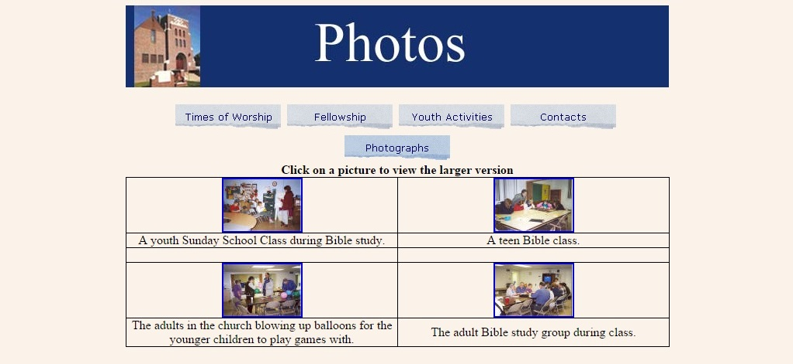

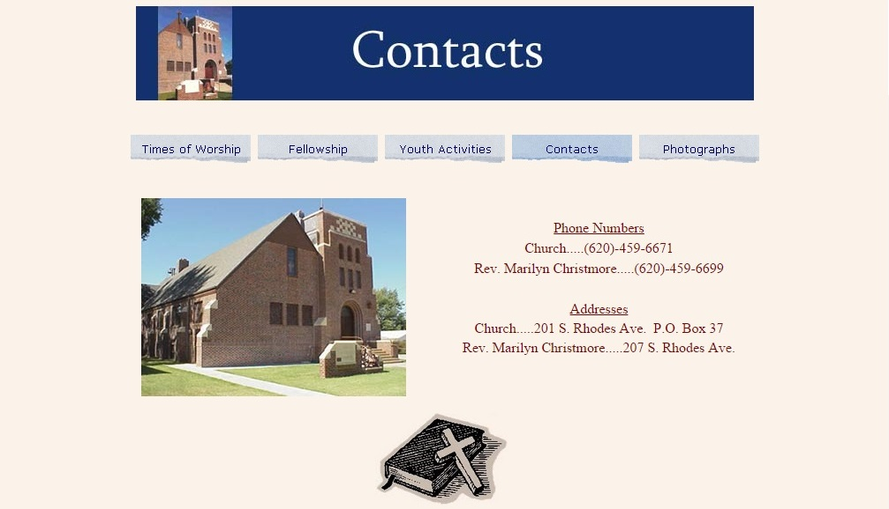

## Old newsletter

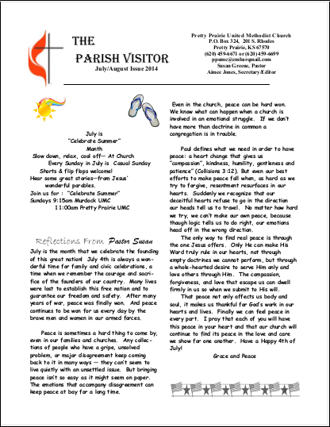

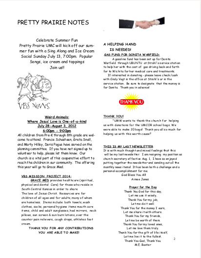

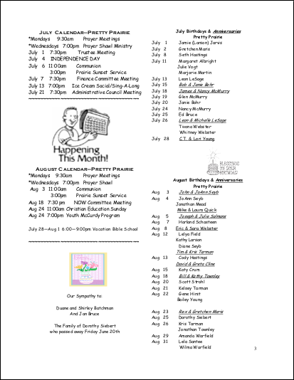

## Old church brochure

Outside 

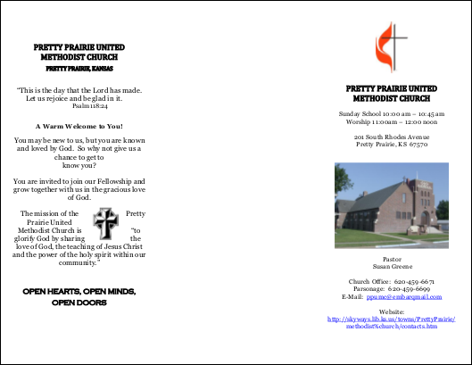

Inside 

## Old visitor postcards

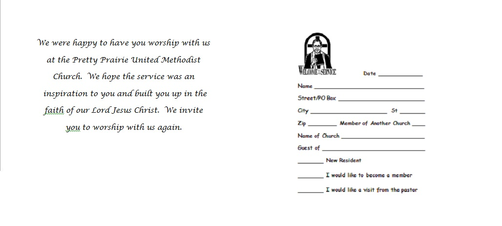

## Old reminder postcards

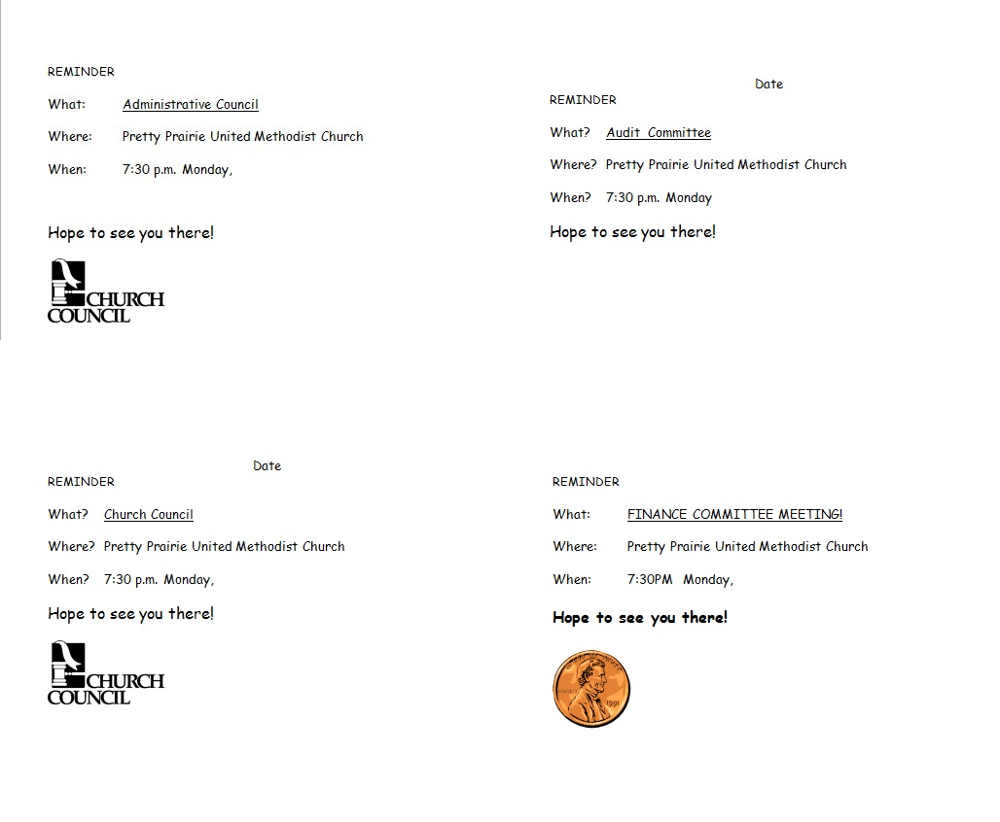

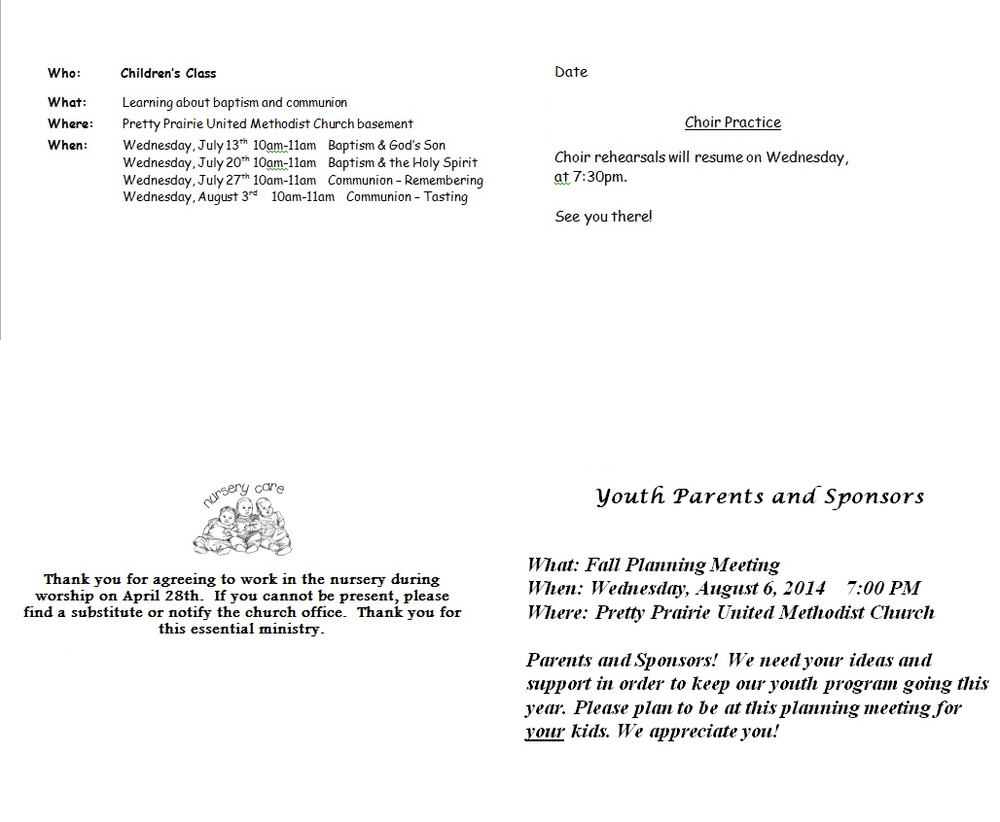

## Old update cards 

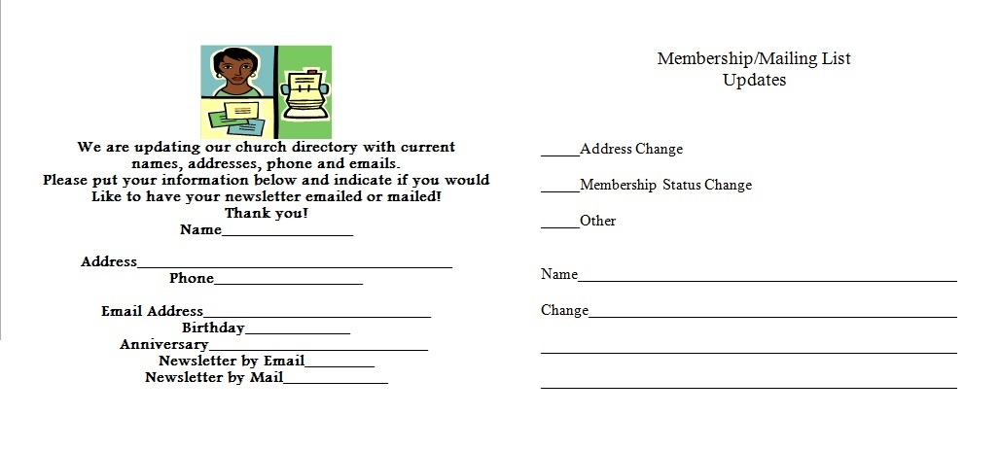

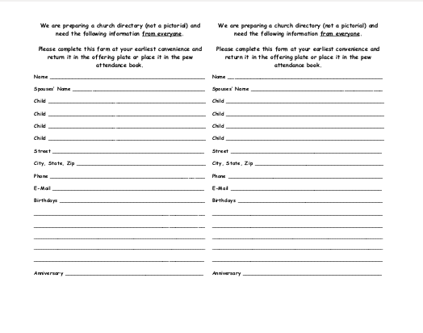

