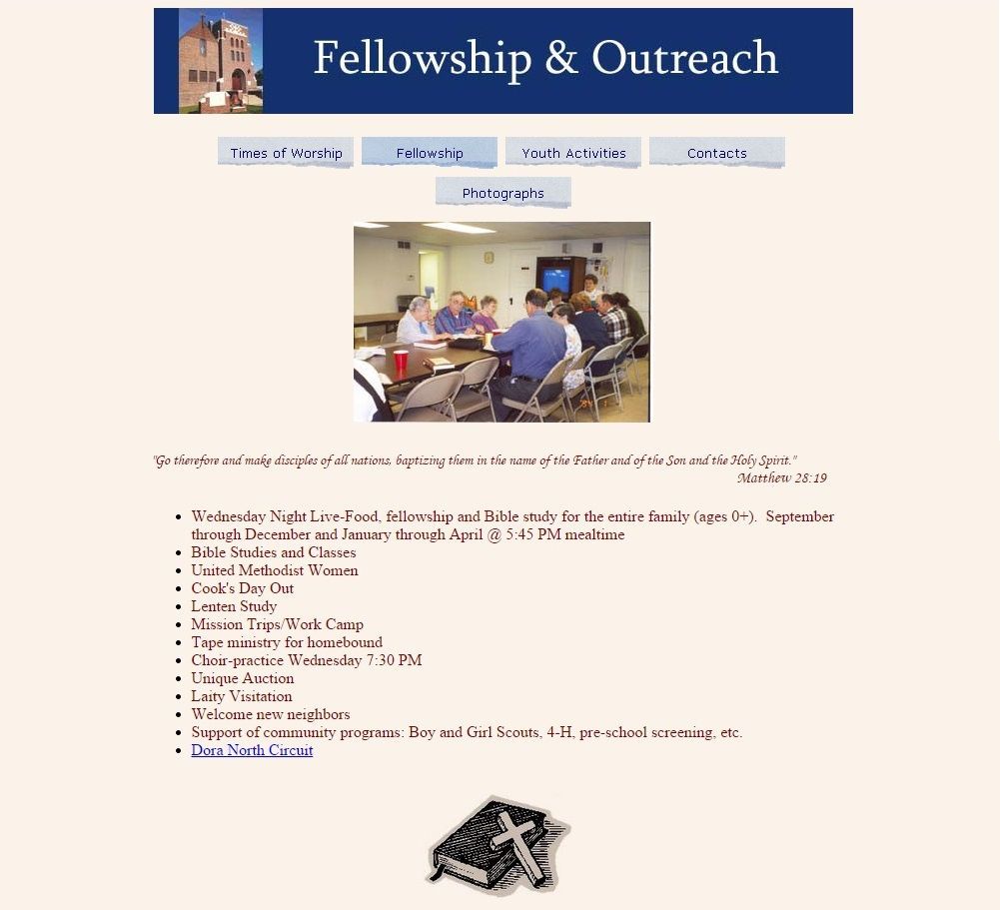

# Old Design

The old church website and marketing materials were created by different people, at different times, with no thought to creating one consistent church brand experience spanning all materials.

## Old website

## Old newsletter

## Old church brochure

Outside 

Inside 

## Old visitor postcards

## Old reminder postcards

## Old update cards 

